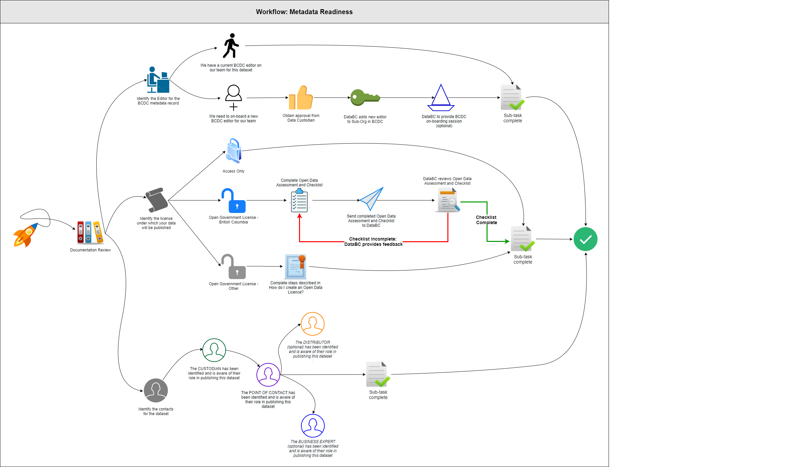
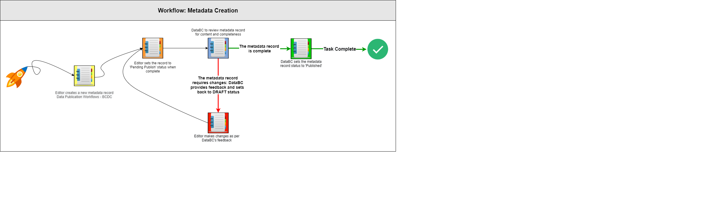
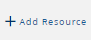

# BC DATA CATALOGUE PUBLICATION WORKFLOW

**This document corresponds with the BC Data Catalogue Beta release that will go to production soon.**

For the classic catalogue pages see [BCDC Classic Worklfow](https://bcgov.github.io/data-publication/pages/dps_bcdc_classic_w.html).

--------------

The BC Data Catalogue or Catalogue as called throughout these documents is intended for the Province of BC as well as Broader Public Sector organizations to publish metadata about their data holdings as well as applications or services. As well when data is published to the DataBC Program through any of its services, as well as published under the [Open Government Licence - British Columbia](https://www2.gov.bc.ca/gov/content?id=A519A56BC2BF44E4A008B33FCF527F61), it must also have a metadata record in the BC Data Catalogue.  DataBC has well documented Data Standards and Guidelines that are followed throughout the process for metadata creation.  The workflows described below will guide you through what your responsibilities are as a publisher to the BC Data Catalogue, and how to create a metadata record in the BC Data Catalogue.

This page is written in the context that you have reviewed all information in the 'Documentation Review' section.

|**AUDIENCE**|  |  |  |  | 
|:---:|:---:|:---:|:---:|:---:|
| *Data Publishers* | *Data Custodians* | *Data Managers* | *Data Stewards* | *Metadata Editors* |

## Table of Contents
+ [**DOCUMENTATION REVIEW**](#documentation-review)
+ [**WORKFLOW DIAGRAMS**](#workflow-diagrams)
+ [**HOW TO BECOME A PROVIDER TO THE CATALOGUE**](#how-to-become-a-provider-to-the-catalogue)
+ [**CREATING A METADATA RECORD**](#creating-a-metadata-record)
	+ [METADATA REQUIREMENTS FOR DATA AND MAPS IN BC MAP HUB (ARCGIS ONLINE)](#metadata-requirements-for-data-and-maps-in-bc-map-hub-arcgis-online)
+ [**MANAGING METADATA RESOURCES**](#managing-metadata-resources)
	+ [REORDERING RESOURCES](#reordering-resources)
	+ [EDITING EXISTING RESOURCES](#editing-existing-resources)
	+ [REPLACING AN EXISTING RESOURCE](#replacing-an-existing-resource)
	+ [DELETING AN EXISTING RESOURCE](#deleting-an-existing-resource)
+ [**METADATA MANAGEMENT AND MAINTENANCE**](#metadata-management-and-maintenance)
+ [**PUBLISHING A METADATA RECORD**](#publishinga-metadata-record)
+ [**ARCHIVING A METADATA RECORD**](#archivinga-metadata-record)
+ [**METADATA GROUPS**](#metadata-groups)
+ [**ORGANIZATION AND SUB-ORGANIZATION UPDATES**](#organization-and-sub-organization-updates)
+ [**BULK UPDATES**](#bulk-updates)
  
------------------------------

## DOCUMENTATION REVIEW

The first step in the process is to review the documentation: 
+ [BCDC Standards and Guidelines](./dsg_bcdc.html)
+ [Naming and Describing](./dsg_naming_describing.html)
+ [Open Data](./open_data.html)

[RETURN TO TOP][1]

------------------------------

## WORKFLOW DIAGRAMS

### [BCDC Metadata Readiness Workflow](./images/wf_MetadataReadiness.svg)
Wondering if you are ready to create metadata? This workflow guides you through the pre-work so you will be ready to create a metadata record.

### [BCDC Metadata Creation Workflow](./images/wf_MetadataCreation.svg)
Once you are ready, use the steps in this workflow to guide you through the process of creating a metadata record.

[RETURN TO TOP][1]

------------------------------

## HOW TO BECOME A PROVIDER TO THE CATALOGUE

To become a Catalogue editor/publisher for a Sub-Organization (a Branch or Division), approval from the Data Custodian (Director or Executive Director) is required. Here are the steps to complete this, provide:

1. Approval from the Data Custodian to publish and manage records and data on their behalf.
3. The name of the Ministry/Organization and Sub-Organization (as it appears in the Catalogue and if that needs to be renamed) in your email. 
4. All names and IDIRs for those requiring access.
5. Forward all this to [DataBC](mailto:DataBC@gov.bc.ca) with the subject: "BCDC Editor Request". 
6. A Catalogue administrator will then add you as an editor to the Sub-Org and contact you with all relevant information to get you started as an Editor in the BC Data Catalogue.

Organizations in the Broader Public Sector (BPS) may publish metadata records and data to the Catalogue. 
+ For datasets licensed under Open Data, these organizations will require their own Open Government Licence. See [Licences](#Licences) section below for more information on this.  
+ Contact [DataBC.DA](mailto:DataBC.DA@gov.bc.ca) to discuss publishing and cataloguing your data, application or service to the Catalogue. 

[RETURN TO TOP][1]

------------------------------

## LICENCES

There are three licencing options for data published data in the BC Data Catalogue:

1. [Access Only](https://www2.gov.bc.ca/gov/content/home/copyright)
   
   Access only is a statement of use that is restrictive as defined in the [Crown Copyright](https://www2.gov.bc.ca/gov/content/home/copyright) Page.
	+ “reproduction or distribution is not permitted without written permission.”
	+ A user is then required to request permission through the [IPP office form](https://forms.gov.bc.ca/copyright-permission-request) and does have a fee associated with it. 
1. [Open Government Licence - British Columbia](https://www2.gov.bc.ca/gov/content?id=A519A56BC2BF44E4A008B33FCF527F61)
 
   For data that is under the Intellectual Property or "ownership of the Province of BC and meets all the requirements of being open data, it is recommended to publish data under an Open Government Licence, where possible, as it is much more permissive.

   To publish a dataset under OGL-BC, [follow the full steps here](./open_data_w.md#how-to-associate-data-to-bcs-open-data-licence) but in brief you will need to obtain the required authorizations as noted in the [Open Data Assessment and Checklist](https://www2.gov.bc.ca/assets/download/97CF56DB283D4AE08968E4A4C7538D65). 
   
   These include:

	+ [The Ministry Information Security Officer (MISO)](https://intranet.gov.bc.ca/intranet/content?id=DC4623F6F1944065B83F70297ED419D7)
	+ [The Intellectual Properties Office (email)](mailto:QPIPPCopyright@gov.bc.ca)
	+ The Custodial organization’s Deputy Minister or designated alternate

   Once these approvals are in place, Data can be published under OGL-BC if:

	+ it is in an open format, e.g., CSV, Shape File (SHP), JSON, or additional formats noted by the OCIO’s [Open Data Physical Dataset Format Standard](https://www2.gov.bc.ca/assets/gov/government/services-for-government-and-broader-public-sector/information-technology-services/standards-files/open_data_physical_dataset_extract.pdf). 
	+ The Catalogue record links to the appropriate Open Data Licence.
	
1. [Open Government - (Other)](./open_data_licence_create.md#creating-an-open-government-licence)

	The Catalogue contains datasets licenced under many other Open Government Licences, from the Broader Public Sector to Federal licences.
	
	Federal Licences are listed as there are times when BC Government employees require data to be published for their own consumption via one or more channels.

	New licences can be added to the drop down.

[RETURN TO TOP][1]

------------------------------

## CREATING A METADATA RECORD
_Note: To use the CKAN API for creating metadata, more information is available [here](./dps_bcdc_w_api_metadata_mgmt.md)._

1. Log into the [BC Data Catalogue](https://catalogue.data.gov.bc.ca) by clicking **Log In** on the upper right of the toolbar.
    + All users with an IDIR can log into the Catalogue but as an editor you will see **Add Dataset** in place of the **Log In** button.
1. Click the [**Add Dataset**] button.
1. Complete the [record](./glossary.md#record) details to describe what you are publishing and then you will be able to add different resource types after.
    + **NEW** This is a change from the previous Catalogue where you had to specify the Resource Type at the beginning. 
    + Follow the [Workflow](./dps_bcdc_record.md) to complete all mandatory fields (minimum requirement). 
    + We suggest adding content to non-mandatory fields as this will help people to better understand and use the data as intended.
	+ Suggestions for metadata content can be found in Tips & Tricks > [Making Useful Metadata](./tips_tricks_making_useful_metadata.md#making-useful-metadata).
1. Click the [**Save**] button. 

### METADATA REQUIREMENTS FOR DATA AND MAPS IN BC MAP HUB (ARCGIS ONLINE)

The use of the BC Map Hub has a requirement for the creation of metadata alongside data and maps. The following documentation will assist in that process:
+ [Publication Request Form](https://www2.gov.bc.ca/assets/gov/data/geographic/web-based-mapping/bc-map-hub/bcs_map_hub_public_publication_checklist.docx)
+ [Content Publication Guidelines](./dps_maphub_w.md#bcs-map-hub---arcgis-online-ago)

[RETURN TO TOP][1]

------------------------------

## MANAGING METADATA RESOURCES

Resources are the additional metadata specific to that resource as a record can have many resources.

1. Resources to a record can be the following types: Application, Geographic Data, Tabular Data/Document or Webservice/API.
1. Resources may reside, depending on type and size within the Catalogue database itself (Data Store (csv)/ File Store (xlsx) or be externally referenced.
1. At times resources are only metadata about a resource that is not accessible or requires authorization to access.
1. Resources that are sourced from the BC Geographic Warehouse are managed differently.
1. If a resources requires authorization, we recommend that a process or form is added as a resource to the record to inform users how to get access, e.g. [Request Archaeology Information](https://catalogue.data.gov.bc.ca/dataset/a6d58d20-8e19-46ba-b5a0-f02e436fa765/resource/cbbd35ea-8ddb-4cb4-b717-d897e5303dc3).

**To add a resource:**
1. Click the **+ Add Resource** button () on the toolbar at the record level.
1. Fill out all the required fields for each resource type as described for each of these resource types.

    - [Application](./dps_bcdc_w_application.md)
    - [Geographic Data](./dps_bcdc_w_geographic_dataset.md)
    - [Tabular Data/Document](./dps_bcdc_w_dataset.md)
    - [Webservice/API](./dps_bcdc_w_webservice_api.md)

_Notes:_
+ To use the CKAN API for managing resources, more information is available [here](./dps_bcdc_w_api_metadata_mgmt.md)
+ Only files less than 150MB in size can be uploaded to the Catalogue file store.

### REORDERING RESOURCES
The **Reorder resources** button allows you to control the order of resources in the metadata record.
+ **TO BE CONFIGURED**

### EDITING EXISTING RESOURCES

There are two ways to edit a resource in the metadata record: 
1. On the resource card of the record page, click the pencil  of the resource to edit.
1. On the resource page, click the **Edit Resource** button on the toolbar.

1. Make edits that follow the workflow for your dataset type under [Creating a New Metadata Record](#CREATING-A-NEW-METADATA-RECORD).
1. Click the **Save** button to save your changes.

### REPLACING AN EXISTING RESOURCE

While in edit mode on a resource (see [Editing Existing Resources](#EDITING-EXISTING-RESOURCES) section above):
1. Click the **Remove** button at the end of the **File** URL.
1. Re-upload or provide a new link to your data.
1. Make any other edits needed to reflect the updated/new resource.
1. Click **Update Resource** to save your changes.

### DELETING AN EXISTING RESOURCE
For records that are still in draft:
1. Click the **Delete** button at the top of the page. 
+ **TO BE CONFIGURED FOR EDITORS**

[RETURN TO TOP][1]

------------------------------

## METADATA MANAGEMENT AND MAINTENANCE

Please review [BC Data Catalogue - Roles and Responsibilities](./dsg_bcdc_roles_responsibilities.md), which outlines the obligations for metadata management and maintenance. It is good practice for the Data Custodian (or designate) to complete regular metadata reviews to ensure currency and completeness for records published under their Branch/Division.

[RETURN TO TOP][1]

------------------------------

## PUBLISHING A METADATA RECORD

All new metadata records are created that allow the State to be asside DRAFT.

Once the metadata record is complete, the editor sets the **State** to **PENDING PUBLISH**. Here are the steps:

1. Log into the Catalogue.
1. Navigate to the metadata record to be edited and click the "edit metadata" button on the top toolbar to start editing.
1. Change the dataset **State**:
	+ from **DRAFT**
	+ to **PENDING PUBLISH**
1. Click **Save**.

Once a metadata record has been set to **PENDING PUBLISH**, administrators of the Catalogue at DataBC weill be notified and will then review the record for: 
+ Completeness
+ Data quality
+ Licence type

If your metadata record is validated by DataBC, they will change the state to **PUBLSHED**.  Otherwise, a DataBC team member will contact you to discuss your record.

_**Note on Publication timing**: if there is a specific time and date that the release of these records is required, contact [DataBC DA](mailto:databc.da@gov.bc.ca) to work on timing that is withing regular government business hours, M-F 8:30 to 5pm._

Once your metadata record is in the Published state, it is then visible and searchable in the BC Data Catalogue for all users, unless set to IDIR visibility ad then a user must log into their IDIR to see the record.  

Data Custodians should regularly review all metadata records within their Sub-Org for currency and completeness. This may be delegated to any of the other Roles or the Editor associated with the metadata record.

[RETURN TO TOP][1]

------------------------------

## ARCHIVING A METADATA RECORD

When a dataset is no longer relevant, the **State** should be set to PENDING ARCHIVE, so as to notify DataBC Catalogue administrators as well it informs uses who read the metadata that there is an intending Archive. Recommend following the items as there are more fields available to give users more information, e.g., what is the replacement dataset or record.

Here are the steps to begin this process:

1. Log into the Catalogue.
1. Navigate to the metadata record to be edited and click the "wrench" tool icon (top right corner) to start editing the record.
1. Ensure the **Organization** and **Sub-Organization** are correct. If not, update these fields or contact  the [DataBC](mailto:data@gov.bc.ca) if you do not have editing access for the Sub-Org.
1. Under **Data Currency/Update**, update the **Resource Status**:
	1. If the data is **obsolete**, a link must be added for a **Replacement Record**.
		+ When this is another record in the catalogue: 
			+ Use the replacement record's permalink
			+ Add the text "DEPRECATED - " to the beginning of the metadata Title
		+ If there is no replacement, then either the main catalogue page can be used or a webpage about the data or program.
		
	1. If the data is going into **historicalArchive**, two additional fields can be completed:
		1. **Retention Expiry Date**
		1. **Source Data Path**
		
1.  Change the dataset **State**:
	+ from **PUBLISHED**
	+ to **PENDING ARCHIVE**.
	
Once the record has been set to **PENDING ARCHIVE**, DataBC will then review the record to ensure it is ready for archiving, this includes:	
+ for BCGW specific datasets:
    - removing the URL for the WMS Get Capabilities and the Network Link KML
    - changing the Title for BCGW Datasets to be "BCGW Deprecated Object"
        - This will disable the _Download/Access_ button. 
    - removing the preview details
        - this will disable the Preview button and the Link to iMapBC
+ confirming the correct Org and Sub-Org
+ confirming that records with a replacement dataset contain "DEPRECATED" in the title

_Note: If the record is related to a BCGW dataset, it will be added to the next Notice of Intent (NOI) for archival._
    - See the [BCGW Data Retirement Workflow](https://bcgov.github.io/data-publication/pages/dps_bcgw_w_data_retirement.html)

Once DataBC has confirmed the record is ready for archiving, they will update the **State** to **ARCHIVED**.

Archived datasets:
+ are only visible to logged in Catalogue members of the Sub-Org which the dataset resides in 

[RETURN TO TOP][1]

------------------------------

## METADATA GROUPS

Metadata Groups provide a listing of like datasets for a specific purpose and can contain records from across multiple organizations.
+ These are not intended to replace a full listing of records for a sub-organization.
+ Groups by default are public but a request them to be visible to IDIR only can be made.

To create a group, the following information is required and can be sent to [DataBC](mailto:data@gov.bc.ca).

**Requirements:**
+ **Group Name**:
+ **Group Description**:
+ **URL**: _for more information_
+ **Image**: _either a file or URL_
+ **Members**: _list of IDIRs who will maintain the Group_
+ **Group visibility**: Public or IDIR

[RETURN TO TOP][1]

------------------------------

## ORGANIZATION AND SUB-ORGANIZATION UPDATES
Organizations change names frequently and thus need continual maintenance.

If a Organization/Ministry or Sub-organization/Branch/Division/Program has changed names, the following can be following information can be sent to [DataBC](mailto:data@gov.bc.ca):

+ Old name
+ New name
+ List of data providers (Editors)
	+ When an update is requested for a sub-organization, we ask that the members and contacts list be reviewed.
	+ DataBC can provide you with a current list to review.

[RETURN TO TOP][1]

------------------------------

## BULK UPDATES
When there are more than 20 records that require updating, a bulk update can be requested for [DataBC](mailto:data@gov.bc.ca) to complete or can be completed by a user via the API.

+ Common bulk updates:
	+ Branch/Division name
	+ Contact information
	+ State Change
	+ URL modifications for More Info and Resources

[RETURN TO TOP][1]

-------------------------------------------------------

[1]: #bc-data-catalogue-publication-workflow
