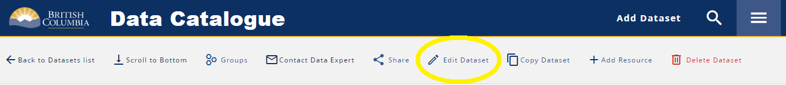
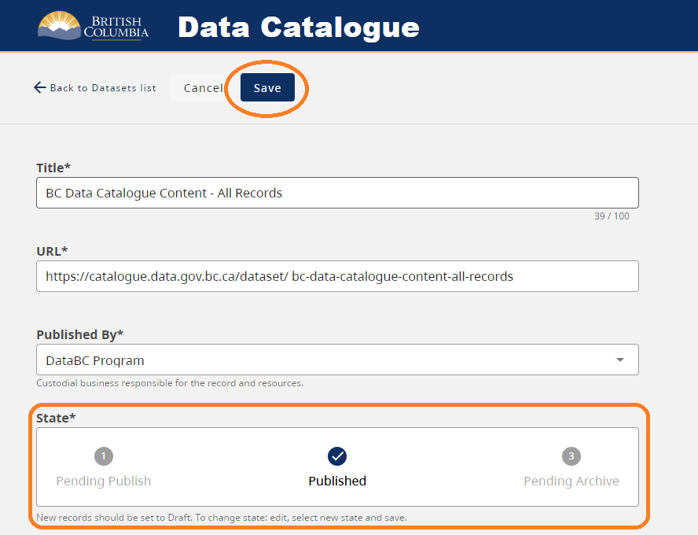
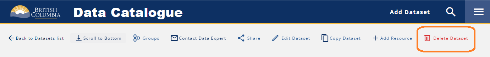

# **BC Data Catalogue Records**

||**Audience** | |
|:---:|:---:|:---:|
| [*Catalogue Editors*](../glossary.md#metadata_editor) | [*Catalogue Admin*](../glossary.md#metadata_admin) | *Catalogue Developers* |

## Resources
[**3.11 Core Administrative and Descriptive Metadata Standards and Guidelines**](https://www2.gov.bc.ca/gov/content?id=7284582C81DF4FD6AE89898C535851F1)
+ This document is being updated to reflect the alignment with this core standard.

## Table of Fields in Data Catalogue align with Metadata Standard and Guidelines
To align with the new <code>Metadate Standard and Guidelines</code>, the following table outline how fields in B.C. Data Catalogue 
could align with Metadata Standard and Guidelines.

|Fileds in B.C. Data Catalogue|Fields in Metadata Standard and Guidelines|
|:-:|:-:|
|*CREATOR* |[*Published by*](#published-by)|
|*DATE CREATED*|[*Lifecycle event -> Created*](#record-lifecycle-history)|
|*DATE MODIFIED*|[*Lifecycle event -> Modified*](#record-lifecycle-history)|
|*DESCRIPTION*|[*Description*](#description), [*Purpose*](#purpose), [*Quality*](#data-quality), [*Lineage*](#data-lineage), [*Resource Description*](dps_bcdc_w_resource_mgmt_ui.md#resouce-description), [*Resource Supplemental Information*](dps_bcdc_w_resource_mgmt_ui.md#supplemental-information)|
|*FILE FORMAT*|[*Resource Storage Format*](dps_bcdc_w_resource_mgmt_ui.md#resource-storage-format)|
|*SECURITY CLASSIFICATION*|[*Security Classification*](#security-classification)|
|*TITLE*|[*Title*](#title) and [*Resource Title*](dps_bcdc_w_resource_mgmt_ui.md#name)|
|*UNIQUE IDENTIFIED*|*Each Record and Resource has a unique identifier. There are obtained by using the Share button*|
|*INFORMATION SCHEDULE*|*This is managed at different levels for organizations, request an engagement with us to determine where it best fits.* |
||If you have general questions about the catalogue or wish to provide feedback, please open a ticket with the [Data Systems & Services request system](https://dpdd.atlassian.net/servicedesk/customer/portal/1/group/1/create/14).|

## Table of Contents
+ [**Record management**](#record-management)
   + [Add a Record](#add-a-record)
   + [Edit a Record](#edit-a-record)
   + [Publish or Archive a Record](#publish-or-archive-a-record)
   + [Delete a Record](#delete-a-record)
   + [Associate a Record to a Group](#associate-a-record-to-a-group)
+ [**Record fields**](#record-fields)
   + [_Title_](#title) 
   + [_URL_](#url)
   + [_Published by_](#published-by)
   + [_Publish state_](#state)
   + [_Description_](#description)
   + [_Licence_](#licence)
   + [_Open a support ticket_](#support-url)
   + [_Contacts_](#contacts)
   + [_Purpose_](#purpose)
   + [_Data quality_](#data-quality)
   + [_Data lineage_](#data-lineage)
   + [_Related links_](#related-links)
   + [_Security classification_](#security-classification)
   + [_Who can view this data?_](#who-can-view-this-data)
   + [_Who can download this data?_](#who-can-download-this-data)
   + [_Who can view this record?_](#who-can-view-this-record)
   + [_Keywords_](#keywords)
   + [_Record lifecycle history_](#record-lifecycle-history)
   + [_Resource status_](#resource-status)
+ [**Resource management**](#resource-management)
+ [**Additional resources**](#additional-resources)

------------------------------

## Record management

The button is defined as <code>Add Dataset</code> as this is a CKAN term used to define the record and all it's resources. As this word is used to mean other things, this document defines the metadata as a record.

1. Log into the [BC Data Catalogue](https://catalogue.data.gov.bc.ca) by clicking <code>Log In</code> on the upper right of the toolbar.
    + All users with an IDIR can log into the Catalogue but as an editor you will see <code>Add Dataset</code> in place of the **Log In** button.
    + Follow the [metadata record management section](#metadata-record-management) to complete all mandatory/required fields (minimum requirement). 
    + We suggest adding content to non-mandatory fields as this will help people to better understand and use the data as intended.
	+ Suggestions for metadata content can be found in Tips & Tricks > [Making Useful Metadata](./tips_tricks_making_useful_metadata.md#making-useful-metadata). 

### Add a Record

**To add a record:**
1. Click the <code>Add Dataset</code> button
1. Fill out all the required fields for a record  as described below as noted in the [field section](#record-fields).

_Note:_ All new metadata records are created that allow the <code>State</code> to be set to <code>Draft</code>. 

[RETURN TO TOP][1]

### Edit a Record

**To edit a record:**
1. Log In
1. Navigate to the record to edit (that you have the privileges to do so) and either:
    1. Click the <code>Edit Dataset</code> button

[RETURN TO TOP][1]

### Publish or Archive a Record

**To publish a record:**
1. Log In
1. Navigate to the record to edit (that you have the privileges to do so) and either:
    1. Click the <code>Edit Dataset</code> button
    1. Change the <code>State</code> to either
       + Pending Publish
       + Pending Archive
    1. Click <code>Save</code>
       + This then triggers the publication email notification process
       + For more details see the [Publication workflow](../dps_bcdc_w.html#publication-states)

[RETURN TO TOP][1]

### Delete a Record

+ Editors can delete records only in a Draft state
+ Admins can delete records in any state
+ Deleted records have their state set to 'deleted' and will be purged by administrators.
    + It is possible to set the state to 'active' if done in error and found quickly. 

**To delete a record:**
1. Log In
1. Navigate to the record to edit (that you have the privileges to do so) and
    1. Click the **Delete Dataset** button

[RETURN TO TOP][1]

### Associate a Record to a Group

Members of a Catalgoue Group can associate any Published record in the catalogue to that Group.

1. Log In
1. Navigate to a record to add to your group
1. Click **Groups** 
1. In the pop-up click **Add to Group**
1. Click the **+** button beside group
1. Click **Stop adding to Group**
2. Click **X** to close pop-up

[RETURN TO TOP][1]

---

## Record fields

Below is a list of fields with supporting details.  

### Title (`title`) 

This is the title of your metadata record and is a required field.

A well defined title reflects what the dataset or record is about. With many other produces the following together will assist to make a title unique and understandable to the public.

1. Subject
2. Type
3. Status (if multiple resources in different statuses, e.g., Draft, Proposed, Approved)
4. Extent (if smaller or larger than the province of BC)

Tips:

+ This is limited to 100 characters as it is used in the URL creation.
+ This text must be unique to the BC Data Catalogue.
+ Recommend to not include organization or program names in titles as these may change over time. Unless there is no other way to distinguish a dataset from another of similar title.
+ For records that will include multiple years, do not include the year in the title.

[**Core Administrative and Descriptive Metadata Guidelines**](https://www2.gov.bc.ca/gov/content?id=7284582C81DF4FD6AE89898C535851F1)
+ This field aligns with the standard field **TITLE**.
+ Refer to both the standard and guideline.

[RETURN TO TOP][1]

### URL (`name`) 

This is automatically generated while typing in the _**Title**_ with special characters and spaces are replaced with underscores.
+ This is a required field.
+ This must be unique to the BC Data Catalogue.
+ This does not need to be the same as the Title.

[RETURN TO TOP][1]

### Published by \* (`owner_org`) 

This is the Sub-Organization (often the Branch or Division) under which the metadata record is created and published.
+ This is a required field

[**Core Administrative and Descriptive Metadata Guidelines**](https://www2.gov.bc.ca/gov/content?id=7284582C81DF4FD6AE89898C535851F1)
+ This field aligns with the standard field **CREATOR**.
+ Refer to both the standard and guideline.

[RETURN TO TOP][1]

### Publish state \* (`publish_state`) 

When creating a new metadata record, the state will be set to **Draft**. To do so click the button  above the state. The state selected will become the checkmark.

+ The Published by has to have an idenified organization for the draft button to be clickable

+ To change a state a record must be saved, edited by clicking on the button  above the state desired.

+ Only states that can transition between each other will be visible in edit mode.

    |State|Record Visibility|Email Notificaiton|
    |:---|:---|:---|
    |Draft|Only editors and admin of an org can see these records |None|
    |Pending Publish|Only editors and admin of an org can see these records| Administrators |
    |Published|Published records are visible to users |All Editors of that org|
    |Pending Archive|Pending archive records are visible to users until Archived |Administrators|
    |Archived|Only editors of an org can see these records |All Editors of that org |
    
   
[RETURN TO TOP][1]

### Description \* (`notes`) 

Provide a meaningful description of the dataset here. Be sure to include any information that would be relevant to an end-user of your dataset.

[**Core Administrative and Descriptive Metadata Guidelines**](https://www2.gov.bc.ca/gov/content?id=7284582C81DF4FD6AE89898C535851F1)
+ This field aligns with the standard field **DESCRIPTION**.
+ Refer to both the standard and guideline.

[RETURN TO TOP][1]

### Licence \* (`license_id`) 

Describes the licence the data is being published under. 
+ See [Licences](./dps_licences.md) section for more info.

[RETURN TO TOP][1]

### Support URL (`support_url`) 

This is an optional field where providers can send users to open a ticket in a portal or hub or to a webpage with more information.

[RETURN TO TOP][1]

### Contacts \* (`contacts`) 

Contacts listed in metadata records play a key role for end-users. When a question, issue or concern with a dataset arises, the best way to get resolution is to reach out to a Contact in the metadata record.

At least one _Displayed_ contact is required. This contact is visible to the public.

Best Practices:
+ If an organization has a generic inbox, make that the first contact and keep _Displayed_ tick box checked.
    + If no generic inbox, then make the first contact the ideal person to be contacted.
+ However, if a generic inbox is used, do add personal contact(s).
   + If desired to not have the contact(s) visible to public, uncheck _Displayed_ tick box.

|Field Name |Descripion |Required/Optional|Comments|
|:---|:---|:---:|:---|
|**Name** (`name`)| Contact full name or business area if group inbox|(required)| |
|**Email** (`email`)| Contact email address|(required)| |
|**Organization** (`org`)| Contact organization| |Ministry level has been removed|(required)|
|**Role** (`role`) | Contact role type | | |
| |[Point of Contact](./glossary.md/#point_of_contact)| (required) |- Recommend the first contact to be a generic inbox. On each record there is a **Contact Data Expert** button, that when selected will open up an email with a defined email template which will go to the first contact listed.|
| |[Access Approver](./glossary.md/#access_approver) |(optional) |  Recommend that this role is not displayed to public catalogue users.|
| |[Business Expert](./glossary.md/#business_expert) |(optional)| |
| |[Data Manager](./glossary.md/#data_manager) |(optional) | |
| |[Custodian](./glossary.md/#custodian)| (optional) |A custodian is truly at the Branch or org level, thus we are reviewing other options to represent this role. However if added, it could be hidden from public visibility unless their contact is to be a primary contact.|
| |[Data Steward](./glossary.md/#data_steward)| (optional) | |
| | [Distributor](./glossary.md/#distributor) |(optional) | |
|**Displayed** (`displayed`)|If the contact is visible to the public (checked) or when and IDIR user is logged in (unchecked)| (required)|

[RETURN TO TOP][1]

### Purpose (`purpose`) 

This is a summary of the intentions for which the dataset was developed. 
+ To provide a complete picture into the nature of the record and resources, it is encouraged to provide some text before publishing so consumers will understand the purpose of and how to use the published data.

[RETURN TO TOP][1]

### Data quality (`data_quality`) 

This is descriptive text that can include information about issues, completeness, consistency, etc.
+ To provide a complete picture into the record's quality, it is encouraged to provide some text before publishing so consumers will understand the data quality of the published data.

[RETURN TO TOP][1]

### Data lineage (`lineage_statement`) 

This is information about the events or source data used in constructing the data.
+ To provide a complete picture into the record's source data, it is encouraged to provide some text before publishing so consumers will understand the underlying source of the published data.  

[RETURN TO TOP][1]

### Related links (`more_info`) 

This is additional information (one or more references) to support the dataset or the publishing organization.
+ **Title of web asset**
   + Allows description text to notify what a link pertains to when the URL uses a Permalink, e.g., for CMS Lite pages, it is recommend using the + Permalink, thus when pages are moved around the link is not broken.
+ **URL**
   + Any related web site URL's can be added here.

[RETURN TO TOP][1]

### Security classification \* (`security_class`) 

The Security Classification has been updated and records transformed to reflect the OCIO's standard.

| [Information Security Classification Levels](https://www2.gov.bc.ca/assets/gov/government/services-for-government-and-broader-public-sector/information-technology-services/standards-files/information_security_classification_standard_july_17_2018.pdf)| Description|
|:---|:---|
|**Public**|No harm to an individual, organization or government. Examples: Job postings, communications to claim clerks, business contact information, research and background papers (without copyright restrictions)|
|**Protected A** | Confidential. Harm to an individual, organization or government. Examples: Home addresses, dates of birth, other low-risk personal information|
|**Protected B**| Confidential. Serious harm to an individual, organization or government. Examples: Law enforcement and medical records, personnel evaluations and investigations, financial records, information subject to solicitor-client privilege or other legal privilege|
|**Protected C** | Confidential. Extremely grave harm to an individual, organization or government. Examples: Information about police agents and other informants, Cabinet records or Cabinet-related records|

[**Core Administrative and Descriptive Metadata Guidelines**](https://www2.gov.bc.ca/gov/content?id=7284582C81DF4FD6AE89898C535851F1)
+ This field aligns with the standard field **SECURITY CLASSIFICATION**.
+ Refer to both the standard and guideline.

[RETURN TO TOP][1]

### Who can view this data? \* (`view_audience`) 

Describes who can view, for example, the BC Geographic Warehouse (BCGW) resources associated with the metadata record in tools like iMapBC.
+ The order reflects the most accessible to the most secure.
+ To change this security in iMapBC, contact the Data Architecture team at databc.da@gov.bc.ca to discuss steps and configuration.

    |Access Type| Description
    |:---|:---|
    |Public| All can access the dataset.
    |Government and Business BCeID| Only people with IDIR and Business BCeID credentials can access the dataset.
    |Government| Only IDIR credentials can access the dataset.
    |Named Users| Only specific named users can access the dataset.

[RETURN TO TOP][1]

### Who can download this data? \* (`download_audience`) 

Describes the security level for access to download BC Geographic Warehouse (BCGW) resources associated with the metadata record
+ The order reflects the most accessible to the most secure.
+ To change this security in the Distribution Service, contact the Data Architecture team at databc.da@gov.bc.ca to discuss steps and configuration.

    |Access Type| Description
    |-|-|
    |Public| All users are can access the dataset.
    |Government and Business BCeID| Only people with IDIR and Business BCeID credentials can access the application.
    |Government| Only IDIR credentials can access the dataset.
    |Named Users| Only specific named users can access the dataset.
    |Not downloadable| Resource cannot be downloaded. Specifically, for the BC Geographic Warehouse (BCGW), the dataset is not configured via the Distribution Service.

[RETURN TO TOP][1]
 
### Who can view this record? \* (`metadata_visibility`) 

Describes who can view the metadata record.
+ The order reflects the most accessible to the most secure.

    |Access Type| Description
    |:---|:---|
    |Public | All users of the catalogue can view the metadata record.
    |IDIR | Only IDIR credentials can view the metadata record.
    
[RETURN TO TOP][1]

### Keywords \* (`tag_string`) 

These are the searchable terms for the metadata record, and at least one keyword is required, however, not limited to just one keywork 
+ Enter meaningful keywords here. 
+ Think of what users may use for search terms to find the dataset in the Catalogue.

Fore datasets that have gender based information include the following: gender, GBA+
   
[RETURN TO TOP][1]
   
### Record lifecycle history \* (`dates`) 

When there are changes to a resource in a metadata record, a new date type and corresponding date should be added to this section. This comprises of two required fields. 

**Type** is used to provide details to users on when resources are created, published, modified, archived, or destroyed. 
 * A date can be selected for each of these date types.

    |Type|Description
    |:---|:---|
    |Created| Date of data creation |
    |Published| Date when the dataset is available to users |
    |Modififed| Date when the dataset is last modified |
    |Archived| Date when the dataset is no longer updated|
    |Destroyed| Date when the dataset is destructed |
         
**Date** is the date the resource was either created, published, modified, archived, or destroyed. 
     +  Required when creating a record.

[**Core Administrative and Descriptive Metadata Guidelines**](https://www2.gov.bc.ca/gov/content?id=7284582C81DF4FD6AE89898C535851F1)
+ This field aligns with the standard field **DATE CREATED** and **DATE MODIFIED**.
+ Refer to both the standard and guideline.

[RETURN TO TOP][1]

### Resource status \* (`resource_status`) 

Defines the status of the dataset, service, API or application as described by one of the types below: 
+ A resource or record changes status over its lifecycle. 
   
    |Data Update Status|Description|
    |:---|:---|
    |Planned|Resources that do not currently exist, but is planned for the future, should be described as planned.|
    |Under Development|Resources that are under development, but are not necessarily complete in nature, should be described as under development.|
    |Ongoing|Resources that are regularly updated should be described as ongoing.|
    |Required| |
    |Completed|Resources with no plan for future updates should be described as completed.|
    |Obsolete|Resources that that have been replaced with another or have long since been maintained should be described as obsolete. When selected, additional information will be required - [**Replacement Record**](./dps_bcdc_record.md#replacement_record)|
    |Historical Archive|Resources that exist but have been archived (can also be defined as no longer relevant) should be described as historical archive. When selected, additional information will be required - [**Retention Expiry Date**](./dps_bcdc_record.md#retention_expiry_date) and [**Source Data Path**](./dps_bcdc_record.md#source_data_path)|
    |Destroyed|Resources that no longer exist should be described as destroyed.|
    

**Replacement record** (`replacement_record`): URL of the new record replacing this dataset after it is retired (archived).
+ Is required when **Resource Status** is **Obsolete**

**Rentention expiry date** (`retention_expiry_date`):
+ Is required when **Resource status** is **Historical Archive**

**Source data path** (`source_data_path`):
+ Is required when **Resource status** is **Historical Archive**

[RETURN TO TOP][1]

---------------

## Resource management

To add a resource:
1. Click the **Add Resource** button on the toolbar at the record level
1. Fill out all the required fields for each resource type as described in the [Resource Mangement](https://bcgov.github.io/data-publication/pages/dps_bcdc_w_resource_mgmt_ui.html) page.

[RETURN TO TOP][1]

---------------

## Additional resources

+ See the full list of value options for drop down fields, see the [BCDC Schema](https://catalogue.data.gov.bc.ca/api/3/action/scheming_dataset_schema_show?type=bcdc_dataset)
+ See all documented changes in the [Change Log](https://github.com/bcgov/ckan-ui/blob/master/pages/beta_schema_changes.md#application-resource-level-changes)

---------------
[RETURN TO TOP][1]

[1]: #bc-data-catalogue-records
