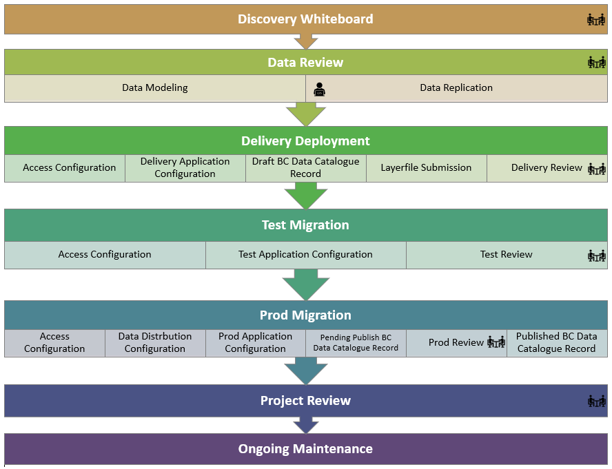

# BC GEOGRAPHIC WAREHOUSE DATA PUBLICATION

When data is published to the BCGW, it must undergo a rigorous and standardized publication process to ensure adherence to government data standards for quality and consistency.  DataBC has well documented Data Standards and Guidelines that are followed throughout the process for data publication.  

The workflows described below will guide you through what your responsibilities are as the client and how we work with you to load and publish your dataset in the BCGW.

_This page is written in the context that you have reviewed the documentation as listed below._

|**AUDIENCE**|  |  |  |
|:---:|:---:|:---:|:---:|
| *Data Publishers* | *Business Analysts* | *Business Portfolio Managers* | *Application Administrators* |

-----------------------
## Table of Contents
+ [**DOCUMENTATION REVIEW**](#documentation-review)
+ [**DATA PUBLICATION - AM I READY?**](#data-publication---am-i-ready)
+ [**DATA PREPARATION CONSULTATION**](#data-preparation-consultation)
+ [**DATA PUBLICATION**](#data-publication)
	+ [What to expect next?](#what-to-expect-next)
	+ [Data Publication Workflow](#data-publication-workflow)
	+ [Technical Whiteboard](#technical-whiteboard)
	+ [Delivery Deployment](#delivery-deployment)
	+ [Test Deployment](#test-deployment)
	+ [Production Deployment](#production-deployment)
+ [**Project Review**](#project-review)
  
-----------------------

## DOCUMENTATION REVIEW

The first step in the process is to review the following documentation: 
+ [Before You Start](dsg_before_you_start.md)
+ [BCDC Standards and Guidelines](dsg_bcdc.md) (all)
+ [BCGW Standards and Guidelines](dsg_bcgw.md) (all)
+ [Common Data Standards and Guidelines](dsg.md) (all)
+ [Data Governance](dg.md)
+ [Open Data](open_data.md)

------------------------------

## DATA PUBLICATION - AM I READY?

Wondering if your data is ready for publishing in the BCGW, or what else you need to do to prepare for the publication process? There are some considerations you'll need to think about and have ready to discuss with DataBC before you initate a request to publish your data. 

Review the key questions below and be ready to discuss with DataBC before you initate a request to publish your data.

|Question|Notes|
|:---|:---|
|Have you read and do you understand the information provided in the Documentation Review section?|Please open a ticket with the [Data Systems & Services request system](https://dpdd.atlassian.net/servicedesk/customer/portal/1/group/5/create/16) if you have additional questions not addressed in our documentation.|
|Has the [Data Custodian](dsg_bcdc_roles_responsibilities.md#the-data-custodian) approved the publication of this dataset for your business area?| |
|Is the source data in a production state and ready for publishing?|Not sure? See: [Data Preparation Consultation](#data-preparation-consultation)
|Have you completed the [Dataset Model](images/Dataset_Model_Current_TEMPLATE.xlsx) file?|The Dataset Model describes your source data structure (fields, data type, data length, column comments). |
|For spatial datsets: Do you have GIS staff available to support QA/QC and the creation of layer files?|_For buisness areas without GIS support, this service can be provided by DataBC_|
|Do you have a Data Manager identified who will be responsible for the day-to-day maintenance of the source data?|_Must be in place prior to initiating a data publicaiton request_|
|Are there specific security needs that will need to be configured for access to the data (other than government or public access)?| |
|Does your business area have a presence in the BC Data Catalogue?|_If not, DataBC can set this up for you with approval from the Data Custodian_|
|Does your business area have a defined BC Data Catalogue editor that will create and maintain the metadata throughout its lifecycle?|_If not, DataBC can configure a new editor(s) with approval from the Data Custodian_|
|How will your data be licensed when published?|See [Licences](dps_licences.md)|
|Are there time constraints that will have an impact on the publication date for the data (tied to legislation or software releases)?| |

[RETURN TO TOP][1] 

--------------------------------

## DATA PREPARATION CONSULTATION

If you require additional support to prepare your source data for publication, please open a ticket with the [Data Systems & Services request system](https://dpdd.atlassian.net/servicedesk/customer/portal/1/group/5/create/16).

--------------------------------

## DATA PUBLICATION

Ready to publish your data? Please open a ticket with the [Data Systems & Services request system](https://dpdd.atlassian.net/servicedesk/customer/portal/1/group/5/create/28)

### What to expect next?

#### Request Confirmation

Once you have submitted a request for data publication, DataBC will send you a confirmation of your request, usually within a few business days.

### Data Publication Workflow

The following illustration shows the steps in the data publication process:

[RETURN TO TOP][1] 

#### Discovery Whiteboard

Discussion in this session will focus on:
1. Reviewing your request to share data
1. Reviewing the questions in [Data Publication - Am I Ready?](#data-publication-am-i-ready)
1. Describing the [Data Publication Workflow](#data-publication-workflow)
1. Reviewing the [Dataset Model](images/Dataset_Model_Current_TEMPLATE.xlsx) and [Data Delivery Guidelines](dsg_bcgw_data_delivery.md)
1. How DataBC will access your source data
1. Scheduling the Technical Whiteboard meeting

[RETURN TO TOP][1] 

-------------------------------

### Technical Whiteboard

Discussion in this session will focus on:
1. Review of the [Dataset Model](dsg_bcgw_data_delivery.md#dataset-model-completed-and-reviewed) and source data
1. Finalizing the Dataset Model, including structure and field descriptions
1. Security model for the database
1. Security for iMapBC and Data Distribution, as applicable
1. [Replication mechanism](dsg_bcgw_data_replication.md) and frequency
1. Scheduling the Delivery Deployment meeting

[RETURN TO TOP][1] 

-------------------------------

### Delivery Deployment

Discussion in this session will focus on:
1. Reviewing the data and access configurations in BCGW Delivery with the client
1. Issues with data or access configuration, or a related map application will be addressed
	1. If simple modifications are required, DataBC will apply these during this session.
1. Modifications to the data model based on the review
1. Layer file presentation creation (if applicable)
1. Data Licencing
1. BC Data Catalogue metadata record creation
1. Client approval for migration to BCGW Test 
1. Scheduling the Test Deployment meeting
 
[RETURN TO TOP][1] 

-------------------------------

### Test Deployment

Discussion in this session will focus on:

1. Reviewing the data and access configurations in BCGW Test with the client
1. Issues with data or access configuration, or a related map application will be addressed
	1. If modifications are required, DataBC will apply these to the Delivery environment outside of this session.
1. Reviewing layer file presentations in iMapBC Test (where applicable)
1. Reviewing an updated DataBC hosted map application in Test with the client (where applicable)
	1. Modifications to a related map application will be addressed
1. Reviewing Draft BC Data Catalogue record(s)
1. Client approval for migration to BCGW Prod
1. Scheduling the Production Deployment meeting

[RETURN TO TOP][1] 

-------------------------------

### Production Deployment

Discussion in this session will focus on:
1. Reviewing the data and security configurations in BCGW Production with the client
1. Issues with data or access configuration, or a related map application will be addressed
	1. If modifications are required, DataBC will apply these to the Delivery and Test environments outside of this session.
1. Reviewing layer file presentations in iMapBC Production and the Layer Library (where applicable)
1. Reviewing and publishing the BC Data Catalogue record
1. Reviewing an updated DataBC hosted map application in Test with the client (where applicable)
	1. Modifications to a related map application will be addressed
1. Client accepts production deployments
1. Scheduling the Project Review meeting

[RETURN TO TOP][1] 

-----------------------

## Project Review

Discussion in this session will focus on:
1. Client feedback on the project
1. Managing your data and metadata thoguhout its lifecycle.

[RETURN TO TOP][1] 

------------------------  

Do you still have questions for DataBC about the data publication process? If so, please open a ticket with the [Data Systems & Services request system](https://dpdd.atlassian.net/servicedesk/customer/portal/1/group/5/create/16) 

------------------------  

[1]: #bc-geographic-warehouse-data-publication
