# USING THE DATABC FME FRAMEWORK

The DataBC Feature Manipulation Engine (FME) Framework was written to allow the structure of FME scripts used in the DataBC program to be standardized, making it easier to maintain and troubleshoot these scripts.  

This page provides instructions on developing a FME Workbench file to DataBC FME Framework standards.

|**AUDIENCE**|  |  |
|:---:|:---:|:---:|
| *Data Publishers* | *Data Architects* | *Vendors* | 

## Table of Contents
+ [**DATABC'S FME FRAMEWORK**](#databcs-fme-framework)
	+ [Overview of how to use the DataBC FME Framework](#overview-of-how-to-use-the-databc-fme-framework)
+ [**ACCESSING THE FME FRAMEWORK**](#accessing-the-fme-framework)
	+ [Allow Reader Feature Type Editing](#allow-reader-feature-type-editing)
	+ [Enable FME Framework Customizations](#enable-fme-framework-customizations)
+ [**CREATING AN FMW**](#creating-an-fmw)
	+ [If developing on a GTS server, configure a dbCreds.json file](#if-developing-on-a-gts-server-configure-a-dbcredsjson-file)
	+ [Add the Source Reader(s)](#add-the-source-readers)
	+ [Define the Source Reader User Parameters](#define-the-source-reader-user-parameters)
	+ [Add the Destination Writer](#add-the-destination-writer)
	+ [Define the Destination Writer User Parameters](#define-the-destination-writer-user-parameters)
	+ [Configure the FMW Framework Parameters](#configure-the-fmw-framework-parameters)
	+ [Define the Workspace Parameters](#define-the-workspace-parameters)
	+ [Add the Transformers](#add-the-transformers)
+ [**APPENDIX 1 - NOTIFICATIONS**](#appendix-1---notifications)
+ [**APPENDIX 2 - NON-BCGW DESTINATIONS**](#appendix-2---non-bcgw-destinations)
	+ [BC Data Catalogue File Store](#bc-data-catalogue-file-store)
	+ [CSV, SHP, and FGDB Files](#csv-shp-and-fgdb-files)
+ [**APPENDIX 3 - KIRK PREPARATION**](#appendix-3---kirk-preparation)
+ [**APPENDIX 4 - FINAL PUBLICATION CHECKLIST**](#appendix-4---final-publication-checklist)
	+ [General](#general)
	+ [Reader/Writer Published and Private Parameters](#readerwriter-published-and-private-parameters)
	+ [Framework Parameters](#framework-parameters)
	+ [Source Readers](#source-readers)
	+ [Destination Writers](#destination-writers)
	+ [Workspace Parameters](#workspace-parameters)
	+ [Documentation](#documentation)
  
-----------------------

## DATABC'S FME FRAMEWORK

The DataBC FME Framework builds upon Safe Software's stock FMW by adding:

1. A published and private parameter standard with some automated / scripted parameters, and

1. Python procedures that runs at Startup and Shutdown.

The purpose / goals of the DataBC FME Framework are to allow DataBC to:

1. Easily identify the relationships between replication scripts, their source datasets and their destination datasets.  This is accomplished using standardized published parameters.

1. Easily add new functionality to either startup / shutdown procedures that can be applied to all replications without the need to edit any of the FMWs.

1. Keep passwords external to FME scripts; with the Framework, they are securely retrieved from our password management application at run time.

The DataBC FME Framework is available to developers outside of DataBC on the GTS 10.6 Kamloops Server.  Access to the GTS environments can be requested by completing the [_GTS / ArcGIS Desktops - Access Request_](https://apps.nrs.gov.bc.ca/int/jira/servicedesk/customer/portal/1/create/261) form.


### ​Overview of how to use the DataBC FME Framework

1. Start with a new FME Framework FMW file or one of the templates, available [_here_](https://gogs.data.gov.bc.ca/datasets/templates/src/branch/master/delivery_kit/gsr_whse/WHSE_IMAGERY_AND_BASE_MAPS/N.N.N_descriptive_name_of_release/dataload/gsr_zzz_sv_staging_csv_bcgw.fmw) for loading the GSR tables and [_here_](https://gogs.data.gov.bc.ca/datasets/templates/src/branch/master/delivery_kit/xyz_whse/WHSE_SCHEMA_NAME/dataload/bcgw_table_name_staging_csv_bcgw.fmw) for other dataloads.   
1. If developing on a GTS server, configure a dbCreds.json file. A template dbCreds.json file is available [_here_](https://gogs.data.gov.bc.ca/datasets/templates/src/branch/master/delivery_kit/xyz_whse/WHSE_SCHEMA_NAME/dataload/dbCreds.json). Copy the [_dbCreds.json file_](https://gogs.data.gov.bc.ca/datasets/templates/src/branch/master/delivery_kit/xyz_whse/WHSE_SCHEMA_NAME/dataload/dbCreds.json) and [_this connection file_](https://gogs.data.gov.bc.ca/datasets/templates/src/branch/master/delivery_kit/xyz_whse/WHSE_SCHEMA_NAME/dataload/bcgw-i.bcgov__idwdlvr1.bcgov.sde)  to the directory containing the FMW that you are writing.
1. Using the GTS 10.6 Kamloops environment, start FME by navigating to and executing the [_FME Launch script_](\\spatialfiles\work\srm\kam\Workarea\kjnether\DataBCFmeFramework\fmeDBCFrameworkLauncher_10_6.cmd).
1. Add and configure the reader(s).
1. Add and configure the writer(s).
1. Define the basic Framework parameters to control startup, shutdown, logging, and file change detection.
1. Add in the File Change Detection transformer and any other transformers needed.
1. Test the FMW by populating to the BCGW delivery environment.

[RETURN TO TOP][1] 

-----------

## ACCESSING THE FME FRAMEWORK

Before using the FME Framework for the first time there are a couple of FME options that have to be reset.  These steps should only have to be done once.

### Allow Reader Feature Type Editing

The FME Framework requires you to be able to link published parameters to reader feature types (tables).  By default, FME will not allow you to do this. You must explicitly allow FME to **Allow reader feature type editing**, by following these steps:

1. Open FME Workbench and from the menu bar
1. Choose **Tools** → **FME Options**
1. Select **Workbench** in the left hand panel of the **FME Options** popup
1. Check the box **Allow reader feature type editing** in the **General Defaults** section

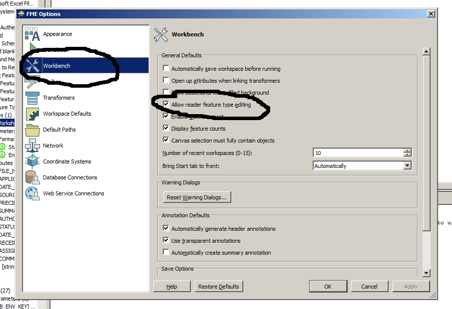

### Enable FME Framework Customizations

1. Open FME Workbench and on the menu bar
1. Choose **Tools** → **FME Options**
1. Select **Default Paths** in the left hand panel of the **FME Options** popup
1. Click on the **+** symbol in the **Shared FME Folders** section
1. Enter this file: **\\spatialfiles\work\srm\kam\Workarea\kjnether\DataBCFmeFramework\fmeCustomizations**
1. Click **YES** on the popup to create one or more of the required subfolders
1. Click **OK**

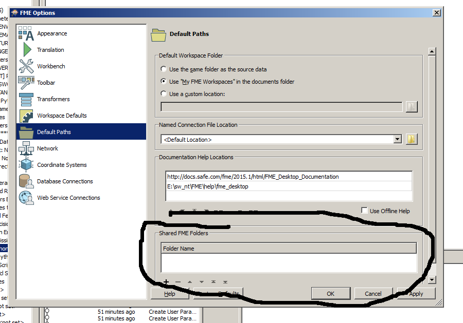

[RETURN TO TOP][1] 

-----------------------------------------------------------

## CREATING AN FMW

+ Start with a new FMW or one of the [_FME Framework templates_](https://gogs.data.gov.bc.ca/datasets/templates/src/branch/master/delivery_kit).
	+ [_For Loading to a GSR view_](https://gogs.data.gov.bc.ca/datasets/templates/src/branch/master/delivery_kit/gsr_whse/WHSE_IMAGERY_AND_BASE_MAPS/N.N.N_descriptive_name_of_release/dataload/gsr_zzz_sv_staging_csv_bcgw.fmw) 
	+ [_For Loading to any other view_](https://gogs.data.gov.bc.ca/datasets/templates/src/branch/master/delivery_kit/xyz_whse/WHSE_SCHEMA_NAME/dataload/bcgw_table_name_staging_csv_bcgw.fmw)
+ Always test your scripts in the BCGW Delivery environment before submitting them to DataBC.

### If developing on a GTS server, configure a dbCreds.json file

The DataBC FME Framework, when run on a DataBC FME Workbench workstation or on FME Server, retrieve passwords from a password management system accessible only by DataBC processes. GTS servers do not have access to this password management system, so scripts that are running on the GTS environment need some other way of retrieving passwords. This is done through supplying a file called 'dbCreds.json' in the same directory in which the FMW being run by FME Workbench is located. Example files are available in Gogs in the same directories as the sample FMW's. Copy the  example file to the same directory as your FMW, then open it up and add the required parameters.

When you deliver the FMW to DataBC, do not include the dbCreds.json file with the files you deliver.  Instead arrange with DataBC [Data Architecture Services](mailto:databc.da@gov.bc.ca) to have the passwords included into our password management system.  
  
[RETURN TO TOP][1] 

---------------------------------------------------------------

### Add the Source Reader(s)

FME Readers are added to a workspace using then menu item **Readers** → **Add Readers...**  

##### FeatureReader and other "Reading" Transformers

In general, FME scripts use FME Readers to read source dataset records. There are, however,  occasions where it is preferable to use a FeatureReader transformer, a SQL Creator transformer, or a SQL Executor transformer instead of an FME Reader. In particular, if the script implements a series of consecutive read-transform-write patterns, with subsequent read-transform-writes being executed depending on the success of earlier ones, then it is preferable to use FeatureReader and FeatureWriter transformers in a single script rather than using traditional Readers and Writers in multiple scripts called by FMEServerJobSubmitter. FeatureReader transformers can be inserted using the menu item **Transformers** → **Add Transformer...** → **FeatureReader**

The following sections describe the properties to enter when adding a new Reader or equivalent transformer.

#### Comma Separated Value (CSV)
+ Comma Separated Value (.csv) files are a common source of data for the BCGW. They may be spatial (having latitude and longitude columns) or non-spatial.  Common locations of source CSV files are:
	1. The read-only staging area `\\data.bcgov\data_staging_ro\BCGW\...`
	1. The BC Data Catalogue file store: `https://catalogue.data.gov.bc.ca/dataset/<dataset permalink>/resource/<resource permalink>/download/<filename>.csv`
	
	|Field|Value|
	|:---|:---|
	|**Format**|CSV (Comma Separated Value)|
	|**Dataset**|Select the .csv file to be read. <br>When specifying a staging area file, use the read-only path (\\data.bcgov\data_staging_ro\bcgw\...)|
	|**Parameters**|normally the defaults are fine|

#### Esri SDE Geodatabase (GEODATABASE_SDE)
+ Tables and views registered with SDE or the geodatabase in an Oracle SDE-enabled database should be read using the GEODATABASE_SDE reader.

	|Field|Value|
	|:---|:---|
	|**Format**|Esri Geodatabase (ArcSDE Geodb) |
	|**Dataset**|N/A |
	|**Parameters**|specify Connection File, check Override Credentials, specify Username, Password, Table List |

When adding a GEODATABASE_SDE reader, specify hard-coded values for the parameters listed above; they will be overridden by FME parameters at a later stage in the configuration.

#### Esri File (gdb) Geodatabase (GEODATABASE_FILE)
+ Common locations of source file geodatabases  are:
	1. The read-only staging area `\\data.bcgov\data_staging_ro\BCGW\...`
	1. The BC Data Catalogue file store: `https://catalogue.data.gov.bc.ca/dataset/<dataset permalink>/resource/<resource permalink>/download/<filename>.zip`
	
	|Field|Value|
	|:---|:---|
	|**Format**|Esri Geodatabase (File Geodb) <br> Do not use Esri Geodatabase (File Geodb Open API)|
	|**Dataset**|select the .gdb folder. <br>When specifying a staging area file, use the read-only path (\\data.bcgov\data_staging_ro\bcgw\...) |
	|**Parameters**|Specify the feature types to read. |

#### Esri Shapefile (SHP)
+ Common locations of source shapefiles  are:
	1. The read-only staging area `\\data.bcgov\data_staging_ro\BCGW\...`
	1. The BC Data Catalogue file store: `https://catalogue.data.gov.bc.ca/dataset/<dataset permalink>/resource/<resource permalink>/download/<filename>.zip`

	|Field|Value|
	|:---|:---|
	|**Format**|Esri Shapefile|
	|**Dataset**|Select the .shp file to be read. <br>When specifying a staging area file, use the read-only path (\\data.bcgov\data_staging_ro\bcgw\...) |
	|**Parameters**|Normally the defaults are fine |

#### GeographicJavaScript Object Notation (GeoJSON)
+ Common locations of source GeoJSON files  are:
	1. Operational systems, through a REST web service (e.g., https://gwells-prod.pathfinder.gov.bc.ca/gwells/api/v1/gis/wells)
	1. The BC Data Catalogue file store: `https://catalogue.data.gov.bc.ca/dataset/<dataset permalink>/resource/<resource permalink>/download/<filename>.json`
	
	|Field|Value|
	|:---|:---|
	|**Format**|GeoJSON (Geographic JavaScript Object Notation)|
	|**Dataset**|Select the .json or .geojson file to be read or the URL to a web accessible file|
	|**Parameters**|Normally the defaults are fine |

#### Microsoft Access Database (MDB_ADO)
+ This reader is used in cases where the operational database management system is Microsoft Access and the database has been copied to the staging area. This is a fairly rare situation.
 
	|Field|Value|
	|:---|:---|
	|**Format**|Microsoft Access|
	|**Dataset**|Select the .mdb or .accdb file to be read. <br>When specifying a staging area file, use the read-only path (\\data.bcgov\data_staging_ro\bcgw\...)|
	|**Parameters**|Enter password, if needed, and select the tables to be read  |

#### Microsoft Excel (XLSX, XLS)
+ Some source spreadsheet datasets are in XLSX or XLS format rather than the open CSV format. This can be the case where there are other consumers of the spreadsheet who require to see the spreadsheet in the context of other sheets in the workbook. Having FME read from the XLSX/XLS workbook removes the need for the client to save an extra copy a the spreadsheet in CSV.
 
	|Field|Value|
	|:---|:---|
	|**Format**|Microsoft Excel|
	|**Dataset**|Select the .xlsx or .xls file to be read. <br>When specifying a staging area file, use the read-only path (\\data.bcgov\data_staging_ro\bcgw\...)|
	|**Parameters**|Select the sheet(s) to be read, the cell range(s), and columns.  |

#### Oracle Non-Spatial
+ This reader is used in cases where the input dataset is non-spatial and not registered with SDE or an SDE geodatabase.

	|Field|Value|
	|:---|:---|
	|**Format**|Oracle Non-Spatial |
	|**Dataset**|Embed Connection Parameters |
	|**Parameters**|specify **Service Name or Easy Connect**, **Username**, **Password**, **Table List**|

When adding the reader, specify hard-coded values for the parameters listed above; they will be overridden by FME parameters at a later stage in the configuration.

#### Oracle Spatial Object (SDO)
+ This reader is used in cases where the input dataset is spatial and not registered with SDE or an SDE geodatabase.

	|Field|Value|
	|:---|:---|
	|**Format**|Oracle Spatial Object |
	|**Dataset**|Embed Connection Parameters |
	|**Parameters**|specify **Service Name or Easy Connect**, **Username**, **Password**, **Table List** |

When adding the reader, specify hard-coded values for the parameters listed above; they will be overridden by FME parameters at a later stage in the configuration.

### Define the Source Reader User Parameters

Configuring an FME Reader or FeatureReader transformer involves creating one or more published or private parameters and then, in some cases, linking those parameters to FME Reader properties.  The parameters that are required differ according to which reader format type is being configured. The parameters and their properties are defined in the sections below, organized by reader format type.  

#### General comments

+ Unless otherwise specified below, all User Parameters should have a default value assigned and the *Optional* checkbox left unchecked.
+ Parameter types that are *Scripted* (Python) will automatically be defined as *Private* parameters.
+ When readers are created some *Published Parameters* are automatically created; these must be renamed, as described below, in order to be used with the FME Framework.
+ When specifying a source data file or directory in the standing area, specify the *read-only* path: `\\data.bcgov\data_staging_ro\bcgw`
+ When specifying multiple inputs, distinguish between them by changing the _1 suffix to _2, _3, etc. for inputs subsequent to the first.
+ When adding a reader or specifying connection parameters in a transformer (e.g., SQLCreator, FeatureReader, DatabaseJoiner, etc.) choose the _Embed Connection Parameters_ option in the __Dataset:__ field. Then click on the __Parameters__ button and specify hard-coded values for the connection parameters; they will be overridden by FME parameters at a later stage in the configuration.

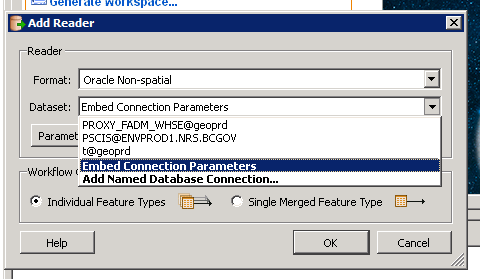

IMAGE SHOWING HARD-CODED PARAMETERS

#### Comma Separated Values (CSV)

This section describes the parameters that need to be defined when configuring a CSV reader.

##### Source CSV Path and Name (SRC_DATASET_CSV_1)

+ This parameter is for the source path and file name. When you add the CSV Reader to your FMW, FME will automatically create a published parameter with a name starting with "SourceDataset_CSV".  This parameter must be renamed:

   + Find the published parameter in the FMW named SourceDataset_CSV
   + Right click on it and choose "Edit Definition"
   + Change the "Name" property of the parameter to **SRC_DATASET_CSV_1**

+ If you source more than one CSV increment the numbers at the end of the parameter name.  Example:

   + SRC_DATASET_CSV_1
   + SRC_DATASET_CSV_2
   + SRC_DATASET_CSV_3
   
+ The following table defines the properties for **SRC_DATASET_CSV_1**:

	|Field|Value|
	|:---|:---|
	|**Published/Private**|published |
	|**Type**|Filename (Existing) or Filename (Multiple)|
	|**Name**|SRC_DATASET_CSV_1 |
	|**Prompt**|Source CSV (Comma Separated Value) File(s)|
	|**Configuration**|*.csv | 
	|**Attribute Assignment**|Default |
	|**Default Value**|Path to the CSV that is being replicated |
	|**Link From**|Reader → Source CSV (CommaSeparatedValue) File → Link to User Parameter → SRC_DATASET_FGDB_1 |

+ When specifying a staging area file, use the read-only path (\\data.bcgov\data_staging_ro\bcgw\...

#### Esri File Geodatabase (GDB)

This section describes the parameters that need to be defined when configuring a Esri File Geodatabase reader.

**NOTE**: If you are building an FMW that just reads from a FGDB and writes to the BCGW and does nothing in between but possibly rename columns and/or populate a primary key with a counter, then this ETL task might be doable using KIRK (*Keeping Information Replicated Kontinuously*).  See [_Appendix 4_](#appendix-4---kirk-preparation).

##### Source FGDB Path and Name (SRC_DATASET_FGDB_1)

+ This parameter describes the fgdb that contains the tables / feature classes that are to be read.  
   + Add the FGDB reader to the FMW that is being created.  
   + When the reader is created FME will automatically create a published parameter with a name starting with "SourceDataset_FILEGDB".  
   Find this parameter and edit it so that its name is "**SRC_DATASET_FGDB_1**"
+ The following table defines the properties for **SRC_DATASET_FGDB_1**:

	|Field|Value|
	|:---|:---|
	|**Published/Private**|published |
	|**Type**|Folder (Existing) |
	|**Name**|SRC_DATASET_FGDB_1 |
	|**Prompt**|Source File Geodatabase |
	|**Configuration**|N/A | 
	|**Attribute Assignment**|Default |
	|**Default Value**|Path to the directory of the FGDB that is being read. |
	|**Link From**|Reader → Source Geodatabase → Link to User Parameter → SRC_DATASET_FGDB_1 |

 When specifying a staging area directory, use the read-only path (\\data.bcgov\data_staging_ro\bcgw\...

##### Source Feature Name (SRC_FEATURE_1)

+ This parameter refers to the feature class that is being read in the FGDB described in the parameter SRC_DATASET_FGDB_1.  
+ After you have added the FileGeodb reader to the FMW:
   + Create a new published parameter with the name **SRC_FEATURE_1**, and set the Default Value to the feature class that is being read by the reader.
   + Now you need to link this parameter to the reader:
      + Find the reader in the Navigator window (upper left) right click on the feature type and select properties.
      + In the subsequent dialog, replace the value in General Parameters->Feature Class or Table Name with the string: **$(SRC_FEATURE_1)**

###### Multiple FGDB Feature Types

For FGDB sources it is important that you maintain a one to one relationship between SRC_DATASET_FGDB_# parameters and SRC_FEATURE_# parameters.  

**Example 1:**

In this example there are two different file geodatabases (Census2012.gdb, and Census2011.gdb) and we need to include the feature type "census_data2016" and "census_data2013" from each of them.  

1. Create two readers, one for each FGDB
1. Rename the parameters that refer to the FileGeodb to:
   + SRC_DATASET_FGDB_1 (refers to Census2011.gdb)
   + SRC_DATASET_FGDB_2 (refers to Census2013.gdb)
1. Create the parameters below with the following default values:
   + SRC_FEATURE_1 (Default Value=census_data2012)
   + SRC_FEATURE_2 (Default Value=census_data2013)
1. Finally ensure the SRC_FEATURE_1 are used by the reader by replacing references to the actual feature type with the string "**$(SRC_FEATURE_1)**" as described above.

**Example 2:**

In this example there is a single FGDB that contains multiple feature types that we want to read, for example "CensusMultiYear.gdb", containing three feature classes: CensusData_2006, CensusData_2011, CensusData_2016.

1. Create the reader for the FGDB that reads multiple feature types.

1. Rename the parameter "SourceDataset_FILEGDB" to **SRC_DATASET_FGDB_1** (referring to CensusMultiYear.gdb).

1. Now create two more parameters with the names:  
   + **SRC_DATASET_FGDB_2**
   + **SRC_DATASET_FGDB_3**. 
	
	Set the *Default Value* for each of these to $(SRC_DATASET_FGDB_1).
	The Screen shot below shows you how to do this.

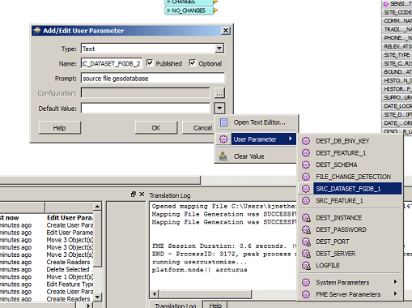

1. Add three **SRC_FEATURE_*n*** parameters:
   + SRC_FEATURE_1 (Default Value=CensusData_2006)
   + SRC_FEATURE_2 (Default Value=CensusData_2011)
   + SRC_FEATURE_3 (Default Value=CensusData_2016) 

+ The following table defines the properties for **SRC_FEATURE_*n***:

	|Field|Value|
	|:---|:---|
	|**Published/Private**|published |
	|**Type**|Text |
	|**Name**|SRC_FEATURE_*n* |
	|**Prompt**|The source feature class |
	|**Configuration**|N/A | 
	|**Attribute Assignment**|Default |
	|**Default Value**|The name of the feature class to read |
	|**Link From**|Reader → Feature Types → Properties → Feature Class or Table Name|

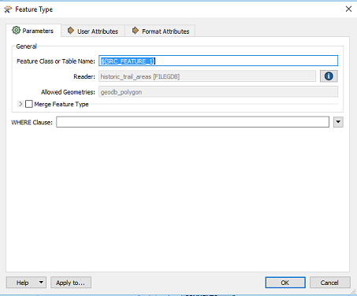

#### Esri Geodatabase (SDE_GEODATABASE)

This section describes the parameters that need to be defined when configuring a Esri SDE Geodatabase reader.

##### Source Proxy Account Name (SRC_ORA_PROXY_SCHEMA)

+ Use this parameter to specify the proxy account used to read the source table/view.  It will likely be different from the schema owner of the source table/view (SRC_ORA_SCHEMA). 

	|Field|Value|
	|:---|:---|
	|**Published/Private**|published |
	|**Type**|Text |
	|**Name**|SRC_ORA_PROXY_SCHEMA |
	|**Prompt**|Proxy used to login to the source database |
	|**Configuration**|N/A | 
	|**Attribute Assignment**|Default |
	|**Default Value**|the proxy account used to log in, e.g., BCGW$XXXX |
	|**Link From**|Reader → Parameters → Advanced → Override Username → Link to User Parameter → SRC_ORA_PROXY_SCHEMA |

##### Source Schema Owner Name (SRC_ORA_SCHEMA)

+ Use this parameter to specify the schema that owns the source table/view.
 
	|Field|Value|
	|:---|:---|
	|**Published/Private**|published |
	|**Type**|Text |
	|**Name**|SRC_ORA_SCHEMA |
	|**Prompt**|Source Database Schema|
	|**Configuration**|N/A | 
	|**Attribute Assignment**|Default |
	|**Default Value**|The owner (schema) of the table or view to be read, e.g., FORESTVIEW|
	|**Link From**|Reader → Feature Types → Properties → Feature Class or Table Name |

   


##### Source Feature Name (SRC_FEATURE_1)

+ Use this parameter to define the feature type to be read.  If multiple feature types are being read, create multiple parameters (SRC_FEATURE_1, SRC_FEATURE_2, etc.). See the examples in [_Multiple-FGDB-Feature-Types_](#Multiple-FGDB-Feature-Types) for a discussion on how to define multiple feature types.

	|Field|Value|
	|:---|:---|
	|**Published/Private**|published |
	|**Type**|Text |
	|**Name**|SRC_FEATURE_1 |
	|**Prompt**|Source table/view to be read and used in the replication |
	|**Configuration**N/A| | 
	|**Attribute Assignment**|Default |
	|**Default Value**|name of table or view, e.g., CUT_BLOCK_SHAPE|
	|**Link From**|Reader → Feature Types → Properties → Feature Class or Table Name |

  

##### Source Host (SRC_HOST)

+ Use this parameter to define the name of the host on which the source Oracle database resides.

	|Field|Value|
	|:---|:---|
	|**Published/Private**|published |
	|**Type**|Text |
	|**Name**|SRC_HOST |
	|**Prompt**|The source oracle database host |
	|**Configuration**|N/A | 
	|**Attribute Assignment**|Default |
	|**Default Value**|The source oracle database host, e.g., lrmbctsp.nrs.bcgov |
	|**Link From**|nowhere - used internally by **SRC_SDE_CONNECTIONFILE**  |

##### Source Port (SRC_PORT)

+ This parameter is only needed if the source port is different from the standard Oracle port 1521.

	|Field|Value|
	|:---|:---|
	|**Published/Private**|published |
	|**Type**|Text |
	|**Name**|SRC_PORT |
	|**Prompt**|The port that the database listener is connected to |
	|**Configuration**|N/A | 
	|**Attribute Assignment**|Default |
	|**Default Value**|Oracle port number, when not 1521 |
	|**Link From**|nowhere - used internally by **SRC_SDE_CONNECTIONFILE**  |

##### Source Service Name (SRC_ORA_SERVICENAME)
+ 
	|Field|Value|
	|:---|:---|
	|**Published/Private**|published |
	|**Type**|Text |
	|**Name**|SRC_ORA_SERVICENAME |
	|**Prompt**|Source Oracle service name|
	|**Configuration**|N/A | 
	|**Attribute Assignment**|Default |
	|**Default Value**|Source service name, e.g., DBP06.NRS.BCGOV |
	|**Link From**|nowhere - used internally by **SRC_SDE_CONNECTIONFILE**  |


##### Source Schema Owner Password (SRC_ORA_PASSWORD)
+ 
	|Field|Value|
	|:---|:---|
	|**Published/Private**|private |
	|**Type**|Scripted (Python) |
	|**Name**|SRC_ORA_PASSWORD |
	|**Prompt**|N/A |
	|**Configuration**|N/A | 
	|**Attribute Assignment**|Default |
	|**Default Value**|import DataBCFMWTemplate<br>params = DataBCFMWTemplate.CalcParams(FME_MacroValues)<br>srcPass = params.getSourcePassword()<br>return srcPass |
	|**Link From**|Reader → Parameters → Advanced → Override Username → Link to User Parameter → SRC_ORA_PASSWORD |

##### Source Database Connection File (SRC_SDE_CONNECTIONFILE)
+ 
	|Field|Value|
	|:---|:---|
	|**Published/Private**|private |
	|**Type**|Scripted (Python) |
	|**Name**|SRC_SDE_CONNECTIONFILE |
	|**Prompt**|N/A |
	|**Configuration**|N/A| 
	|**Attribute Assignment**|Default |
	|**Default Value**|import DataBCFMWTemplate<br>params = DataBCFMWTemplate.CalcParams(FME_MacroValues)<br>connFile = params.getSrcDatabaseConnectionFilePath()<br>return connFile |
	|**Link From**|Reader → Parameters → Connection File → Link to User Parameter → SRC_SDE_CONNECTIONFILE |

When run from either DataBC's FME Workbench workstation or DataBC's FME Server machine, the connection file used by the **SDE_GEODATABASE** reader will get created automatically. The process will read the parameters **SRC_HOST** and **SRC_ORA_SERVICENAME** to calculate the name of the connection file.  Then the framework will create those connection files. The connection file will be named <host>__<servicename>.sde

However, when run on the GTS environment, the framework will calculate the name of the sde connection file, but **it will not attempt to create it**. It will look for this connection file in the directory of the FMW file that is being run. For this to work the developer of the FMW will have to create the connection file either using arcpy or ArcCatalog. The name of the connection file should be <host>__<servicename>.sde, e.g., lrmbctsp.nrs.bcgov__DBP06.NRS.BCGOV.sde. If the name of your connection file is incorrect you will get an error message that tells you what name the framework is expecting the connection file to be called.


#### Esri Shapefile (SHP)

+ This section describes the parameters that need to be defined when configuring a Esri Shapefile reader.
+ Rename the automatically created Published Parameter **SourceDataset_SHP** to **SRC_DATASET_SHP_1**.

##### Source Shapefile Name (SRC_DATASET_SHP_1)
+ 
	|Field|Value|
	|-----|-----|
	|**Published/Private**|published |
	|**Type**|Filename (Existing)|
	|**Name**|SRC_DATASET_SHP_1 |
	|**Prompt**|Source Esri Shapefile(s)|
	|**Configuration**|*.shp
	|**Attribute Assignment**|Default |
	|**Default Value**|Path of the Shapefile (with .shp extension), e.g.,\\data.bcgov\data_staging_ro\BCGW\administrative_boundaries\ALC_Panel_regions.shp|
	|**Link From**|Reader → Source Esri Shape File(s) → Link to User Parameter → SRC_DATASET_SHP_1 |


##### Source Feature Name (SRC_FEATURE_1)
+ 
	|Field|Value|
	|-----|-----|
	|**Published/Private**|published |
	|**Type**|Text |
	|**Name**|SRC_FEATURE_1 |
	|**Prompt**|Source Feature class |
	|**Configuration**|N/A | 
	|**Attribute Assignment**|Default |
	|**Default Value**|Name of the shapefile without the .shp extension, e.g., ALC_Panel_regions |
	|**Link From**|N/A |

#### GeoJSON

+ This section describes the parameters that need to be defined when configuring a GeoJSON reader.
+ Rename the automatically created Published Parameter **SourceDataset_GEOJSON** to **SRC_GEOJSON_FILE_1**.


##### Source GeoJSON File Name (SRC_GEOJSON_FILE_1)
+ 
	|Field|Value|
	|-----|-----|
	|**Published/Private**|published |
	|**Type**|N/A |
	|**Name**|SRC_GEOJSON_FILE_1 |
	|**Prompt**|Source GeoJSON File or URL |
	|**Configuration**|N/A | 
	|**Attribute Assignment**|N/A |
	|**Default Value**|Source GeoJSON File or URL, e.g., https://gwells-prod.pathfinder.gov.bc.ca/gwells/api/v1/gis/aquifers |
	|**Link From**|Reader → Source GeoJSON File or URL → Link to User Parameter → SRC_DATASET_SHP_1  |

#### Microsoft Access Database (MDB_ADO)

This section describes the parameters that need to be defined when configuring a Microsoft Access database reader.


##### Source Access Database File Name (SRC_DATASET_MDBADO_1)

+ This parameter is for the source path and file name.
+ Rename the automatically created Published Parameter **SourceDataset_ADO_MDB** to **SRC_DATASET_MDBADO_1**.

	|Field|Value|
	|-----|-----|
	|**Published/Private**|published |
	|**Type**|Filename (Multiple) |
	|**Name**|SRC_DATASET_MDBADO_1 |
	|**Prompt**|Source Access Database |
	|**Configuration**| *.mdb, *.accdb | 
	|**Attribute Assignment**| Default |
	|**Value**|Path to the .mdb or .accdb file that is being read. |
	|**Link From**|Reader → Source Microsoft Access Database File(s) → Link to User Parameter → SRC_DATASET_MDBADO_1  |

##### Source Feature Name (SRC_FEATURE_1)

+ This parameter is for the source table or view.

	|Field|Value|
	|-----|-----|
	|**Published/Private**|published |
	|**Type**|Text |
	|**Name**|SRC_FEATURE_1 |
	|**Prompt**|The source table |
	|**Configuration**|N/A | 
	|**Attribute Assignment**|Default |
	|**Default Value**|the feature class that is being read by the reader, e.g., BH_SITE_LITHOLOGY_VIEW |
	|**Link From**| |

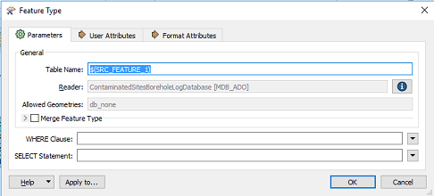

#### Microsoft Excel (XLSX)

This section describes the parameters that need to be defined when configuring a Microsoft Excel reader.

##### Source Excel File Name (SRC_DATASET_XLS_1)

+ This parameter is for the source path and file name.
+ Rename the automatically created Published Parameter **SourceDataset_XLSR** to **SRC_DATASET_XLS_1**.

	|Field|Value|
	|-----|-----|
	|**Published/Private**|published |
	|**Type**|Filename (Multiple) |
	|**Name**|SRC_DATASET_XLS_1 |
	|**Prompt**|Source Microsoft Excel File(s) |
	|**Configuration**|*.xlsx | 
	|**Attribute Assignment**|Default |
	|**Default Value**|Path to source Excel file |
	|**Link From**|Reader → Source Microsoft Excel File(s) → Link to User Parameter → SRC_DATASET_XLS_1  |


##### Source Feature Name (SRC_FEATURE_1)

+ This parameter is for the source sheet within the Excel file

	|Field|Value|
	|-----|-----|
	|**Published/Private**|published |
	|**Type**|Text |
	|**Name**|SRC_FEATURE_1 |
	|**Prompt**|The source Excel file sheet name |
	|**Configuration**|N/A| 
	|**Attribute Assignment**|Default |
	|**Default Value**|the name of the sheet that is being read by the reader, e.g., BC_HEX_V3, Sheet1 |
	|**Link From**|Reader → Feature Types → Properties -> Sheet Name |

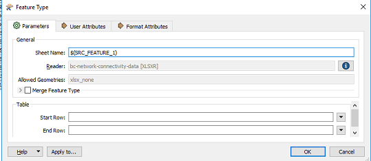

#### Oracle Spatial Object (SDO) and Non-Spatial

This section applies to any reader that natively connects to an Oracle database.  This includes:

+ Oracle Non-Spatial (ORACLE_NONSPATIAL)
+ Oracle Spatial Object (ORACLE_SPATIAL)

##### Source Proxy Account Name (SRC_ORA_PROXY_SCHEMA)

+ Use this parameter to specify the proxy account used to read the source table/view.  It will likely be different from the schema owner of the source table/view. 

	|Field|Value|
	|:---|:---|
	|**Published/Private**|published |
	|**Type**|Text |
	|**Name**|SRC_ORA_PROXY_SCHEMA |
	|**Prompt**|Proxy used to login to the source database |
	|**Configuration**|N/A | 
	|**Attribute Assignment**|Default |
	|**Default Value**|the proxy account used to log in, e.g., BCGW$XXXX |
	|**Link From**|Reader → Parameters → Advanced → Override Username → Link to User Parameter → SRC_ORA_PROXY_SCHEMA |

##### Source Schema Owner Name (SRC_ORA_SCHEMA)

+ Use this parameter to specify the schema that owns the source table/view.

	|Field|Value|
	|:---|:---|
	|**Published/Private**|published |
	|**Type**|Text |
	|**Name**|SRC_ORA_SCHEMA |
	|**Prompt**|Source Database Schema|
	|**Configuration**|N/A | 
	|**Attribute Assignment**|Default |
	|**Default Value**|The owner (schema) of the table or view to be read, e.g., FORESTVIEW|
	|**Link From**|Reader → Feature Types → Properties → Feature Class or Table Name |

	

##### Source Feature Name (SRC_FEATURE_1)

+
	|Field|Value|
	|:---|:---|
	|**Published/Private**|published |
	|**Type**|Text |
	|**Name**|SRC_FEATURE_1 |
	|**Prompt**|Source table/view to be read and used in the replication |
	|**Configuration**|N/A |
	|**Attribute Assignment**|Default |
	|**Default Value**|name of table or view, e.g., CUT_BLOCK_SHAPE|
	|**Link From**|Reader → Feature Types → Properties → Feature Class or Table Name |

	  

##### Source Service Name (SRC_ORA_SERVICENAME)
+ 
	|Field|Value|
	|:---|:---|
	|**Published/Private**|published |
	|**Type**|Text |
	|**Name**|SRC_ORA_SERVICENAME |
	|**Prompt**|Source Oracle service name|
	|**Configuration**|N/A | 
	|**Attribute Assignment**|Default |
	|**Default Value**|Source service name, e.g., DBP06.NRS.BCGOV |
	|**Link From**|nowhere - used internally by **SRC_EASYCONNECT**  |


##### Source Host (SRC_HOST)
+ 
	|Field|Value|
	|:---|:---|
	|**Published/Private**|published |
	|**Type**|Text |
	|**Name**|SRC_HOST |
	|**Prompt**|The source oracle database host |
	|**Configuration**|N/A | 
	|**Attribute Assignment**|Default |
	|**Default Value**|The source oracle database host, e.g., lrmbctsp.nrs.bcgov |
	|**Link From**|nowhere - used internally by **SRC_EASYCONNECT**  |

##### Source Port (SRC_PORT)

+ This parameter is only needed if the source port is different from the standard Oracle port 1521.

	|Field|Value|
	|:---|:---|
	|**Published/Private**|published |
	|**Type**|Text |
	|**Name**|SRC_PORT |
	|**Prompt**|The port that the database listener is connected to |
	|**Configuration**|N/A | 
	|**Attribute Assignment**|Default |
	|**Default Value**|Oracle port number, when not 1521 |
	|**Link From**|nowhere - used internally by **SRC_EASYCONNECT**  |

##### Source Schema Owner Password (SRC_ORA_PASSWORD)
+ 
	|Field|Value|
	|:---|:---|
	|**Published/Private**|private |
	|**Type**|Scripted (Python) |
	|**Name**|SRC_ORA_PASSWORD |
	|**Prompt**|N/A |
	|**Configuration**|N/A | 
	|**Attribute Assignment**|Default |
	|**Default Value**|import DataBCFMWTemplate<br>params = DataBCFMWTemplate.CalcParams(FME_MacroValues)<br>srcPass = params.getSourcePassword()<br>return srcPass | 
	|**Link From**|Reader → Parameters → Advanced → Override Username → Link to User Parameter → SRC_ORA_PASSWORD |

##### Source Easy Connect String (SRC_EASYCONNECT)
+ 
	|Field|Value|
	|:---|:---|
	|**Published/Private**|private |
	|**Type**|Scripted (Python) |
	|**Name**|SRC_EASYCONNECT |
	|**Prompt**|N/A |
	|**Configuration**|N/A| 
	|**Attribute Assignment**|Default |
	|**Default Value**|import DataBCFMWTemplate<br>params = DataBCFMWTemplate.CalcParams(FME_MacroValues)<br>ecStr = params.getSrcEasyConnectString()<br>return ecStr |
	|**Link From**|Reader → Parameters → Service Name or Easy Connect → Link to User Parameter → SRC_EASYCONNECT |

### Add the Destination Writer

In general, FME scripts use FME Writers to write to destination datasets.  There are, however,  occasions where it is preferable to use a FeatureWriter transformer instead of an FME Writer. In particular, if the script implements a series of consecutive read-transform-write patterns, with subsequent read-transform-writes being executed depending on the success of earlier ones, then it is preferable to use FeatureReader and FeatureWriter transformers in a single script rather than using traditional Readers and Writers in multiple scripts called by FMEServerJobSubmitter. 


#### Esri SDE Geodatabase (GEODATABASE_SDE)
+ Adding this writer will take you through a series of panels, each of which include some of the fields defined below.

	|Field/Panel|Value/Action|
	|-----|-----|
	|**Format**|Esri Geodatabase (ArcSDE Geodb) |
	|**Dataset**|N/A |
	|**Feature Class or Table Definition**|select **Import from Dataset...**|
	|**Esri Geodatabase (ArcSDE Geodb) Parameters panel**|Enter Connection File name, check **Override Credentials** box, and enter Username and Password, select the table to be written to |
	|**Feature Type Panel**|Change *Truncate Table* to **Yes**|

The connection file specified can be one generated using ArcCatalog or ArcPy, pointing to the BCGW delivery environment. This hard-coded connection file, and the specified username and password will be overridden in a subsequent step.

The Feature Type Panel noted above can be clicking the sprocket on the writer icon in the **Main** window after adding the writer.

#### Oracle Non-Spatial 

+ Adding this writer will take you through a series of panels, each of which include some of the fields defined below.

	|Field/Panel|Value/Action|
	|-----|-----|
	|**Format**|Oracle Non-Spatial |
	|**Dataset**|select Embed Connection Parameters |
	|**Parameters**|enter Service Name or Easy Connect (e.g., bcgw-i.bcgov/dwdlvr1.bcgov), Username and Password|
	|**Table Definition**|select Import from Dataset...|
	|**Oracle Spatial Object Parameters Panel**|select the name of the table to be written|
	|**Feature Type Panel**|Change **Table Handling** to **Truncate Existing**|

The hard-coded username and password entered will be overridden in a subsequent step.

The Feature Type Panel noted above can be reached by clicking the sprocket on the writer icon after adding the writer,

#### Oracle Spatial Object (SDO)

+ Adding this writer will take you through a series of panels, each of which include some of the fields defined below.

+ **This writer is to be used only in exceptional circumstances. Contact [DataBC Data Architecture Services](mailto:databc.da@gov.bc.ca) before using.**

	|Field/Panel|Value/Action|
	|-----|-----|
	|**Format**|Oracle Spatial Object |
	|**Dataset**|select Embed Connection Parameters |
	|**Parameters**|enter Service Name or Easy Connect (e.g., bcgw-i.bcgov/dwdlvr1.bcgov), Username and Password|
	|**Table Definition**|select Import from Dataset...|
	|**Oracle Spatial Object Parameters Panel**|select the name of the table to be written|
	|**Feature Type Panel**|Change **Table Handling** to **Truncate Existing**|

The hard-coded username and password entered will be overridden in a subsequent step.

The Feature Type Panel noted above can be clicking the sprocket on the writer icon after adding the writer,

### Define the Destination Writer User Parameters

Once defined, some parameters will be linked to items in the Navigation window.

When linking to User Parameters:

1. Right click on the item you want to link from in the Navigator window.
1. Select **Link to User Parameter**
1. Select the associated user parameter name in drop down list
1. Click **OK**

#### Parameters Applying to All Writers

+ The following parameters are required for all writers writing to the BCGW.

##### Destination Database Keyword (DEST_DB_ENV_KEY)
+ This parameter is used internally when calculating the destination host, service name, and password corresponding to the environment being loaded into (delivery, test, or production). A value of OTHER can be used when preparing a script that writes to a non-BCGW destination (e.g., a file). When run on a DataBC workstation or FME Server the password is fetched from the DataBC password management system. When run in the GTS environment, the password will be fetched from the **dbCreds.json** that you supply as described in [_If developing on a GTS server, configure a dbCreds.json file_](#If-developing-on-a-GTS-server-configure-a-dbcredsjson-file).
 
	|Field|Value|
	|-----|-----|
	|**Published/Private**|published|
	|**Type**|Choice or Text|
	|**Name**|DEST_DB_ENV_KEY|
	|**Prompt**|Destination Database Keyword (DLV,TST,PRD,OTHER)|
	|**Configuration**|DLV%TST%PRD%OTHER| 
	|**Attribute Assignment**|Default|
	|**Default Value**|DLV|
	|**Link From**|N/A|

##### Destination Schema Owner (DEST_SCHEMA)
+ This parameter identifies the schema containing the BCGW table being loaded into.

	|Field|Value|
	|-----|-----|
	|**Published/Private**|published |
	|**Type**|Text |
	|**Name**|DEST_SCHEMA |
	|**Prompt**|Destination Schema |
	|**Configuration**|N/A | 
	|**Attribute Assignment**|Default |
	|**Default Value**|Schema name (owner) of the BCGW table to be written |
	|**Link From**|Writer → Parameters → Advanced → Override Username → Link to User Parameter → DEST_SCHEMA |
	
	Also, for the corresponding feature type (writer → Feature Types), update the _Feature Class or Table Name_ in the properties to $(DEST_SCHEMA).$(DEST_FEATURE_1) (or $(DEST_SCHEMA).$(DEST_FEATURE_2), etc.)

##### Destination Feature Object Name 1 (DEST_FEATURE_1)

+ If there is more than one destination object, create a parameter for each and increment the number, e.g., DEST_FEATURE_2.

	|Field|Value|
	|-----|-----|
	|**Published/Private**|published |
	|**Type**|Text |
	|**Name**|DEST_FEATURE_1 |
	|**Prompt**|Destination Feature 1 |
	|**Configuration**|N/A | 
	|**Attribute Assignment**|Default |
	|**Default Value**|Name of the BCGW table to be written  |

	For the corresponding feature type (writer → Feature Types), update the _Feature Class or Table Name_ in the properties to $(DEST_SCHEMA).$(DEST_FEATURE_1) (or $(DEST_SCHEMA).$(DEST_FEATURE_2), etc.)


##### Destination Schema Password (DEST_PASSWORD)

+ This parameter is used to calculate the password for **DESC_SCHEMA**, either from the DataBC password management system (when run on a DataBC workstation or FME Server) or the **dbCreds.json** file (when run on a GTS server).

	|Field|Value|
	|-----|-----|
	|**Published/Private**|private |
	|**Type**|Scripted (Python) |
	|**Name**|DEST_PASSWORD |
	|**Prompt**|N/A|
	|**Configuration**|N/A | 
	|**Attribute Assignment**|Default |
	|**Default Value**|import DataBCFMWTemplate<br>params = DataBCFMWTemplate.CalcParams(FME_MacroValues)<br>return params.getDestinationPassword() |
	|**Link From**|Writer → Parameters → Advanced → Override Password → Link to User Parameter → DEST_PASSWORD |
	

#### Oracle (SPATIAL AND NON-SPATIAL)

The following parameters are required when using the FME native Oracle Spatial and Non-spatial writers. 

**NOTE: The Oracle native spatial writer should only be used in exceptional circumstances. Consult DataBC [Data Architecture Services](mailto:databc.da@gov.bc.ca) before using. The Non-spatial writer should be used for unregistered, non-spatial BCGW tables.**


##### Destination Easy Connect String (DEST_EASYCONNECT)
+ This parameter builds the [_EZ Connect string_](https://www.orafaq.com/wiki/EZCONNECT) used by native Oracle FME writers.

	|Field|Value|
	|-----|-----|
	|**Published/Private**|private |
	|**Type**|Scripted (Python) |
	|**Name**| |
	|**Prompt**|N/A |
	|**Configuration**|N/A | 
	|**Attribute Assignment**|Default |
	|**Default Value**|import DataBCFMWTemplate<br>params = DataBCFMWTemplate.CalcParams(FME_MacroValues)<br>return params.getDestEasyConnectString() |
	|**Link From**||Writer → Service Name or Easy Connect → Link to User Parameter → DEST_EASYCONNECT  |

##### Destination Host (DEST_HOST)
+ This parameter is used in building **DEST_EASYCONNECT**. 

	|Field|Value|
	|-----|-----|
	|**Published/Private**|private |
	|**Type**|Scripted (Python) |
	|**Name**| |
	|**Prompt**|N/A |
	|**Configuration**|N/A | 
	|**Attribute Assignment**|Default |
	|**Default Value**|import DataBCFMWTemplate<br>params = DataBCFMWTemplate.CalcParams(FME_MacroValues)<br>return params.getDestinationHost() |
	|**Link From**|N/A |

##### Destination Service Name (DEST_SERVICENAME)
+ This parameter is used in building **DEST_EASYCONNECT**. 

	|Field|Value|
	|-----|-----|
	|**Published/Private**|private |
	|**Type**|Scripted (Python) |
	|**Name**| |
	|**Prompt**|N/A |
	|**Configuration**|N/A | 
	|**Attribute Assignment**|Default |
	|**Default Value**|import DataBCFMWTemplate<br>params = DataBCFMWTemplate.CalcParams(FME_MacroValues)<br>return params.getDestinationServiceName() |
	|**Link From**|N/A |

#### Esri SDE Geodatabase (SDE_GEODATABASE)

The following parameters are required for the Esri SDE Geodatabase writer.

##### Destination Database Connection File (DEST_SDE_CONNFILE)

+ This parameter is used to calculate the name and contents of an Esri connection file to use when connecting to the BCGW.  

+ When run from either DataBC's FME Workbench workstation or DataBC's FME Server machine, the connection file used by the **SDE_GEODATABASE** reader will get created automatically. The process will read the parameters **DEST_HOST** and **DEST_ORA_SERVICENAME** to calculate the name of the connection file.  Then the framework will create those connection files. The connection file will be named <host>__<servicename>.sde

+ However, when run on the GTS environment, the framework will calculate the name of the sde connection file, but **it will not attempt to create it**. It will look for this connection file in the directory of the FMW file that is being run. For this to work the developer of the FMW will have to create the connection file either using arcpy or ArcCatalog. The name of the connection file should be <host>__<servicename>.sde, e.g., bcgw-i.bcgov__idwdlvr1.sde. If the name of your connection file is incorrect you will get an error message that tells you what name the framework is expecting the connection file to be called.

	|Field|Value|
	|-----|-----|
	|**Published/Private**|private|
	|**Type**|Scripted (Python) |
	|**Name**|DEST_SDE_CONNFILE |
	|**Prompt**|N/A |
	|**Configuration**|N/A |
	|**Attribute Assignment**|Default |
	|**Default Value**|import DataBCFMWTemplate<br>params = DataBCFMWTemplate.CalcParams(FME_MacroValues)<br>return params.getDestDatabaseConnectionFilePath() |
	|**Link From**|Writer → Service Name or Easy Connect → Link to User Parameter → DEST_SDE_CONNFILE  |

##### Failed Features (FAILED_FEATURES)
+ This parameter is used to calculate the file path where the failed features files (FFS) will get stored.  This parameter should be linked to the Geodatabase Writer parameter called “Failed Features Dump filename” (Geodatabase Writer->Parameters->Advanced->Failed Features Dump filename). In addition, the Writer parameter “Ignore Failed Features” should be set to “Yes” (which allows the script to continue after failed features are encountered), and also the Writer parameter “Dump Failed Features to File” needs to be set to “Yes” (which, along with the Failed Feature Dump filename”, would allow the failed features to be saved out to an .FFS file for troubleshooting purposes). 

+ When run on a DataBC machine (FME Workbench or FME Server), the path will be $TEMPLATEHOME/outputs\failed\<FMW name>\<DEST_SCHEMA>_<DEST_FEATURE_1>_<job#>_failedFeatures.ffs  On workbench there is no job number so that value will be null.

+ When run on a non-DataBC machine the path will be calculated relative to the path where the FMW resides.

i.e., .\outputs\failed\<FMW name>\<DEST_SCHEMA>_<DEST_FEATURE_1>__failedFeatures.ffs

+ If the FMW has more than one DEST_FEATURE, e.g., **DEST_FEATURE_1** and **DEST_FEATURE_2**, then to create an FFS file for the second destination change the line
`return params.getFailedFeaturesFile()` to `return params.getFailedFeaturesFile(2)`.

	|Field|Value|
	|-----|-----|
	|**Published/Private**|private |
	|**Type**|Scripted (Python) |
	|**Name**|FAILED_FEATURES |
	|**Prompt**|N/A |
	|**Configuration**|N/A | 
	|**Attribute Assignment**|Default |
	|**Default Value**|import DataBCFMWTemplate<br>params = DataBCFMWTemplate.CalcParams(FME_MacroValues)<br>return params.getFailedFeaturesFile() |
	|**Link From**|Writer → Parameters → Advanced → Failed Feature Dump filename → Link to User Parameter → FAILED_FEATURES |


### Configure the FMW Framework Parameters

When linking to User Parameters:

1. Right click on the item you want to link from in the Navigator window.
1. Select **Link to User Parameter**
1. Select the associated user parameter name in drop down list
1. Click **OK**

#### Log File (LOGFILE)
+ This parameter will populate the location for the log file when the script is run from FME Workbench.  This parameter is ignored when FMW's are run from FME Server.  The location for the log file will be an "./outputs/log" folder in the same folder as the FMW that is being run.  The code will create the folder if it does not already exist.

	|Field|Value|
	|-----|-----|
	|**Published/Private**|private|
	|**Type**|Scripted (Python)|
	|**Name**|LOGFILE|
	|**Prompt**|N/A|
	|**Configuration**|N/A| 
	|**Attribute Assignment**|Default|
	|**Value**|import DataBCFMWTemplate<br>params = DataBCFMWTemplate.CalcParams(FME_MacroValues)<br>return params.getFMWLogFileRelativePath()|
	|**Link From**| Workspace Parameters → Logging → Log File. See [_Logging_](#logging)|


#### File Change Detection (FILE_CHANGE_DETECTION)
+ The File Change Detector transformer can be used to bypass loading from a file if the file has not changed since it was last loaded. Set the **FILE_CHANGE_DETECTION** to **FALSE** to bypass the transformer (and force a reload even if the file hasn't changed).
   
	|Field|Value|
	|-----|-----|
	|**Published/Private**|published|
	|**Type**|Choice|
	|**Name**|FILE_CHANGE_DETECTION|
	|**Prompt**|Set to TRUE to enable (else disable) change detection|
	|**Configuration**|TRUE%FALSE| 
	|**Attribute Assignment**|Default|
	|**Default Value**|TRUE|
	|**Link From**|N/A|

### Define the Workspace Parameters

+ Define the following workstation parameters in the **Workstation Parameters** section of the Navigator tree.

#### Name

Enter the name of the FMW without the .fmw file extension. See [_FMW File Naming_](data_replication_standards_and_guidelines.md#fmw-file-naming).

#### Logging

In the Navigator:

1. Expand **Workspace Parameters** and then **Logging**
1. Right click **Log File:<not set>**
1. Link to User Parameter... **LOGFILE**

#### Scripting → Startup Python Script

In the Navigator:

1. Expand **Workspace Parameters** and then **Scripting** 
1. Double click **Startup Python Script:<not set>**
1. Copy and paste the text below:
1. Click **OK**

```
import fme
import DataBCFMWTemplate
start = DataBCFMWTemplate.Start(fme)
start.startup()
```

#### Scripting → Shutdown Python Script

In the Navigator:

1. Expand **Workspace Parameters** and then **Scripting**
1. Double click **Shutdown Python Script:<not set>**
1. Copy and paste the text below
1. Click **OK**

```
import fme
import DataBCFMWTemplate
shutIt = DataBCFMWTemplate.Shutdown(fme)
shutIt.shutdown()
```

### Add the Transformers

This section describes commonly used FME transformers and provides guidelines for their use.

#### File Change Detector v2
+ This transformer normally is first transformer after a Reader. It filters records into two output ports:  **CHANGES** and **NO_CHANGES**.  **All** records from the file are output to the **CHANGES** port if the file has changed since the file was last successfully loaded into the same destination environment. **All** records from the file are output to the **NO_CHANGES** port if the file has not changed since the file was last successfully loaded into the same destination environment. Note that this transformer filters based on the status of the file, and not on whether individual records have changed.

#### BCDC File Change Detector

+ This transformer is like **File Change Detector v2** except that it is used when reading from a resource in the BC Data Catalogue.
 
#### Logger

+ Logger transformers are often connected to Tester transformers that test for exceptional situations. Because the Logger transform creates an FFS file, care should be taken to restrict their use to logging abnormal (error) situations. 

#### Tester

+ The Tester transformer is usually used to route features through different flows and to check for exceptional (error situations). Tester transforms should be annotated with a comment so that it is clear what is being tested.

##### Provincial Bounding Box

+ For point datasets where the points lie in British Columbia, this should be tested as shown in the following diagram:

![]{images/image_testers.png)

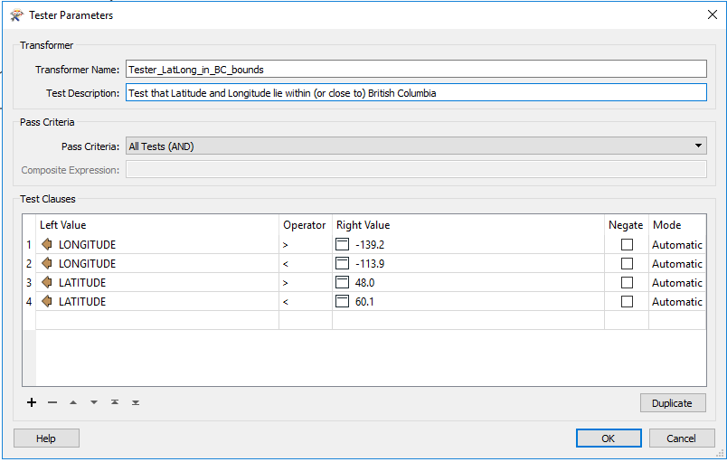

#### Reader and Writer Transformers, SQL Transformers, DatabaseJoiner

+ Several types of transformers connect to source and destination datasets/databases.  When configuring these, hard-code the connection parameters so that the lists of source and destination columns are populated. As a final step, though, find these transformers in the **Transformers** section in the Navigator pane, and update the hard-coded values with the appropriate published or private parameters, as illustrated below:

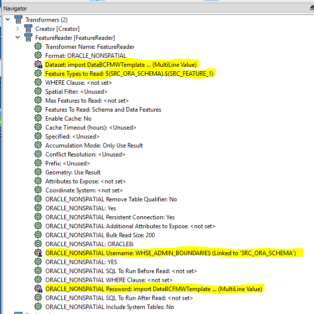 

#### Vertex Creator

+ Spreadsheets of point data (with a latitude and longitude column) can be spatialized by building a point from the latitude and longitude, as shown in the following diagram.  Note the relationship between X/Y and Longitude/Latitude.

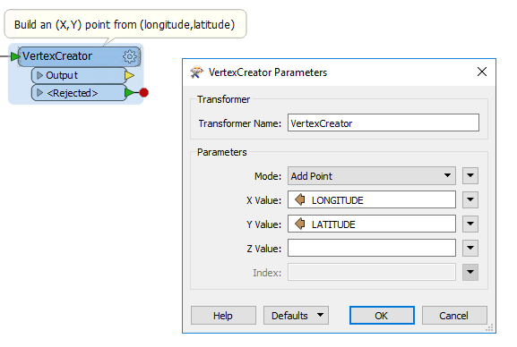


#### Attribute Manager

+ Often the source dataset has more columns than the target table, and the columns that match may have different names.  Use an Attribute Manager transform, defined so that its output matches the columns and their names in the target table.

#### Counter

+ Counter transformers are often used to populate a primary key.

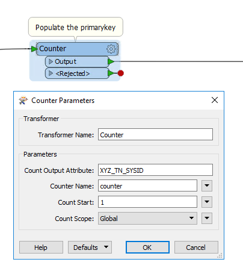


[RETURN TO TOP][1] 

-----------------------------------------------------------

## APPENDIX 1 - NOTIFICATIONS

The framework as of version 1.0.15, can now do email notifications. Currently there are three different notification types. Each of these is defined in the following subsections.  Notifications work through the definitions of one of the three published parameters NOTIFY_ALL, NOTIFY_FAILURE, NOTIFY_SUCCESS.  The shutdown method will determine the status of the job, and then look for any of the following parameters to be defined.  If they are defined the shutdown procedure will parse out the email lists from the parameters and send notifications out based on the status (success/failure) of the job.

Notifications should be defined as: 

**_Type_***:				*Text (Multiline)

**_Name_***: 			<one of the following names>*

**_Prompt_***:			 *emails for job notifications

**_Default Value_***: 		*<enter your email list, one email per line>

The emails sent will include an attachment with the job log.

##### NOTIFY_ALL

**_Prompt_**:			*Notifications for all replication events*

Emails defined in this parameter will be sent out regardless of what happens with the job.  The only exceptions would be if there is a failure associated with the population of published parameters.

##### NOTIFY_FAILURE

**_Prompt_**:			*Notifications for failure*

Emails defined in this parameter will be sent out ONLY if the job FAILS.  If the job completes successfully and FME Server tells us that the jobs succeeded then this list of emails will NOT be sent out.

##### NOTIFY_SUCCESS

**_Prompt_**:			*Notifications for success*

Emails defined in this parameter will be sent out ONLY if the job SUCCEEDS.  

[RETURN TO TOP][1] 

-----------------------------------------------------------

## APPENDIX 2 - NON-BCGW DESTINATIONS

The proceeding sections dealt with the cases where FMWs are being written to load BCGW tables.  Some DataBC FMWs write to the BC Data Catalogue and https://pub.data.gov.bc.ca/datasets and/or other file systems.  This section describes the parameters to use in those situations.

### BC Data Catalogue File Store

--under construction--

### CSV, SHP, and FGDB Files

#### Comma Separated Value (CSV)
+ 
	|Field|Value|
	|-----|-----|
	|**Format**|CSV (Comma Separated Value) |
	|**Dataset**|Path of the directory where file will be created/stored |
	|**Parameters**|Defaults should be fine |
	|**Feature Type**|Specify CSV File Name|

After adding the writer, define the following published parameter:

##### Destination CSV Path and Name (DEST_DATASET_CSV_1)

+ This parameter is for the destination path and file name. When you add the CSV Reader to your FMW, FME will automatically create a published parameter with a name starting with "DestDataset_CSV".  This parameter must be renamed:
   + Find the published parameter in the FMW name starting with DestDataset_CSV
   + Right click on it and choose "Edit Definition"
   + Change the "Name" property of the parameter to **DEST_DATASET_CSV_1**

+ If you source more than one CSV increment the numbers at the end of the parameter name.  Example:
   + DEST_DATASET_CSV_1
   + DEST_DATASET_CSV_2
   + DEST_DATASET_CSV_3
   
+ The following table defines the properties for **DEST_DATASET_CSV_1**:

	|Field|Value|
	|:---|:---|
	|**Published/Private**|published |
	|**Type**|Filename (Existing) or Filename (Multiple)|
	|**Name**|DEST_DATASET_CSV_1 |
	|**Prompt**|Destination CSV (Comma Separated Value) File(s)|
	|**Configuration**|*.csv | 
	|**Attribute Assignment**|Default |
	|**Default Value**|Path to the CSV that is being produced |
	|**Link From**|Writer → Destination CSV (CommaSeparatedValue) File → Link to User Parameter → DEST_DATASET_CSV_1 |


#### Shapefile (SHAPE)
+ 
	|Field|Value|
	|-----|-----|
	|**Format**|Esri Shapefile |
	|**Dataset**|Path of the zip file where the shapefile components will be created/stored |
	|**Parameters**|Defaults should be fine |
	|**Feature Type**|Specify shapefile name, without the .shp extension|

After adding the writer, define the following published parameters:

##### Destination Shapefile Name (DEST_DATASET_SHP_1)
+ 
	|Field|Value|
	|-----|-----|
	|**Published/Private**|published |
	|**Type**|Filename (Existing)|
	|**Name**|DEST_DATASET_SHP_1 |
	|**Prompt**|Destination Esri Shapefile(s)|
	|**Configuration**|*.shp
	|**Attribute Assignment**|Default |
	|**Default Value**|Path of the shapefile (with .shp extension)|
	|**Link From**|Writer → Destination Esri Shape File(s) → Link to User Parameter → DEST_DATASET_SHP_1 |


##### Destination Feature Name (DEST_FEATURE_1)
+ 
	|Field|Value|
	|-----|-----|
	|**Published/Private**|published |
	|**Type**|Text |
	|**Name**|DEST_FEATURE_1 |
	|**Prompt**|Destination Feature class |
	|**Configuration**|N/A | 
	|**Attribute Assignment**|Default |
	|**Default Value**|Name of the shapefile without the .shp extension, e.g., ALC_Panel_regions |
	|**Link From**|N/A |


#### Esri FILE Geodatabase (GEODATABASE_FILE)
+ 
	|Field|Value|
	|-----|-----|
	|**Format**|Esri Geodatabase (File Geodb) |
	|**Dataset**|specify Geodatabase (.gdb) folder |
	|**Parameters**|check Overwrite Existing Geodatabase box |
	|**Feature Type**|specify Feature Class or Table Name<br>select Geometry<br>Drop Table = No<br>Truncate Table = Yes<br>Specify name of Feature Dataset|

After adding the writer, define the following published parameters:

##### Destination FGDB Path and Name (DEST_DATASET_FGDB_1)

+ This parameter describes the fgdb that contains the tables / feature classes that are to be read.  
   + Add the FGDB reader to the FMW that is being created.  
   + When the reader is created FME will automatically create a published parameter with a name starting with "DestinationDataset_FILEGDB".  
   Find this parameter and edit it so that its name is "**DEST_DATASET_FGDB_1**"
+ The following table defines the properties for **DEST_DATASET_FGDB_1**:

	|Field|Value|
	|:---|:---|
	|**Published/Private**|published |
	|**Type**|Folder (Existing) |
	|**Name**|DEST_DATASET_FGDB_1 |
	|**Prompt**|Destination File Geodatabase |
	|**Configuration**|N/A | 
	|**Attribute Assignment**|Default |
	|**Default Value**|Path to the directory of the FGDB that is being written. |
	|**Link From**|Writer → Destination Geodatabase → Link to User Parameter → DEST_DATASET_FGDB_1 |

 When specifying a staging area directory, use the read-only path (\\data.bcgov\data_staging_ro\bcgw\...

##### Destination Feature Name (DEST_FEATURE_1)

+ This parameter refers to the feature class that is being written in the FGDB described in the parameter DEST_DATASET_FGDB_1.  
+ After you have added the FileGeodb reader to the FMW:
   + Create a new published parameter with the name **DEST_FEATURE_1**, and set the Default Value to the feature class that is being written by the writer.
   + Now you need to link this parameter to the writer:
      + Find the writer in the Navigator window (upper left) right click on the feature type and select properties.
      + In the subsequent dialog, replace the value in General Parameters->Feature Class or Table Name with the string: **$(DEST_FEATURE_1)**

[RETURN TO TOP][1] 

-----------------------------------------------------------

## APPENDIX 3 - KIRK PREPARATION

Many DataBC ETL jobs do nothing more than read a file geodatabase, write to the BCGW, and possibly rename columns and populate a primary key value. ETL jobs that fit 
this pattern can be implemented using KIRK (*Keeping Information Replicated Kontinuously*) rather than writing a separate FMW. KIRK does use an underlying FMW, but it is parameterized, allowing it to be used with different FGDB sources and BCGW destinations.

Currently, the process of defining a KIRK job is manual, and it must be done by DataBC staff. So if you are a vendor or employee external to DataBC you must still delivery a working FMW.  But that FMW does not need to follow any standards - you just need to verify that it works in BCGW Delivery.  Include the FMW in your delivery kit, along with a spreadsheet having the following information:

|FIELD|Example value|
|:---|:---|
|Source FGDB|\\data.bcgov\data_staging_ro\BCGW\administrative_boundaries\GBA_Administrative_Boundaries.gdb|
|Source Feature Class|IMPROVEMENT_DISTRICTS_SP_SECURE|
|Destination Schema|WHSE_LEGAL_ADMIN_BOUNDARIES|
|Destination Table|ABMS_IMPROVEMENT_DISTRICTS_SP|
|Transformation Name|abms_improvement_districts_sp_staging_gdb_bcgw|
|Counter Column|ABMS_IDS_SYSID|
|Counter Start #|1|
|[_Cron Expression_](https://community.safe.com/s/article/writing-cron-expressions-to-schedule-fme-server-jo)|0 0 23 ? * SUN *|

If the source FGDB columns map to BCGW columns having different names, then a field map is required as well, as shown in this example:

|FGDB Column Name|BCGW Column Name|
|:---|:---|
|ADMIN_AREA_ID|LGL_ADMIN_AREA_ID|
|ADMIN_AREA_PARENT_NAME|ADMIN_AREA_GROUP_NAME|
|UPDATE_DATE|WHEN_UPDATED|
|IS_PUBLIC|PUBLIC_IND|

-------------------------------------------------------

## APPENDIX 4 - FINAL PUBLICATION CHECKLIST

Before submitting your FMW to DataBC, check the following:

### General
+ FMW has been tested in BCGW delivery.
+ FMWs have been supplied in the `dataload` directory of the delivery kit.
+ dbCreds.json file and <hostname>_<servicename>.sde files have been removed from the delivery kit.

### Reader/Writer Published and Private Parameters

The following parameters have been defined:

|Reader|Parameter|
|------|---------|
|[Comma Separated Values](#Comma-Separated-Values-CSV)|[SRC_DATASET_CSV_1](#Source-CSV-Path-and-Name-SRC_DATASET_CSV_1)|
|   |   |
|[Esri File Geodatabase](#Esri-File-Geodatabase-GDB)|[SRC_DATASET_FGDB_1](#Source-FGDB-Path-and-Name-SRC_DATASET_FGDB_1)|
|[Esri File Geodatabase](#Esri-File-Geodatabase-GDB)|[SRC_FEATURE_1](#Source-Feature-Name-SRC_FEATURE_1)|
|   |   |
|[Esri SDE Geodatabase](#Esri-Geodatabase-SDEGEODATABASE)|[SRC_ORA_PROXY_SCHEMA](#Source-Proxy-Account-Name-SRC_ORA_PROXY_SCHEMA)|
|[Esri SDE Geodatabase](#Esri-Geodatabase-SDEGEODATABASE)|[SRC_ORA_SCHEMA](#Source-Schema-Owner-Name-SRC_ORA_SCHEMA)|
|[Esri SDE Geodatabase](#Esri-Geodatabase-SDEGEODATABASE)|[SRC_FEATURE_1](#Source-Feature-Name-SRC_FEATURE_1)|
|[Esri SDE Geodatabase](#Esri-Geodatabase-SDEGEODATABASE)|[SRC_HOST](#Source-Host-SRC_HOST)|
|[Esri SDE Geodatabase](#Esri-Geodatabase-SDEGEODATABASE)|[SRC_PORT](#Source-Port-SRC_PORT)|
|[Esri SDE Geodatabase](#Esri-Geodatabase-SDEGEODATABASE)|[SRC_ORA_SERVICENAME](#Source-Service-Name-SRC_ORA_SERVICENAME)|
|[Esri SDE Geodatabase](#Esri-Geodatabase-SDEGEODATABASE)|[SRC_ORA_PASSWORD](#Source-Schema-Owner-Password-SRC_ORA_PASSWORD)|
|[Esri SDE Geodatabase](#Esri-Geodatabase-SDEGEODATABASE)|[SRC_SDE_CONNECTIONFILE](#Source-Database-Connection-File-SRC_SDE_CONNECTIONFILE)|
|   |   |
|[Esri Shapefile](#Esri-Shapefile-SHP)|[SRC_DATASET_SHP_1](#Source-Shapefile-Name-SRC_DATASET_SHP_1)|
|[Esri Shapefile](#Esri-Shapefile-SHP)|[SRC_FEATURE_1](#Source-Feature-Name-SRC_FEATURE_1)|
|   |   |
|[GeoJSON](#GeoJSON)|[SRC_GEOJSON_FILE_1](#Source-GeoJSON-File-Name-SRC_GEOJSON_FILE_1)|
|   |   |
|[Microsoft Access Database](#Microsoft-Access-Database-MDBADO)|[SRC_DATASET_MDBADO_1](#Source-Access-Database-File-Name-SRC_DATASET_MDBADO_1)|
|[Microsoft Access Database](#Microsoft-Access-Database-MDBADO)|[SRC_FEATURE_1](#Source-Feature-Name-SRC_FEATURE_1)|
|   |   |
|[Microsoft Excel](#Microsoft-Excel-XLSX)|[SRC_DATASET_XLS_1](#Source-Excel-File-Name-SRC_DATASET_XLS_1)|
|[Microsoft Excel](#Microsoft-Excel-XLSX)|[SRC_FEATURE_1](#Source-Feature-Name-SRC_FEATURE_1)|
|   |   |
|[Oracle Spatial Object (SDO) and Non-Spatial](#Oracle-Spatial-Object-SDO-and-Non-Spatial)|[SRC_ORA_PROXY_SCHEMA](#Source-Proxy-Account-Name-SRC_ORA_PROXY_SCHEMA)|
|[Oracle Spatial Object (SDO) and Non-Spatial](#Oracle-Spatial-Object-SDO-and-Non-Spatial)|[SRC_ORA_SCHEMA](#Source-Schema-Owner-Name-SRC_ORA_SCHEMA)|
|[Oracle Spatial Object (SDO) and Non-Spatial](#Oracle-Spatial-Object-SDO-and-Non-Spatial)|[SRC_FEATURE_1](#Source-Feature-Name-SRC_FEATURE_1)|
|[Oracle Spatial Object (SDO) and Non-Spatial](#Oracle-Spatial-Object-SDO-and-Non-Spatial)|[SRC_ORA_SERVICENAME](#Source-Service-Name-SRC_ORA_SERVICENAME)|
|[Oracle Spatial Object (SDO) and Non-Spatial](#Oracle-Spatial-Object-SDO-and-Non-Spatial)|[SRC_HOST](#Source-Host-SRC_HOST)|
|[Oracle Spatial Object (SDO) and Non-Spatial](#Oracle-Spatial-Object-SDO-and-Non-Spatial)|[SRC_PORT](#Source-Port-SRC_PORT)|
|[Oracle Spatial Object (SDO) and Non-Spatial](#Oracle-Spatial-Object-SDO-and-Non-Spatial)|[SRC_ORA_PASSWORD](#Source-Schema-Owner-Password-SRC_ORA_PASSWORD)|
|[Oracle Spatial Object (SDO) and Non-Spatial](#Oracle-Spatial-Object-SDO-and-Non-Spatial)|[SRC_EASYCONNECT](#Source-Easy-Connect-String-SRC_EASYCONNECT)

<br>

|Writer|Parameter|
|------|---------|
|[All Writers](#Parameters-Applying-to-All-Writers)|[DEST_DB_ENV_KEY](#Destination-Database-Keyword-DEST_DB_ENV_KEY)|
|[All Writers](#Parameters-Applying-to-All-Writers)|[DEST_SCHEMA](#Destination-Schema-Owner-DEST_SCHEMA)|
|[All Writers](#Parameters-Applying-to-All-Writers)|[DEST_FEATURE_1](#Destination-Feature-Object-Name-1-DEST_FEATURE_1)|
|[All Writers](#Parameters-Applying-to-All-Writers)|[DEST_PASSWORD](#Destination-Schema-Password-DEST_PASSWORD)|
|   |   |
|[Oracle (SPATIAL AND NON-SPATIAL)](#Oracle-SPATIAL-AND-NON-SPATIAL)|[DEST_EASYCONNECT](#Destination-Easy-Connect-String-DEST_EASYCONNECT)|
|[Oracle (SPATIAL AND NON-SPATIAL)](#Oracle-SPATIAL-AND-NON-SPATIAL)|[DEST_HOST](#Destination-Host-DEST_HOST)|
|[Oracle (SPATIAL AND NON-SPATIAL)](#Oracle-SPATIAL-AND-NON-SPATIAL)|[DEST_SERVICENAME](#Destination-Host-DEST_SERVICENAME)
|   |   |
|[Esri SDE Geodatabase](#Esri-SDE-Geodatabase-SDEGEODATABASE)|[FAILED_FEATURES](#Failed-Features-FAILED_FEATURES)
|[Esri SDE Geodatabase](#Esri-SDE-Geodatabase-SDEGEODATABASE)|[DEST_SDE_CONNFILE](#Destination-Database-Connection-File-DEST_SDE_CONNFILE)|

### Framework Parameters

+ [_DEST_DB_ENV_KEY_](#Destination-Database-Keyword-DEST_DB_ENV_KEY) has been set to **DLV**
+ [_FILE_CHANGE_DETECTION_](#File-Change-Detection-FILE_CHANGE_DETECTION) has been set to  **TRUE**
+ Writer → Workspace Parameters → Logging → Log File has been linked to [**_LOGFILE_**](#Log-File-LOGFILE)

### Source Readers

+ Source file is linked to the appropriate parameter.
+ For staging area sources, the read-only path is used.
+ Feature type name is linked to the appropriate parameter (except for CSV sources).

### Destination Writers

Writer parameters have been set or linked to the appropriate Writer properties. The checklist items depend on which Writer is used.

#### SDE Geodatabase Writer

+ Writer → Connection File has been linked to **DEST_SDE_CONNFILE**
+ Writer → Advanced → Failed Feature Dump filename has been linked to **FAILED_FEATURES**
+ Writer → Advanced → Override Username has been linked to **DEST_SCHEMA**
+ Writer → Advanced → Override Password has been linked to **DEST_PASSWORD**
+ Writer → Feature Types → <feature type> → Feature Class or Table Name has been set to **$(DEST_SCHEMA).$(DEST_FEATURE_1)**
+ Writer → Feature Types → <feature type> → Drop Table has been set to **No**
+ Writer → Feature Types → <feature type> → Truncate Table has been set **Yes**

#### Oracle Spatial Writer

+ Writer → Service Name or Easy Connect has been linked to **DEST_EASYCONNECT**
+ Writer → Parameters → Username has been linked to **DEST_SCHEMA**
+ Writer → Parameters → Password has been linked to **DEST_PASSWORD**
+ Writer → Feature Types → <feature type> → Table Name has been set to **$(DEST_SCHEMA).$(DEST_FEATURE_1)**
+ Writer → Feature Types → <feature type> → Create Table has been set to **No**
+ Writer → Feature Types → <feature type> → Truncate Existing Table has been set **Yes**

#### Oracle Non-spatial Writer

+ Writer → Service Name or Easy Connect has been linked to **DEST_EASYCONNECT**
+ Writer → Parameters → Username has been linked to **DEST_SCHEMA**
+ Writer → Parameters → Password has been linked to **DEST_PASSWORD**
+ Writer → Feature Types → <feature type> → Table Name has been set to **$(DEST_SCHEMA).$(DEST_FEATURE_1)**
+ Writer → Feature Types → <feature type> → Feature Operation has been set to **Insert**
+ Writer → Feature Types → <feature type> → Table Handling has been set **Truncate Existing**

### Workspace Parameters
+ Workspace Parameters → Name: Name of the FMW without file extension
+ Workspace Parameters → Logging → Log File: linked to **LOGFILE** parameter
+ Workspace Parameters → Scripting → Startup Python Script: set to [_python code_](#Scripting--Startup-Python-Script)
+ Workspace Parameters → Scripting → Shutdown Python Script: set to [_python code_](#Scripting--Shutdown-Python-Script)

### Documentation

+ Annotations are used to explain complex logic and Tester transformer tests.
+ For complex scripts (> 10 transformers) Bookmarks are used to document flows.

-----------------------------------------------------------

[RETURN TO TOP][1] 

[1]: #Using-the-DataBC-FME-Framework
