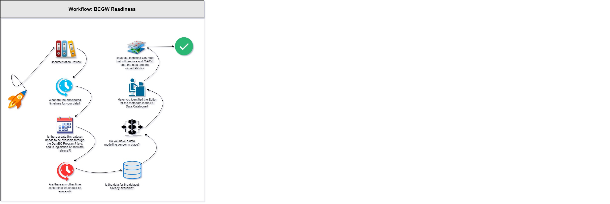

# DATA PUBLICATION WORKFLOW - BC GEOGRAPHIC WAREHOUSE

# Purpose

This page describes the client workflow for loading datasets into the BC Geographic Warehouse (BCGW).

-----------------------
-----------------------

# Audience

The intended audiences for this page are:
+ clients that are publishing data to the BC Geographic Warehouse (BCGW)
+ _Business Analysts_
+ _Business Portfolio Managers_
+ _Application Administrators_

For a description of the roles and responsibilities of the business functions defined in this section, please refer to [_Data Publication: Roles and Responsibilities_](roles_and_responsibilities.md#data-publication-roles-and-responsibilities).

-----------------------
## Table of Contents
+ [**INTRODUCTION**](#introduction)
+ [**WORKFLOW DIAGRAM**](#workflow-diagram)
+ [**DOCUMENTATION REVIEW**](#documentation-review)
+ [**WHITEBOARD SESSIONS**](#whiteboard-sessions)
	+ [Discovery Whiteboard](#discovery-whiteboard)
	+ [Dataset Logfile](#dataset-logfile)
	+ [Technical Whiteboard](#technical-whiteboard)
+ [**DATA MODELLING**](#data-modelling)
	+ [Deploy and Approve Data Content in Delivery](#deploy-and-approve-data-content-in-delivery)
+ [**DATA MIGRATION TO TEST**](#data-migration-to-test)
	+ [Deploy and Approve Data Content in Test](#deploy-and-approve-data-content-in-test)
+ [**DATA MIGRATION TO PRODUCTION**](#data-migration-to-production)
	+ [Deploy and Approve Data Content in Production](#deploy-and-approve-data-content-in-production)
+ [**DISTRIBUTION CONFIGURATION**](#distribution-configuration)
+ [**REPLICATION SERVICES**](#replication-services)

---------------------------
---------------------------

## INTRODUCTION

When data is published to the BCGW, it must undergo a rigorous and standardized publication process to ensure adherance to government data standards for quality and consistency.  DataBC has well documented Data Standards and Guidelines that are followed throughout the process for data publication.  The workflows described below will guide you through what your reponsibilities are as the client and how we work with you to publish your dataset in the BCGW.

This page is written in the context that you have reviewed the documentation as listed below.

------------------------------
------------------------------
## WORKFLOW DIAGRAM

## WORKFLOW DIAGRAM - SVG

<svg xmlns="http://www.w3.org/2000/svg" xmlns:xlink="http://www.w3.org/1999/xlink" version="1.1" width="2444px" viewBox="-0.5 -0.5 2444 811" content="&lt;mxfile host=&quot;app.diagrams.net&quot; modified=&quot;2020-10-16T21:43:39.938Z&quot; agent=&quot;5.0 (Windows NT 10.0; Win64; x64) AppleWebKit/537.36 (KHTML, like Gecko) Chrome/86.0.4240.75 Safari/537.36&quot; etag=&quot;0mXpEpyil2hjndShgFn-&quot; version=&quot;13.8.0&quot; type=&quot;device&quot;&gt;&lt;diagram name=&quot;Page-1&quot; id=&quot;74e2e168-ea6b-b213-b513-2b3c1d86103e&quot;&gt;5VzdcuI8En2aVO1e4LL8g+3L/JH5amd2M5OqycwVpdjCaGMsxhYQ8vSfJMvGlgyYgBOym6kakCxk0X26+3RL5sK+nr3cZXA+/UYilFxYZvRyYd9cWJYNhhZ74T3rogeYQ7foiTMcyb5NxwN+ReVA2bvAEcobAykhCcXzZmdI0hSFtNEHs4ysmsMmJGnedQ5jpHU8hDDRex9xRKeyF5jm5sIXhOOpvLXvygtPMHyOM7JI5f0uLHsi/orLM1jOJcfnUxiRVa3Lvr2wrzNCaPFu9nKNEi7cUmzF50ZbrlbrzlBKu3zA89AwDLwJCIYR9H17IGdYwmQhZfFIsudJwhd5yS5cXd89spcfCEY4RXkuvwZdl6LLV3iWwJS1rqZ0lrBOwN6GU5xEX+GaLPiycsrEVLauWCujEgOeyTqE/BBfIW9VIuKNBD6h5KoS8jVJSMYupUTcMKcZea40xu87ISkdwRlOOBK/oGSJKA6hvCDvafGJYYLjlDVCJjiU8QE4ScrpmRZvh/wf69clXIoMZRS91LqkxO8QmSGardkQeXUATF/qXxpICZ/VBmx+CZFpHWelgUAJ8LiafKNk9kbquaPOLU3nHbVa1xwX4mqKKXqYw5B3rJhvaJXXVsztF6AUl9dRXJ5zAnFd/bT+uPMgpFfL8JX+mHl/Hr8PSqXXRIQi5kJkk2R0SmKSwuR206vgejPmKyFzKdH/IkrXUqJwQUlT3ugF01/844YrW79rV25e5MyisZaNLhYA7LIt19/iR7ahhn/tnTrLUAIpXjY9a5tC5EfvCWb3rIzFcmy3YStDNzCAHWz+mjPmZJGFSE5S93xHzsugHiOqzSvQU33bToCy6PVD6v5yn0fRt/H4P+bo9sdP7hL2W2G4yJYCP0LlaXTJQx13WgnMcxwqYEnZijhaBqZhWn7Z81vgx9l0bGAjWut66x5lmH0z7hArZPEpgWEKzJQQZHcA3k4Y8oY6W3eQFUrdJT5JEoSSdozrCtqaZ3FbHEvZdyS2ARNiA4Kqe+8KZmA6zYDiDZWZtsCXIQiua8PmfEC+fcXKbSzT3LkuVxke7B4OgDLebYxnb4r1ntby9tsdzOcFy5zgF25/dTOTEmPj3KsL96aNSuCZoJsNj2tt+m/wLGYrT/ATX38eQsRevy9w+Dx+4AF2fC0mMvJlfJDRdCcktqom2/AsLcR6bkuEdY8PsI8Pk+/3f0Y2Rvlw/PMu+U1v84Ht7FcL54DzI+RR5Q/wqZzS3CknoNA2yw4MT5MTGLZ4DGAGhmv3JCygC+txCqlIhhB3i1P+P0xZ5MdzSBmEWR9zxQmn8CI/yviXYs6GJ22QMnow0qTNZEdV+sfptsLB67xZdmkGwTXBSEhyKS/McBQJhtRGIJusSVf3bvh05pT+Rj/7dGmdgFW2rroDES9F95UnQvckxxQTLsInQimZNfWjiplymqlrY68aWfpjmle3I6vIxuZ8KbOXmOf+BnxdZMjIwymKFomYTjhElN0uUeEXQS9aU+JR3U215U0n0Fhr8DhLLxU0vZTP2Fn9rwXlbRyHeayehNYl35QwK0PnXlTvtYstlYNNgUbG48sy1ouqgBr4y5A9pZSXoi65IKxRGKWmgZmaJpi5qswI2R2tkXCk1oj353zQImcr4a0I5WzpAzKZ4BB5g6LAMZinnAUARsyt0X1GokVIBxEJFzMGGci/jSFGqDjaCcsDGIDharDwgxZL6gsUtgaKm/qXFzWnJUarTxOXjlTMuinvfdbaX0wyz9HFKUTMDvQ40E7D7L7kBFxNTn/lBfcSHAwW1KqgYziXRCtHnKWlCEViLGH/PYnRS4gTIQ0+nIk3nlY87oZ97oot0mReggXhmSBr5j+QERuC1xX0jk+VoBjnSWk/guTlZEJXBStkyStiC2Af/+enMardEO1sVUFHpuf2hRbd233+EGjtDYEvZEYGTzDHYV6FujLEDUx/wHrag9yxai+jXLPiV/qjGgqCFhAEvbnW3kp+vD7n1Ct+ogbovqXkd6Ay6hW41oEyAp5LBc5qQkI1+M4FOLUQcqJ6m6UEOtAsuB1dEWvXZYeS2IeHfNfvGvKB18x/hj2Zc4dc8L2y97dl6UrOPxrZ7O8AF3DwRqij5xx9Ze/tnG2oqeyyLJgVpC3lqyW8eVGUzArgMqHDwnDNFe/Kp2SRRBV5kwSLTD59He0AnZbUqt3aPq6m1oFqFc6Mi0gmm/ZNcNgG1fH+zQFqSqMbR7t/s8z38W9Apys3PMtYkwVfElzW0hz+MuPnghLM+RyTTxqJ/APzTGSeCGR+dtuwt+h+q22w6H1exqH7P00lny4NAXvTkDIHHqA0xiz3zhhGBzCNBkscITKI4UyAduQCLl7H88aXSUwyTKezcVG7GzPxT0k0FhAfzzMSojwf88R8/BBilIZoPIJPGRMD//JjJooqtznkZNGxsJNXPaDDzGzzJGZv6W4HRnlQpnOgrM4l2yg1UWUbrZX5g5MPhRoPgNlPNmIrMWogj3X2m42UIfacshE1Wh+QjZhG4NZ03tcGOvA0sZX1yE2ILjZ+N11FORImGYKRAEZVhvz0wXqb6rcT2XZFfVis1uvLmkZaYvPWKKzpoENYbg/4zVO3loYDsX3smyPtMG8E82n9mG8jZcUk90Qkz43iRMLRcbM7AuRVX6dnbemp11vq0kHl7+/5rKbn81zDc/UY1qUq05vrCzS5fSmykyJVYSyP8UO5UXL314OQKORn9JkrFMdmVljcZS62YYtCAB/7nbPM73zrhZnRZkNGOtNiTNG1xPmCWdir4H/55/ee7hb47AiQDZQEXsv+8vv6T9CBR3y6ZGf/not4TRg24zlv3v/7rth6eSm2XwT8R1/hGmX5ifKTg7HiB4bXUgn0W1yt35er1dmSBo63bcUwFuE0tmJMA4iq6gl2YrZ5+b2bMOeVFtlmM6RYnlLC6n4MWjlwDPo6Bq2cmLXfZVtGD2tHYnRzmt8r2wVCbat8wKT7af7G8wYeaEL+RFuPXZ4P2LU3s9cw3LMyDGCqlvHWBwQ8dR8xUDzpqSoEXvM+Q+e0hrEYXMbur4H9ZfrqfPsXTTyyirucJzzRNjpDtgPeAuXK1BpmttvI3gb/XScu98LfOiv42/zMfBP/Kjvsin/HHhrDQM/mq5MgTmCAluunNo+gPT71Gjfsk9tH9Rhi4DsNQAPbOjhunNDLB2cF39N5b1eFjWoGJ4LnUL2P/x605hzP0DtKpd6yHcPp+qhPfymsfhZXK2xQPJEnQEUh4jbCVBR566VethooixZiP7boFWdKb4rua/aSkHjxP1D4PfjIdbUN9mGlig7nArdYxGEi6G4W+8t5fRXzOiQ9auk4xHlIjDki8wQZMI0yEqOULPLxHGU5L89oz28qB6EahWn1SSh76AdeW5G7KujoBfG9ZaKOh73IgvJn9q6rnz05wBD8LSDYcTpLYV9At4uhY7Q9FWr1BAZbd4CnoTJNXg4c+2Aas0kamgmDty/1PSH/karYS/OHZ8aTlGLxm3kSMIPmTH3Vf4bqYVT7PXh8h5Ns3cuSB9Zn3i1/3Vm7ryO7tRQAzisFcNWyC3AM9aT4B4L7iB8x2Sn9/7MtljhDKOVxuTozFk5R+Lz9cZbjf7HBU1JLsQurRWe/BdlvOEzNmptfJCuwsvndN/v2bw==&lt;/diagram&gt;&lt;/mxfile&gt;" onclick="(function(svg){var src=window.event.target||window.event.srcElement;while (src!=null&amp;&amp;src.nodeName.toLowerCase()!='a'){src=src.parentNode;}if(src==null){if(svg.wnd!=null&amp;&amp;!svg.wnd.closed){svg.wnd.focus();}else{var r=function(evt){if(evt.data=='ready'&amp;&amp;evt.source==svg.wnd){svg.wnd.postMessage(decodeURIComponent(svg.getAttribute('content')),'*');window.removeEventListener('message',r);}};window.addEventListener('message',r);svg.wnd=window.open('https://viewer.diagrams.net/?client=1');}}})(this);" style="cursor:pointer;max-width:100%;max-height:811px;"><defs/><g><path d="M 0 70 L 0 0 L 820 0 L 820 70" fill="#e6e6e6" stroke="#000000" stroke-miterlimit="10" pointer-events="all"/><path d="M 0 70 L 0 810 L 820 810 L 820 70" fill="none" stroke="#000000" stroke-miterlimit="10" pointer-events="none"/><path d="M 0 70 L 820 70" fill="none" stroke="#000000" stroke-miterlimit="10" pointer-events="none"/><g transform="translate(-0.5 -0.5)"><switch><foreignObject style="overflow: visible; text-align: left;" pointer-events="none" width="100%" height="100%" requiredFeatures="http://www.w3.org/TR/SVG11/feature#Extensibility">

Workflow: BCGW Readiness

</foreignObject><text x="410" y="41" fill="#000000" font-family="Helvetica" font-size="20px" text-anchor="middle" font-weight="bold">Workflow: BCGW Readiness</text></switch></g><path d="M 0 70 L 0 70 L 820 70 L 820 70" fill="#ffffff" stroke="#000000" stroke-miterlimit="10" pointer-events="none"/><path d="M 0 70 L 0 810 L 820 810 L 820 70" fill="none" stroke="#000000" stroke-miterlimit="10" pointer-events="none"/><path d="M 0 70 L 820 70" fill="none" stroke="#000000" stroke-miterlimit="10" pointer-events="none"/><path d="M 2435 729.14 L 2435 729.14" fill="none" stroke="#000000" stroke-miterlimit="10" pointer-events="none"/><path d="M 2435 729.14 L 2435 729.14 L 2435 729.14 L 2435 729.14 Z" fill="#000000" stroke="#000000" stroke-miterlimit="10" pointer-events="none"/><path d="M 105.97 365 Q 40 270 45 315 Q 50 360 80 340 Q 110 320 213.97 193.02" fill="none" stroke="#000000" stroke-miterlimit="10" pointer-events="none"/><path d="M 217.3 188.96 L 215.57 196.59 L 213.97 193.02 L 210.16 192.16 Z" fill="#000000" stroke="#000000" stroke-miterlimit="10" pointer-events="none"/><image x="29.5" y="363.22" width="75" height="75" xlink:href="https://app.diagrams.net/img/lib/mscae/Quick_Start_Center.svg" pointer-events="none"/><g transform="translate(-0.5 -0.5)"><switch><foreignObject style="overflow: visible; text-align: left;" pointer-events="none" width="100%" height="100%" requiredFeatures="http://www.w3.org/TR/SVG11/feature#Extensibility">

What are the anticipated timelines for your data?

</foreignObject><text x="260" y="413" fill="#000000" font-family="Helvetica" font-size="12px" text-anchor="middle">What are the anticipated t...</text></switch></g><ellipse cx="263.28" cy="344.15" rx="26.72403345049085" ry="24.737410425051536" fill="#00bef2" stroke="none" pointer-events="none"/><path d="M 270.06 380.28 L 259.88 389.7 L 259.88 383.42 C 244.45 382.88 230.87 373.82 225.43 360.44 C 220 347.05 223.77 331.96 235 322.14 C 246.23 312.32 262.73 309.7 276.85 315.49 C 264.31 310.73 249.92 313.17 240.01 321.74 C 230.11 330.3 226.5 343.42 230.77 355.33 C 235.04 367.24 246.41 375.76 259.88 377.13 L 259.88 370.85 Z Z" fill="#00bef2" stroke="none" pointer-events="none"/><ellipse cx="263.44" cy="323.19" rx="2.596048963761968" ry="2.010405418670855" fill="#ffffff" stroke="none" pointer-events="none"/><ellipse cx="240.96" cy="345.33" rx="2.706338625621137" ry="2.355943850004908" fill="#ffffff" stroke="none" pointer-events="none"/><ellipse cx="264.07" cy="365.75" rx="2.918434129196461" ry="2.1596151958378327" fill="#ffffff" stroke="none" pointer-events="none"/><ellipse cx="286.39" cy="345.23" rx="2.54514604290389" ry="2.1596151958378327" fill="#ffffff" stroke="none" pointer-events="none"/><path d="M 258.61 346.51 L 258.61 331.59 C 259.28 329.73 261.16 328.48 263.28 328.48 C 265.39 328.48 267.27 329.73 267.94 331.59 L 267.94 341.8 L 276.85 350.04 C 278.14 351.86 277.92 354.27 276.3 355.86 C 274.69 357.45 272.11 357.8 270.06 356.72 Z Z" fill="#ffffff" stroke="none" pointer-events="none"/><image x="220" y="149.5" width="89" height="89" xlink:href="https://cdn0.iconfinder.com/data/icons/customicondesign-office7-shadow-png/128/Product-documentation.png" preserveAspectRatio="none" pointer-events="none"/><g transform="translate(-0.5 -0.5)"><switch><foreignObject style="overflow: visible; text-align: left;" pointer-events="none" width="100%" height="100%" requiredFeatures="http://www.w3.org/TR/SVG11/feature#Extensibility">

Documentation Review

</foreignObject><text x="265" y="253" fill="#000000" font-family="Helvetica" font-size="12px" text-anchor="middle">Documentation Review</text></switch></g><g transform="translate(-0.5 -0.5)"><switch><foreignObject style="overflow: visible; text-align: left;" pointer-events="none" width="100%" height="100%" requiredFeatures="http://www.w3.org/TR/SVG11/feature#Extensibility">

Is there a date this dataset needs to be available through the DataBC Program? (e.g. tied to legislation or software release?)

</foreignObject><text x="260" y="582" fill="#000000" font-family="Helvetica" font-size="12px" text-anchor="middle">Is there a date this datas...</text></switch></g><image x="214.5" y="457.5" width="90" height="90" xlink:href="https://cdn2.iconfinder.com/data/icons/xomo-basics/128/document-08-128.png" preserveAspectRatio="none" pointer-events="none"/><path d="M 305 510 Q 460 560 301.59 644.99" fill="none" stroke="#000000" stroke-miterlimit="10" pointer-events="none"/><path d="M 296.97 647.47 L 301.48 641.08 L 301.59 644.99 L 304.79 647.25 Z" fill="#000000" stroke="#000000" stroke-miterlimit="10" pointer-events="none"/><ellipse cx="268.28" cy="684.45" rx="26.72403345049085" ry="24.737410425051536" fill="#ff3333" stroke="none" pointer-events="none"/><path d="M 275.06 720.58 L 264.88 730 L 264.88 723.72 C 249.45 723.18 235.87 714.12 230.43 700.74 C 225 687.35 228.77 672.26 240 662.44 C 251.23 652.62 267.73 650 281.85 655.79 C 269.31 651.03 254.92 653.47 245.01 662.04 C 235.11 670.6 231.5 683.72 235.77 695.63 C 240.04 707.54 251.41 716.06 264.88 717.43 L 264.88 711.15 Z Z" fill="#ff3333" stroke="none" pointer-events="none"/><ellipse cx="268.44" cy="663.49" rx="2.596048963761968" ry="2.010405418670855" fill="#ffffff" stroke="none" pointer-events="none"/><ellipse cx="245.96" cy="685.63" rx="2.706338625621137" ry="2.355943850004908" fill="#ffffff" stroke="none" pointer-events="none"/><ellipse cx="269.07" cy="706.05" rx="2.918434129196461" ry="2.1596151958378327" fill="#ffffff" stroke="none" pointer-events="none"/><ellipse cx="291.39" cy="685.53" rx="2.54514604290389" ry="2.1596151958378327" fill="#ffffff" stroke="none" pointer-events="none"/><path d="M 263.61 686.81 L 263.61 671.89 C 264.28 670.03 266.16 668.78 268.28 668.78 C 270.39 668.78 272.27 670.03 272.94 671.89 L 272.94 682.1 L 281.85 690.34 C 283.14 692.16 282.92 694.57 281.3 696.16 C 279.69 697.75 277.11 698.1 275.06 697.02 Z Z" fill="#ffffff" stroke="none" pointer-events="none"/><g transform="translate(-0.5 -0.5)"><switch><foreignObject style="overflow: visible; text-align: left;" pointer-events="none" width="100%" height="100%" requiredFeatures="http://www.w3.org/TR/SVG11/feature#Extensibility">

Are there any other time constraints we should be aware of?

</foreignObject><text x="260" y="761" fill="#000000" font-family="Helvetica" font-size="12px" text-anchor="middle">Are there any other time c...</text></switch></g><g transform="translate(-0.5 -0.5)"><switch><foreignObject style="overflow: visible; text-align: left;" pointer-events="none" width="100%" height="100%" requiredFeatures="http://www.w3.org/TR/SVG11/feature#Extensibility">

Do you have a data modelling vendor in place?

</foreignObject><text x="490" y="579" fill="#000000" font-family="Helvetica" font-size="12px" text-anchor="middle">Do you have a data modelli...</text></switch></g><image x="480.5" y="464.5" width="100" height="100" xlink:href="https://cdn1.iconfinder.com/data/icons/software-engineering-and-video-gaming/512/477_Algorithm_design_method_model_process_Data_Science_Fabrication_Lab-128.png" preserveAspectRatio="none" pointer-events="none"/><path d="M 581 515 Q 720 400 596.09 361.87" fill="none" stroke="#000000" stroke-miterlimit="10" pointer-events="none"/><path d="M 591.07 360.33 L 598.79 359.04 L 596.09 361.87 L 596.73 365.73 Z" fill="#000000" stroke="#000000" stroke-miterlimit="10" pointer-events="none"/><g transform="translate(-0.5 -0.5)"><switch><foreignObject style="overflow: visible; text-align: left;" pointer-events="none" width="100%" height="100%" requiredFeatures="http://www.w3.org/TR/SVG11/feature#Extensibility">

Is the data for the dataset already available?

</foreignObject><text x="490" y="755" fill="#000000" font-family="Helvetica" font-size="12px" text-anchor="middle">Is the data for the datase...</text></switch></g><path d="M 496 659.65 C 496 654.32 511.67 650 531 650 C 550.33 650 566 654.32 566 659.65 L 566 710.34 C 566 715.67 550.33 720 531 720 C 511.67 720 496 715.67 496 710.34 Z" fill="#e6e6e6" stroke="#0080f0" stroke-width="2" stroke-miterlimit="10" pointer-events="none"/><path d="M 496 659.65 C 496 664.98 511.67 669.31 531 669.31 C 550.33 669.31 566 664.98 566 659.65 M 496 675.58 C 496 680.92 511.67 685.24 531 685.24 C 550.33 685.24 566 680.92 566 675.58 M 496 693.69 C 496 699.02 511.67 703.34 531 703.34 C 550.33 703.34 566 699.02 566 693.69" fill="none" stroke="#0080f0" stroke-width="2" stroke-miterlimit="10" pointer-events="none"/><g transform="translate(-0.5 -0.5)"><switch><foreignObject style="overflow: visible; text-align: left;" pointer-events="none" width="100%" height="100%" requiredFeatures="http://www.w3.org/TR/SVG11/feature#Extensibility">

Have you idenfitied GIS staff that will produce and QA/QC both the data and the visualizations?

</foreignObject><text x="541" y="257" fill="#000000" font-family="Helvetica" font-size="12px" text-anchor="middle">Have you idenfitied GIS st...</text></switch></g><image x="509.25" y="145.25" width="78" height="78" xlink:href="https://cdn2.iconfinder.com/data/icons/iconslandgps/PNG/128x128/GIS/Layers.png" preserveAspectRatio="none" pointer-events="none"/><path d="M 300 346 Q 430 370 305.01 466.09" fill="none" stroke="#000000" stroke-miterlimit="10" pointer-events="none"/><path d="M 300.85 469.29 L 304.26 462.25 L 305.01 466.09 L 308.53 467.8 Z" fill="#000000" stroke="#000000" stroke-miterlimit="10" pointer-events="none"/><path d="M 299.97 676 Q 370 710 484.79 686.29" fill="none" stroke="#000000" stroke-miterlimit="10" pointer-events="none"/><path d="M 489.94 685.23 L 483.79 690.07 L 484.79 686.29 L 482.37 683.21 Z" fill="#000000" stroke="#000000" stroke-miterlimit="10" pointer-events="none"/><path d="M 309.5 194.5 Q 390 230 295.86 308.89" fill="none" stroke="#000000" stroke-miterlimit="10" pointer-events="none"/><path d="M 291.84 312.26 L 294.95 305.08 L 295.86 308.89 L 299.45 310.45 Z" fill="#000000" stroke="#000000" stroke-miterlimit="10" pointer-events="none"/><path d="M 579.97 323.97 Q 690 250 595.46 193.28" fill="none" stroke="#000000" stroke-miterlimit="10" pointer-events="none"/><path d="M 590.96 190.58 L 598.76 191.18 L 595.46 193.28 L 595.16 197.18 Z" fill="#000000" stroke="#000000" stroke-miterlimit="10" pointer-events="none"/><g transform="translate(-0.5 -0.5)"><switch><foreignObject style="overflow: visible; text-align: left;" pointer-events="none" width="100%" height="100%" requiredFeatures="http://www.w3.org/TR/SVG11/feature#Extensibility">

Have you identified the Editor for the metadata in the BC Data Catalogue?

</foreignObject><text x="551" y="418" fill="#000000" font-family="Helvetica" font-size="12px" text-anchor="middle">Have you identified the Ed...</text></switch></g><path d="M 540.14 322.94 C 540.14 327.64 536.19 331.41 531.27 331.41 C 526.34 331.41 522.9 327.64 522.9 322.94 C 522.9 318.24 526.34 314.47 531.27 314.47 C 536.19 314.47 540.14 318.24 540.14 322.94 Z M 581 386.47 L 545.06 386.47 L 545.06 349.76 L 581 349.76 Z M 557.36 345.06 L 578.55 345.06 L 578.55 349.3 L 557.36 349.3 Z M 574.6 333.29 C 574.6 345.06 574.6 345.06 574.6 345.06 C 557.87 345.06 557.87 345.06 557.87 345.06 C 557.87 329.05 557.87 329.05 557.87 329.05 C 572.64 330.95 572.64 330.95 572.64 330.95 C 572.64 330.95 574.6 330.95 574.6 333.29 Z M 542.59 381.77 C 532.75 381.77 532.75 381.77 532.75 381.77 C 532.75 370.47 532.75 370.47 532.75 370.47 C 527.82 370.47 527.82 370.47 527.82 370.47 C 527.82 381.77 527.82 381.77 527.82 381.77 C 517.98 381.77 517.98 381.77 517.98 381.77 C 516.99 381.77 516.5 382.23 516.5 383.18 C 516.5 384.59 516.5 384.59 516.5 384.59 C 516.5 385.52 516.99 386.47 517.98 386.47 C 542.59 386.47 542.59 386.47 542.59 386.47 C 543.58 386.47 544.07 385.52 544.07 384.59 C 544.07 383.18 544.07 383.18 544.07 383.18 C 544.07 382.23 543.58 381.77 542.59 381.77 Z M 543.09 364.83 C 522.41 364.83 522.41 364.83 522.41 364.83 C 522.41 337.06 522.41 337.06 522.41 337.06 C 522.41 336.11 521.91 335.18 520.93 335.18 C 518.95 335.18 518.95 335.18 518.95 335.18 C 517.98 335.18 516.99 336.11 516.99 337.06 C 516.99 368.58 516.99 368.58 516.99 368.58 C 516.99 369.53 517.98 369.99 518.95 369.99 C 520.93 369.99 520.93 369.99 520.93 369.99 C 543.09 369.99 543.09 369.99 543.09 369.99 C 544.07 369.99 545.06 369.53 545.06 368.58 C 545.06 366.71 545.06 366.71 545.06 366.71 C 545.06 365.76 544.07 364.83 543.09 364.83 Z M 538.16 333.29 C 553.92 344.12 553.92 344.12 553.92 344.12 C 554.91 344.58 555.4 345.53 555.4 346.47 C 555.4 347.89 553.92 349.3 551.96 349.3 C 551.45 349.3 550.97 349.3 550.48 348.82 C 537.18 341.29 537.18 341.29 537.18 341.29 C 537.18 355.41 537.18 355.41 537.18 355.41 C 544.57 355.41 544.57 355.41 544.57 355.41 C 544.57 364.35 544.57 364.35 544.57 364.35 C 523.38 364.35 523.38 364.35 523.38 364.35 C 523.38 334.23 523.38 334.23 523.38 334.23 C 523.38 334.23 523.38 331.88 527.82 331.88 C 535.2 331.88 535.2 331.88 535.2 331.88 C 535.2 331.88 536.68 331.88 538.16 333.29 Z" fill="#036897" stroke="#ffffff" stroke-width="2" stroke-miterlimit="10" pointer-events="none"/><path d="M 566 660.01 Q 680 600 586.45 543.3" fill="none" stroke="#000000" stroke-miterlimit="10" pointer-events="none"/><path d="M 581.96 540.58 L 589.76 541.21 L 586.45 543.3 L 586.13 547.2 Z" fill="#000000" stroke="#000000" stroke-miterlimit="10" pointer-events="none"/><path d="M 587.75 184.75 L 693.63 185.69" fill="none" stroke="#000000" stroke-miterlimit="10" pointer-events="none"/><path d="M 698.88 185.74 L 691.85 189.18 L 693.63 185.69 L 691.91 182.18 Z" fill="#000000" stroke="#000000" stroke-miterlimit="10" pointer-events="none"/><image x="699.5" y="145.25" width="80" height="80" xlink:href="https://cdn2.iconfinder.com/data/icons/greenline/512/check-128.png" preserveAspectRatio="none" pointer-events="none"/></g><switch><g requiredFeatures="http://www.w3.org/TR/SVG11/feature#Extensibility"/><a transform="translate(0,-5)" xlink:href="https://desk.draw.io/support/solutions/articles/16000042487" target="_blank"><text text-anchor="middle" font-size="10px" x="50%" y="100%">Viewer does not support full SVG 1.1</text></a></switch></svg>

------------------------------
------------------------------

## DOCUMENTATION REVIEW

The first step in the process is to review the documentation in the following sections: 
+ [Data Governance](https://bcgov.github.io/data-publication/pages/data_governance.html) (all)
+ [Standards and Guidelines](https://bcgov.github.io/data-publication/pages/standards_and_guidelines.html) (all)
+ Data Publication Workflows
	+ [Before You Start](before_you_start.md#before-you-start)
	+ [Roles and Responsibilities](https://bcgov.github.io/data-publication/pages/roles_and_responsibilities.html)
	+ [Delivery Standards](https://bcgov.github.io/data-publication/pages/delivery_standards.html)
+ [Open Data](https://bcgov.github.io/data-publication/pages/open_data.html)

------------------------------
------------------------------

## BEFORE YOU START

Complete the questions in the Before You Start documentation.  This will help you to answer questions about your data that will be discussed at the Whiteboard Session with DataBC.

------------------------------
------------------------------

## WHITEBOARD SESSIONS

Once you have completed the documentation review and questions, it's time to contact [DataBC.DA](mailto:DataBC.DA@gov.bc.ca) to schedule a Whiteboard Session.  This purpose of this session is to discuss your dataset, the questions you answered in Before You Start as well as provide you with some personal guidance on next steps for the process.  

*We will ask that you send us a sample of the data so we can provide constructive feedback in the session.*

### **Discovery Whiteboard**
  
**Resources**

Having the right people available for the session allows us to all move forward efficiently. Please ensure attendance for the following resources from your business area:

|Type|Resource|Attendance|Purpose|Action Items from Session|
|:---|:---|:---|:---|:--|
|Business Area|Data Suppliers|**Required**|Data overview|Provide copy of dataset to BCGW Staging Area|
|||||Complete [_Dataset Logfile_](https://gogs.data.gov.bc.ca/datasets/templates/src/master/dataset_logfile) with assistance from ***DataBC DA*** and [_Data Delivery Standards - Data Delivery Checklist_](delivery_standards.md#data-delivery-checklist)|
|||||Request access to the BCGW via the [_NRM Service Desk_](https://nrsservicedesk.gov.bc.ca/IM/scripts/LoginPage.asp)|
|||| |Start working on the Open Government Licence - British Columbia assessment and checklist (if applicable) using the [_Open Data Assessment and Checklist_](https://www2.gov.bc.ca/assets/gov/data/open-data/open_data_assessment_and_checklist.docx)|
|Business Area|IMB: BA/BP|**Required**|Access requirements|If a database or web service, provide access to the source data|
|||| |Set up proxies to operation databases (delivery/test/production)|
|||| |Set up Web Service to pull data from and accounts|
|Business Area|Vendor/Developer|_Optional_| _If using, please attend_

The following resources from DataBC will be in attendance:

|Type|Resource|Attendance|Action Items from Session|
|:---|:---|:---|:--|
|DataBC|[DataBC Data Admin](mailto:DataBC.DA@gov.bc.ca)|**Required**|If a file, provide access to the BCGW Staging Area|
||| |Review if Data Suppliers intended on QAing the data in the BCGW directly, if they have accounts.|
|DataBC|[DataBC ETL](mailto:DataBC.DA@gov.bc.ca)|_As Required_|
|DataBC|[DataBC Catalogue Admin](mailto:datacat@gov.bc.ca)|_Optional_|

-------------------------------
-------------------------------
## DATASET LOGFILE

The [_Dataset Logfile_](https://gogs.data.gov.bc.ca/datasets/templates/src/branch/master/dataset_logfile/) is where you provide specific details about your dataset in order to capture the following information:

   + ***Business Details:*** Overarching Title, Description, Custodian, Business Area Contacts and IMB BA/BPM
   + ***Data Details:*** Dataset Title, Descriptions, Source, Feature Type and Count and who to create Metadata
   + ***Security Details:*** Database, Applications, iMapBC, Distribution, WMS, License Type, Replication Mechanism
   + ***Data Model Details:*** Object Name, Column Names, Column Definitions (data type, length) Short Names (for Distribution) and Column Definitions

   *{INSERT WORKFLOW DIAGRAM HERE}*
   
**References:**

+ List/link database and data standards documentation here
+ [_File Geodatabase (FGDB) Standards_](http://geobc.gov.bc.ca/common/specs/file_geodatabase_standards.pdf)

-------------------------------
-------------------------------

## TECHNICAL WHITEBOARD
The purpose of the Technical Whiteboard Session is to discuss the technical details of your dataset after your Dataset Logfile has been completed.  During this session, we will discuss:
+ Specifics about data model based on Dataset Logfile and access to source data
+ Security model for Database, iMap, Distribution, WMS, Open Data
+ Replication mechanism and frequency

**Client resources for session:**

|Type|Resource|Attendance|Action Items from Session|
|:---|:---|:---|:--|
|Business Area|Data Suppliers|**Required**|Provide IDIRs and/or BCeIDs of users and data managers|
||||If not using vendor/developer: complete [_Data Delivery Standards - Repository Container Checkout List_](delivery_standards.md#repository-container-checkout-list-completed)|
|Business Area|IMB: BA/BP|**Required**|_if Named User access is required, security configuration for: Database Roles, Proxy Accounts, Firewalls_|
|Business Area|Vendor/Developer|_Optional_|If using vendor/developer: complete [_Data Delivery Standards - Repository Container Checkout List_](delivery_standards.md#repository-container-checkout-list-completed)|

-------------------------------

**DataBC Resources for session:**

|Type|Resource|Attendance|Action Items from Session|
|:---|:---|:---|:--
|DataBC|DataBC DA|**Required**|Account Management may include: Gogs, BCGW (del/test/prod), Staging Area, Oracle Designer, BCGW Delivery passwords|
||||Finalize database object names|
||||_if Named User access is required, security configuration for: Database Roles, Proxy accounts, iMap Workspaces, Firewalls_
|DataBC|DataBC ETL|_Optional_|

**References:**
+ [_Data Delivery Standards - Data Delivery Loading Accounts_](delivery_standards.md#data-delivery-loading-accounts-created-and-verified)|
+ [_Data Naming and Describing Standards_](naming_and_describing.md#naming-and-describing-standards)
+ [_Data Classification Hierarchy_](data_classification_hierarchy.md#data-classification-hierarchy)
+ [_Staging Area Standards_](staging_area_standards.md#staging-area-standards)

-------------------------------
-------------------------------
## DATA MODELLING 

Clients will provide input to their vendor/developer so the data model can be created.  DataBC will then review the model (and provide feedback when required) prior to your vendor/developer delivering the final product.

**Resources for data modelling**

|Type|Resource|Responsibility 
|:---|:---|:---|
|Business Area|Data Suppliers|Input|
|Business Area|IMB: BA/BP|cc'd on communication|
|Business Area|Vendor/Developer|**Required** to complete Data Model|
|DataBC|[DataBC DAs](mailto:DataBC.DA@gov.bc.ca)|**Required** to review Data Model|

**References:**

+ [_Data Naming and Describing Standards_](naming_and_describing.md#naming-and-describing-standards)
+ [_BC Geographic Warehouse Delivery Standards_](delivery_standards.md#bc-geographic-warehouse-delivery-standards)
+ [_Role Naming and Creation Standards_](role_naming_and_creation_standards.md#role-naming-and-creation-standards)
+ [_Spatial Data Object Creation and Deletion Guidelines_](data_guidance_and_best_practices.md#spatial-data-standards)
+ [_Using the DataBC FME Framework_](using_the_databc_fme_framework.md#using-the-databc-feature-manipulation-engine-fme-framework)
+ [_Database Connections_](tips_and_tricks.md#database-connections)

-------------------------------

## DEPLOY AND APPROVE CONTENT IN DELIVERY
Once the data modelling is complete, the data will be then deployed to the BCGW Delivery environment via a Delivery Kit (completed by vendor/developer).

**Resources**

|Type|Resource|Action Items|
|:---|:---|:---|
|Business Area|Data Suppliers|**Required** to review data|
|||Create metadata record in BC Data Catalogue
|||_If data is spatial, create layerfile(s)_
|Business Area|IMB: BA/BP|**Required** to notify **Data Supplier(s)** if using their own vendors
|Business Area|Vendor/Developer|**Required** to deploy Delivery Kit to BCGW Delivery|
|DataBC|[DataBC DAs](mailto:DataBC.DA@gov.bc.ca)|**Required** to notify **Data Supplier(s)** if using DataBC's existing Vendor|

-------------------------------

**References:**

+ [_Database Connections_](tips_and_tricks.md#database-connections)

[RETURN TO TOP][1]
 
-------------------------------

## DATA MIGRATION TO TEST

Once the data has been successfully deployed to BCGW Delivery, DataBC can then migrate the dataset(s) to TEST.  During this time:
+ the client will test data for content and performance in end-user platforms and provide feedback to DataBC from testing
+ DataBC will test data for content and performance in standard desktop and web-based mapping platforms (ArcGIS, iMapBC) and provide feedback to the client from testing

## Deploy and Approve Data Content in Test

#### Migration Bookings for TEST
+ ***DataBC*** will book tentative migrations where there is a dependency on a source database migration and will only promote once the business area has informed us that their migration was successful.

**Resources for Test Deployment**

|Type|Resource|Responsibility|Action Items|
|:---|:---|:---|:--|
|Business Area|Data Suppliers|**Required**|Coordinate with BA/BPM to notify [DataBC.DA](mailto:DataBC.DA@gov.bc.ca) via email that Delivery kit is ready to promote to **BCGW Test** and provide date and time for migration
||||Coordinate with the BA/BPM to provide the **OKAY** to migrate if there is a dependency on a operational migration|
||||Data testing - content, performance|
|Business Area|IMB: BA/BPM|**Required**|Coordinate with Data Supplier to notify [DataBC.DA](mailto:DataBC.DA@gov.bc.ca) via email that Delivery kit is ready to promote to **BCGW Test** and provide date and time for migration
||||Coordinate with the Data Supplier to provide the **OKAY** to migrate if there is a dependency on a operational migration|
||||Data testing - content, performance|
|Business Area|Vendor/Developer|_Optional_|
|DataBC|DataBC DA|**Required**|Schedule migration
||||Data testing - content, performance|
|DataBC|DataBC Delivery Specialist|**Required**|Migrate Delivery Kit|
-------------------------------

**References:**

+ [_Database Connections_](tips_and_tricks.md#database-connections)

-------------------------------
## DATA MIGRATION TO PRODUCTION
Once the data has been successfully tested and approved in BCGW TEST, DataBC can then migrate the dataset(s) to PROD. During this time:
+ the client will test data for content and performance in end-user platforms and provide feedback to DataBC from testing
+ DataBC will test data for content and performance in standard desktop and web-based mapping platforms (ArcGIS, iMapBC) and provide feedback to the client from testing

## Deploy and Approve Data Content in Production

#### Migration Bookings for PROD

+ ***DataBC*** will book tentative migrations where there is a dependency on a source database migration and will only promote once the business area has informed us that their migration was successful.

**Resources for Production Deployment**

|Type|Resource|Responsibility|Action Items|
|:---|:---|:---|:---|
|Business Area|Data Suppliers|**Required**|Coordinate with BA/BPM to notify [DataBC.DA](mailto:DataBC.DA@gov.bc.ca) via email that Delivery kit is ready to promote to **BCGW Prod** and provide date and time for migration
||||Coordinate with the BA/BPM to provide the **OKAY** to migrate if there is a dependency on a operational migration|
||||Data confirmation - content, performance|
|Business Area|IMB: BA/BP|**Required**|Coordinate with Data Supplier to notify [DataBC.DA](mailto:DataBC.DA@gov.bc.ca) via email that Delivery kit is ready to promote to **BCGW Prod** and provide date and time for migration
||||Coordinate with the Data Supplier to provide the **OKAY** to migrate if there is a dependency on a operational migration|
||||Data confirmation - content, performance|
|Business Area|Vendor/Developer|_Optional_|
|DataBC|DataBC DA|**Required**|Schedule migration|
||||Cooridinate with DataBC Delivery Specialist to migrate Delivery kit|
|||| Kick off all access pieces|
||||Data confirmation - content, performance|
|DataBC|DataBC Delivery Specialist|**Required**|Cooridinate with DataBC DA to migrate Delivery kit|
-------------------------------

**References:**

+ [_Database Connections_](tips_and_tricks.md#database-connections)

[RETURN TO TOP][1]
 
------------------------------------------------------------------------------

 
------------------------------------------------------------------------------

## DISTRIBUTION CONFIGURATION

**Resources**

|Type|Resource|Action|
|:---|:---|:---:|
|Business Area|Data Suppliers|_Input_|
|Business Area|IMB: BA/BP|_Not Required_|
|Business Area|Vendor/Developer|_Not Required_|
|DataBC|[DataBC DAs](mailto:DataBC.DA@gov.bc.ca)|**Required**|
|DataBC|[DataBC Catalogue Services](mailto:Datacat@gov.bc.ca)|_Not Required_|

**Required for Action Items:**

+ Security model as indicated in the Data Suppliers in the Dataset Logfile
+ If Named User, then IDIRs and/or BCeIDs as provided by the Data Suppliers
+ Column Short Names as provided by the Data Suppliers in the Dataset Logfile

**Action Items**

|**Resource**|**Action Item**|
|:---|:---|
|_DataBC: DA/Catalogue Services_| Publish distribution link in metadata|

[RETURN TO TOP][1]
 
------------------------------------------------------------------------------

## REPLICATION SERVICES

**Resources**

|Type|Resource|Action|
|:---|:---|:---:|
|Business Area|Data Suppliers|_Input_|
|Business Area|IMB: BA/BP|_Input_|
|Business Area|Vendor/Developer|_Not Required_|
|DataBC|[DataBC DAs](mailto:DataBC.DA@gov.bc.ca)|**Required**|
|DataBC|[DataBC ETL](mailto:DataBC.DA@gov.bc.ca)|**Required**|

**Required for Action Items:**

+ for file based source data, usually ESRI File Geodatabase to be located in the BCGW Staging Area
+ for database source data	Proxy account and passwords for source Del/Test/Prod as provided by the  ***Business Area IMB*** 
+ SQL query for materialized view replication
+ FME Workspace (FMW) file	Provided by business area client (or client’s vendor)
+ [_Use the DataBC FME Framework_](using_the_databc_fme_framework.md#using-the-databc-feature-manipulation-engine-fme-framework)+ Replication frequency as identified by the ***Data Suppliers*** in the Dataset Logfile

**Action Items**

|Resource|Action Item|
|:---|:---|
|_DataBC: DA_|Perform QA on FMW scripts|
|_DataBC: ETL_| Schedules replication for FMW|

[RETURN TO TOP][1]

[RETURN TO PUBLISHING DATA TO THE DATABC PROGRAM > DATA PUBLICATION PROCESS][2]

-------------------------------------------------------

[1]: #data-publication-workflow---bc-geographic-warehouse
[2]: ../index.md#data-publication-process

