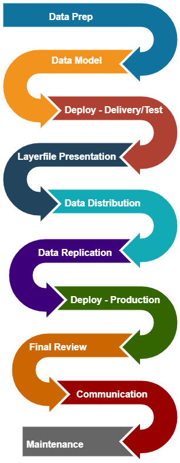
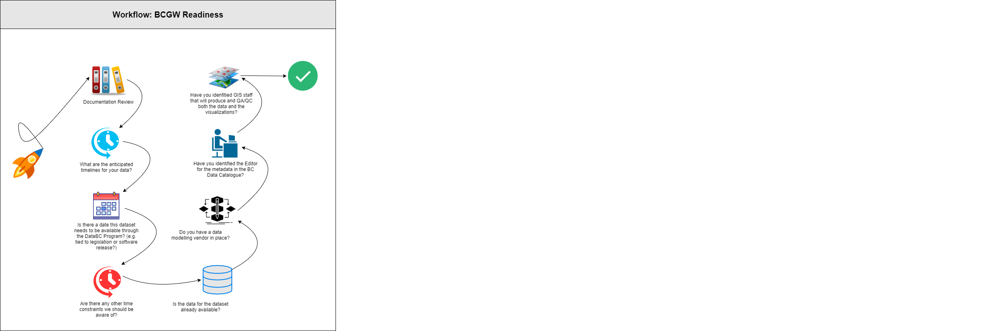
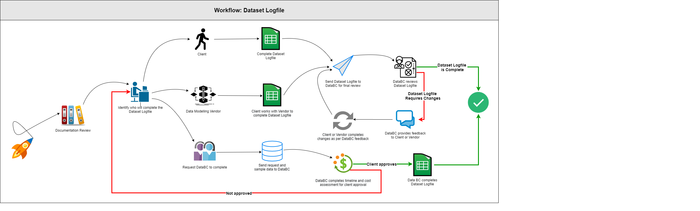

# BC GEOGRAPHIC WAREHOUSE PUBLICATION WORKFLOW

When data is published to the BCGW, it must undergo a rigorous and standardized publication process to ensure adherance to government data standards for quality and consistency.  DataBC has well documented Data Standards and Guidelines that are followed throughout the process for data publication.  

The workflows described below will guide you through what your reponsibilities are as the client and how we work with you to load and publish your dataset in the BCGW.

This page is written in the context that you have reviewed the documentation as listed below.

|**AUDIENCE**|  |  |  |
|:---:|:---:|:---:|:---:|
| *Data Publishers* | *Business Analysts* | *Business Portfolio Managers* | *Application Administrators* |

-----------------------

## Table of Contents
+ [**DOCUMENTATION REVIEW**](#documentation-review)
+ [**DATA PREPARATION**](#data-preparation)
	+ [Create a Plan](#create-a-plan)
	+ [Whiteboard Sessions](#whiteboard-sessions)
+ [**DATA MODELLING**](#data-modelling)
	+ [Dataset Logfile](#dataset-logfile)
	+ [Technical Whiteboard](#technical-whiteboard)
	+ [The Data Model](#the-data-model)
	+ [Data Population](#data-population)
+ [**DATA DEPLOYMENT - DELIVERY AND TEST**](#data-deployment---delivery-and-test)
	+ [BC Data Catalogue Metadata Record](#bc-data-catalogue-metadata-record)
	+ [Deploy and Approve Content in Delivery](#deploy-and-approve-content-in-delivery)
	+ [Migrate and Approve Content in Test](#migrate-and-approve-content-in-test)
+ [**LAYERFILE PRESENTATION**](#layerfile-presentation)
+ [**DATA DISTRIBUTION**](#data-distribution)
+ [**DATA REPLICATION**](#data-replication)
+ [**DATA DEPLOYMENT - PRODUCTION**](#data-deployment---production)
	+ [Deploy and Approve Data Content in Production](#deploy-and-approve-data-content-in-production)
+ [**FINAL REVIEW**](#final-review)
+ [**COMMUNICATION**](#communication)
+ [**DATA MAINTENANCE**](#data-maintenance)
  
-----------------------

## DOCUMENTATION REVIEW

The first step in the process is to review the following documentation: 
+ **[Before You Start](dsg_before_you_start.md)**
+ **[BCDC Standards and Guidelines](dsg_bcdc.md) (all)**
+ **[BCGW Standards and Guidelines](dsg_bcgw.md) (all)**
+ **[Common Data Standards and Guidelines](dsg.md) (all)**
+ **[Data Governance](dg.md)**
+ **[Open Data](open_data.md)**

------------------------------

## DATA PREPARATION

The effort required to publish data to the BCGW depends on the nature and complexity of your data set. As a [_Data Publisher_](glossary.md#data-publisher), you will need to keep in mind that this process is to not just end up with your data in the BCGW, but that it is packaged and presented in a format that makes it easy for your clients to use it for planning, analysis and decision-making.

Though the steps described in this page represent the complete BCGW population sequence, the process will be "right-sized" to fit your needs. To determine which steps are required for your dataset, we recommend thinking first about the final steps of the process (i.e., how will I present my data and what data products will I provide?), and then working backwards. This can help you define the security, metadata and other modelling requirements.

### Create a Plan

Depending on the size and complexity of your data, the steps required to prepare the data and make it accessible using the BCGW may take days or weeks, and will require participation from your staff throughout the process. To better understand the process and specific requirements, start first with reviewing the BCGW Readiness Worflow and the answering the questions in Before You Start. Then, you can create a work plan to ensure you have the required time and resources. 

1. [BCGW Readiness Workflow](images/wf_BCGWReadiness.svg)

2. **[Before You Start](#documentation-review)**

3. Create a work plan
+ Identify your Business Analyst (or person desginated to act in this role) from your team that will facilitate the process.
+ Your Business Analyst will set up a whiteboard session that will be attended by you, technical staff, and any vendors who may be involved in developing and maintaining your operational system. 

### Whiteboard Sessions

Once you have completed the documentation review and questions, it's time to contact [DataBC DA](mailto:DataBC.DA@gov.bc.ca) to schedule the first of two Whiteboard Sessions - the Discovery Whiteboard. The Technical Whiteboard is the other Whiteboard Session and will be completed during the Data Modelling process.

#### **Discovery Whiteboard**

This purpose of this session is to discuss your dataset, the questions you answered in Before You Start, develop a plan that defines all the resources required, roles and responsibilities, issues and timelines as well as provide you with some personal guidance on next steps for the process.

+ This plan must be approved by you before work proceeds.
+ Your Business Analyst will then implement and manage the plan to completion.
+ Based on need, a Stewardship agreement may be developed.
+ The process to establish the licensing requirements for the data is also initiated at this point using the Open Data Assessment Checklist.

*We will ask that you send us a sample of the data so we can provide constructive feedback in the session.*

**Resources**

Having the right people available for the session allows us to all move forward efficiently. Please ensure attendance for the following resources from your business area:

|Type|Resource|Attendance|Purpose|Action Items from Session|
|:---|:---|:---|:---|:--|
|Business Area|Data Suppliers|**Required**|Data overview|Provide copy of dataset to BCGW Staging Area|
|||||Complete the [Dataset Logfile](#dataset-logfile) with assistance from ***DataBC DA*** and [_Data Delivery Standards - Data Delivery Checklist_](dsg_bcgw_data_delivery.md#data-delivery-checklist)|
|||||Request access to the BCGW via the [_NRM Service Desk_](https://nrsservicedesk.gov.bc.ca/IM/scripts/LoginPage.asp)|
|||| |Start working on the [Open Data](open_data.md) requirements, if applicable|
|Business Area|IMB: BA/BP|**Required**|Access requirements|If a database or web service, provide access to the source data|
|||| |Set up proxies to operation databases (delivery/test/production)|
|||| |Set up Web Service to pull data from and accounts|
|Business Area|Vendor/Developer|_Optional_| _If using, please attend_

The following resources from DataBC will be in attendance:

|Type|Resource|Attendance|Action Items from Session|
|:---|:---|:---|:--|
|DataBC|[DataBC Data Admin](mailto:DataBC.DA@gov.bc.ca)|**Required**|If a file, provide access to the BCGW Staging Area|
||| |Review if Data Suppliers intended on QAing the data in the BCGW directly, if they have accounts.|
|DataBC|[DataBC ETL](mailto:DataBC.DA@gov.bc.ca)|_As Required_|
|DataBC|[DataBC Catalogue Admin](mailto:datacat@gov.bc.ca)|_Optional_|

-------------------------------

## DATA MODELLING

When your data is stored in the BCGW, it may have to be structured differently from how it is organized in your operational system. This is because it may be used for different purposes or may be serving a different audience that uses DataBC's applications and infrastructure for browsing and accessing the data. 

Your data, as described in your [_Data Model_](glossary.md#data-model), is also required to conform to the [BCGW Standards and Guidelines](dsg_bcgw.md). The [_Data Manager_](glossary.md#data-manager) is responsible for ensuring the data is modelled as per these standards and guidelines. 

It is common for programs that do not have internal resources for data modelling to have this work carried out by a vendor. In this case, you will provide input to the vendor so the data model can be created. 

### Dataset Logfile

The [Dataset Logfile](https://gogs.data.gov.bc.ca/datasets/templates/src/branch/master/dataset_logfile/) is where you provide specific details about your dataset in order to capture the following information: 

   + **Business Details:** Overarching Title, Description, Custodian, Business Area Contacts and IMB BA/BPM
   + **Data Details:** Dataset Title, Descriptions, Source, Feature Type and Count and who to create Metadata
   + **Security Details:** Database, Applications, iMapBC, Distribution, WMS, License Type, Replication Mechanism
   + **Data Model Details:** Object Name, Column Names, Column Definitions (data type, length) Short Names (for Distribution) and Column Definitions
   
_Note that the Dataset Logfile directory contains two TEMPLATE files, one for [GSR](glossary.md#geographic-sites-registry) dataloads and one for non-GSR dataloads._

[Dataset Logfile Workflow](images/wf_DatsetLogfile.svg)

Once the Dataset Logfile has been reviewed and approved, the Technical Whiteboard Session will be scheduled.

### Technical Whiteboard

The purpose of the Technical Whiteboard Session is to discuss the technical details of your dataset after your Dataset Logfile has been completed.  During this session, we will discuss:
+ Specifics about data model based on Dataset Logfile and access to source data
+ Security model for Database, iMap, Distribution, WMS, Open Data
+ Replication mechanism and frequency

Depending on the complexity of your dataset, you may be required to create a [logical data model](glossary.md#logical-data-model) (e.g., ddl, erd) along with your [physical data model](glossary.md#physical-data-model). The DataBC team will work with you and/or your vendor to leverage any existing source models during this process. 

**Client resources for session:**

|Type|Resource|Attendance|Action Items from Session|
|:---|:---|:---|:--|
|Business Area|Data Suppliers|**Required**|Provide IDIRs and/or BCeIDs of users and data managers|
||||If not using vendor/developer: complete [_Data Delivery Standards - Repository Container Checkout List_](dsg_bcgw_data_delivery.md#repository-container-checkout-list-completed)|
|Business Area|IMB: BA/BP|**Required**|_if Named User access is required, security configuration for: Database Roles, Proxy Accounts, Firewalls_|
|Business Area|Vendor/Developer|_Optional_|If using vendor/developer: complete [_Data Delivery Standards - Repository Container Checkout List_](dsg_bcgw_data_delivery.md#repository-container-checkout-list-completed)|

**DataBC Resources for session:**

|Type|Resource|Attendance|Action Items from Session|
|:---|:---|:---|:--
|DataBC|DataBC DA|**Required**|Account Management may include: Gogs, BCGW (del/test/prod), Staging Area, Oracle Designer, BCGW Delivery passwords|
||||Finalize database object names|
||||_if Named User access is required, security configuration for: Database Roles, Proxy accounts, iMap Workspaces, Firewalls_
|DataBC|DataBC ETL|_Optional_|

### The Data Model

Clients will provide input to their vendor/developer so the data model can be created. DataBC will then review the model (and provide feedback when required) prior to your vendor/developer delivering the final product.

**Resources for data modelling**

|Type|Resource|Responsibility 
|:---|:---|:---|
|Business Area|Data Suppliers|Input|
|Business Area|IMB: BA/BP|cc'd on communication|
|Business Area|Vendor/Developer|**Required** to complete Data Model|
|DataBC|[DataBC DAs](mailto:DataBC.DA@gov.bc.ca)|**Required** to review Data Model|

### Data Population

Based on your data type, different methods are used for [_Data Population_](glossary.md#data-population):
+ Non-spatial Oracle to Oracle tables are accepted as materialized views
+ Spatial population is completed using FME
   + see [DataBC's FME Framework](dps_bcgw_w_databc_fme.md) for more information
+ _Note: SDR is being deprecated._

Once the population process has been initiated, test the transformation process to confirm that the warehouse model is correct (e.g. source fields are mapped correctly to destination fields). The DataBC team can be available to you for consultation and support during the population process, if required.

When this process is completed, the data has been correctly represented in the warehouse and the process is in place for populating the data from the operational system, but the data is not yet ready for access by BCGW users.

-------------------------------

## DATA DEPLOYMENT - DELIVERY AND TEST

### BC Data Catalogue Metadata Record

Each data publication in the BCGW requires a related metadata record in the BC Data Catalogue. You or your Business Analyst will use the BC Data Catalogue to enter the metadata that describes your data. For information on creating a BC Data Catalogue metadata record, visit the [BC Data Catalogue](dps_bcdc.md) section.

#### Security Profile

+ Define a [_Security Profile_](glossary.md#security-profile) by defining access rules and restrictions that cover browsing, viewing, ordering and downloading your data via the BCGW. This is done using the metadata management tool.
+ Work with DataBC staff to ensure that your [_Security Profile_](glossary.md#security-profile) is complete, addressing all of your data and all types of user access.
+ Create any required data use agreements. (Note that it is your responsibility to ensure compliance with Freedom of Information and Protection of Privacy policies.)

### Deploy and Approve Content in Delivery
Once the data modelling is complete and in parallel with drafting the metadata record, the data can be deployed to the BCGW Delivery environment via a Delivery Kit.

**Resources**

|Type|Resource|Action Items|
|:---|:---|:---|
|Business Area|Data Suppliers|**Required** to review data|
|||Create metadata record in BC Data Catalogue
|||_If data is spatial, create layerfile(s)_
|Business Area|IMB: BA/BP|**Required** to notify **Data Supplier(s)** if using their own vendors
|Business Area|Vendor/Developer|**Required** to deploy Delivery Kit to BCGW Delivery|
|DataBC|[DataBC DAs](mailto:DataBC.DA@gov.bc.ca)|**Required** to notify **Data Supplier(s)** if using DataBC's existing Vendor|

[RETURN TO TOP][1]
 
-------------------------------

### Migrate and Approve Content in Test

Once the data has been successfully deployed to BCGW Delivery, DataBC can then migrate the dataset(s) to TEST.  During this time:
+ the client will test data for content and performance in end-user platforms and provide feedback to DataBC from testing
+ DataBC will test data for content and performance in standard desktop and web-based mapping platforms (ArcGIS, iMapBC) and provide feedback to the client from testing

#### Migration Bookings for Test
+ ***DataBC*** will book tentative migrations where there is a dependency on a source database migration and will only promote once the business area has informed us that their migration was successful.

**Resources for Test Deployment**

|Type|Resource|Responsibility|Action Items|
|:---|:---|:---|:--|
|Business Area|Data Suppliers|**Required**|Coordinate with BA/BPM to notify [DataBC.DA](mailto:DataBC.DA@gov.bc.ca) via email that Delivery kit is ready to promote to **BCGW Test** and provide date and time for migration
||||Coordinate with the BA/BPM to provide the **OKAY** to migrate if there is a dependency on a operational migration|
||||Data testing - content, performance|
|Business Area|IMB: BA/BPM|**Required**|Coordinate with Data Supplier to notify [DataBC.DA](mailto:DataBC.DA@gov.bc.ca) via email that Delivery kit is ready to promote to **BCGW Test** and provide date and time for migration
||||Coordinate with the Data Supplier to provide the **OKAY** to migrate if there is a dependency on a operational migration|
||||Data testing - content, performance|
|Business Area|Vendor/Developer|_Optional_|
|DataBC|DataBC DA|**Required**|Schedule migration
||||Data testing - content, performance|
|DataBC|DataBC Delivery Specialist|**Required**|Migrate Delivery Kit|

-----------------------

## LAYERFILE PRESENTATION

The purpose of a [layerfile](glossary.md#layerfile) presentation is to present data in a consistent manner that best supports users' needs for analysis and decision-making. In effect, it represents a business view of the data from the users' perspective, rather than the operational view of the source system. Ideally, the layerfile presentation should make invisible the complexities and technicalities of the underlying physical data structures. 

Layerfile presentations for iMapBC and ArcGIS can be built at any time throughout the process, but must be configured for the data once it is deployed in PRODUCTION. 
Typically, it includes elements such as these:

+ user-friendly names for data layers, tables and columns, e.g.,
   + `VEG_VEGETATIVE_COVER_POLYGON` becomes Vegetative Land Cover,
   + `PRI_UTIL_LEVEL_CD` becomes Primary Utilization Code
+ translation of codes into understandable descriptions
   + e.g., `{1,2,3}` becomes `{high, medium, low}`
+ colours, symbols and fonts to distinguish different data types
   + e.g., blue for rivers
+ grouping of records according to logical category

This step usually requires substantial input from the business area. You can expedite the process by identifying who will make decisions about presentation and then arranging one or two focused meetings to reach agreement.

#### Activities

+ DataBC will contact you to discuss how you want your data named and presented.
   + You may also provide an ArcGIS layer file. If you do this, DataBC will review and approve the file
   + Alternatively, you may ask DataBC to develop a layer file on your behalf. 
      + In this case, DataBC will develop a first version according to your instructions and then send to you for review and approval.
+ Once the layer file is defined, DataBC will translate it for use with in various warehouse access channels for use with web mapping tools such as iMapBC.
+ You will then be asked to review and approve the translation within a test environment.

For more information about the various tools available to view, analyze and connect to data, visit the [BC Government's Data page](https://www2.gov.bc.ca/gov/content/data).

-----------------------

## DATA DISTRIBUTION

[_Data products_](glossary.md#data-products) are important because they specify how your data can be used to support analysis and decision-making. You can define them based on types of use of the data (for instance, it may help users if you apply some pre-processing to the data to save them having to do it), or based on how your data is capable of being accessed (e.g., your data model may not support fine-grained access to the data).

Data Distribution configuration is completed to implement access and security for datasets that are stored in the BCGW and available for download via:
	+ BC Data Catalogue
	+ iMapBC  

#### Activities

+ Through discussion with users, develop an understanding of how they would like data assembled or "pre-packaged".
+ Within the technical constraints of your data and the BCGW, define a set of data products. 
   + DataBC can help in defining the data products and translating the definitions into technical specifications.
+ It is important that you reflect the security requirements associated with data products explicitly in the security profile because this will govern who may access the data products.

**Required for Action Items:**

+ Security model as indicated in the Data Suppliers in the Dataset Logfile
+ If Named User, then IDIRs and/or BCeIDs as provided by the Data Suppliers
+ Column Short Names as provided by the Data Suppliers in the Dataset Logfile

**Action Items**

|**Resource**|**Action Item**|
|:---|:---|
|_DataBC: DA/Catalogue Services_| Publish distribution link in metadata|

**Resources**

|Type|Resource|Action|
|:---|:---|:---:|
|Business Area|Data Suppliers|_Input_|
|Business Area|IMB: BA/BP|_Not Required_|
|Business Area|Vendor/Developer|_Not Required_|
|DataBC|[DataBC DAs](mailto:DataBC.DA@gov.bc.ca)|**Required**|
|DataBC|[DataBC Catalogue Services](mailto:Datacat@gov.bc.ca)|Publish distribution link in metadata|
 
-------------------------------------

## DATA REPLICATION

Data Replication provides the channel in which the data is updated.  Some datasets require frequent, scheduled updates, while others may be updated less frequently or on an ad-hoc basis. DataBC DA and [ETL](glossary.md#ETL) services will work with you to set up the replication process for your dataset.

**Required for Action Items:**

+ for file based source data, usually ESRI File Geodatabase to be located in the BCGW Staging Area
+ for database source data	
	+ Proxy account and passwords for source Del/Test/Prod as provided by the  ***Business Area IMB*** 
+ SQL query for materialized view replication
+ FME Workspace (FMW) file
	+ Provided by business area client (or client’s vendor)
+ [_Using the DataBC FME Framework_](dps_bcgw_w_databc_fme.md)
+ Replication frequency as identified by the ***Data Suppliers*** in the Dataset Logfile

**Action Items**

|Resource|Action Item|
|:---|:---|
|_DataBC: DA_|Perform QA on FMW scripts|
|_DataBC: ETL_| Schedules replication for FMW|

**Resources**

|Type|Resource|Action|
|:---|:---|:---:|
|Business Area|Data Suppliers|_Input_|
|Business Area|IMB: BA/BP|_Input_|
|Business Area|Vendor/Developer|_Not Required_|
|DataBC|[DataBC DAs](mailto:DataBC.DA@gov.bc.ca)|**Required**|
|DataBC|[DataBC ETL](mailto:DataBC.DA@gov.bc.ca)|**Required**|

[RETURN TO TOP][1]

-----------------------

## DATA DEPLOYMENT - PRODUCTION

### Deploy and Approve Data Content in Production

Once the data has been successfully tested and approved in BCGW TEST, DataBC can then migrate the dataset(s) to PROD. During this time:
+ the client will test data for content and performance in end-user platforms and provide feedback to DataBC from testing
+ DataBC will test data for content and performance in standard desktop and web-based mapping platforms (ArcGIS, iMapBC) and provide feedback to the client from testing

#### Migration Bookings for Production

***DataBC*** will book tentative migrations where there is a dependency on a source database migration and will only promote once the business area has informed us that their migration was successful.

**Resources for Production Deployment**

|Type|Resource|Responsibility|Action Items|
|:---|:---|:---|:---|
|Business Area|Data Suppliers|**Required**|Coordinate with BA/BPM to notify [DataBC.DA](mailto:DataBC.DA@gov.bc.ca) via email that Delivery kit is ready to promote to **BCGW Prod** and provide date and time for migration
||||Coordinate with the BA/BPM to provide the **OKAY** to migrate if there is a dependency on a operational migration|
||||Data confirmation - content, performance|
|Business Area|IMB: BA/BP|**Required**|Coordinate with Data Supplier to notify [DataBC.DA](mailto:DataBC.DA@gov.bc.ca) via email that Delivery kit is ready to promote to **BCGW Prod** and provide date and time for migration
||||Coordinate with the Data Supplier to provide the **OKAY** to migrate if there is a dependency on a operational migration|
||||Data confirmation - content, performance|
|Business Area|Vendor/Developer|_Optional_|
|DataBC|DataBC DA|**Required**|Schedule migration|
||||Cooridinate with DataBC Delivery Specialist to migrate Delivery kit|
|||| Kick off all access pieces|
||||Data confirmation - content, performance|
|DataBC|DataBC Delivery Specialist|**Required**|Cooridinate with DataBC DA to migrate Delivery kit|

-----------------------

## FINAL REVIEW

Your dataset has been modelled and loaded into the BCGW in Production, your layerfile is presented in iMap and available in ArcGIS, you have a metadata record in the BC Data Catalogue where users can find detailed information and download your dataset, the data may be automatically getting updated on a nightly basis...now what?

Please review all the functions and access points that have been configured for your dataset.  Provide [DataBC.DA](mailto:DataBC.DA@gov.bc.ca) with any feedback or issues you may come across, or even just let us know how excited you are to have your data published through the DataBC Program! 

-----------------------

## COMMUNICATION

Continued engagement with your clients is important. This applies both at the levels of their business and their individual needs. Once you have completed the steps described above, your data will be ready for use. You now need to let your user audience know that your data is available for access.

#### Activities

+ Decide on a communication strategy. 
   + Who do you have to reach? 
   + What are the messages that you want to convey? 
   + Users will want to know about the characteristics of the data and data products, what they can be used for, if there are restrictions on who may use them.
+ Launch the strategy. 
   + Initial promotion may involve several channels and extend over a period of months.
+ Sustain the strategy. 
   + Communication must continue throughout the lifetime of the data. 
   + You will need to continue to promote your data, to inform users of changes to the data, and to solicit their ideas and feedback.

------------------------   

## DATA MAINTENANCE

If there are data structure changes needed to your tables, layers or views in the warehouse, DataBC will work with you to modify the models and transformation process to ensure data continues to be provided as expected to BCGW users.

#### Why is Data Maintenance Required?

Once you have the data available for access via the BCGW, you must keep the pipeline flowing smoothly. You will enter into the maintenance phase, which involves less day-to-day effort, but is nevertheless important.

Over time the nature and application of a data holding may change. It's up to you as Data Manager to periodically update the models and profiles described above. You must also decide when obsolete data should be retired and removed from the BCGW.

#### Activities

+ Establish procedures for maintaining the data. These must address items such as:
   + who is responsible for day-to-day operations
   + how updates to the data are handled
   + how quality assurance is conducted (quality assurance is not DataBC's responsibility)
   + how changes to profiles and models are handled
   + how records management is done
+ Provide user support. 
   + This includes assigning resources to answer users' business-related questions and resolve issues (technical support will be handled through DataBC and Shared Services)
   
[RETURN TO TOP][1] 

------------------------   

[1]: #bc-geographic-warehouse-publication-workflow
