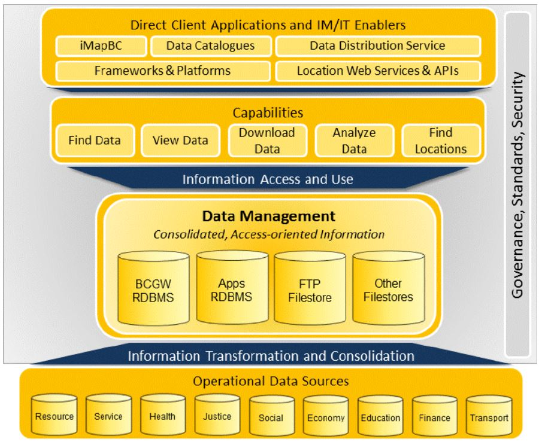
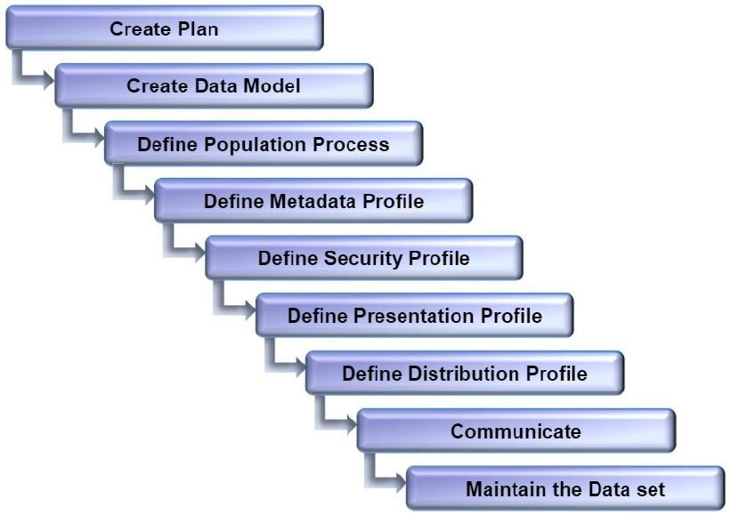

# ROLES AND RESPONSIBILITIES
_Formerly: A Guide for Data Custodians and Data Managers_

This is a guide for Data Custodians and Data Managers. It explains why these roles are important, and their associated responsibilities. It also describes how business areas can use the BC Geographic Warehouse (BCGW) to make their data holdings accessible to clients.

The page covers the following topics:

+ Getting the most out of the data we collect and manage
+ The role and obligations of Data Custodians and Data Managers
+ Using the BC Geographic Warehouse (BCGW) to distribute data
+ Where to find more information

|**AUDIENCE**|  |  |  |  | 
|:---:|:---:|:---:|:---:|:---:|
| *Data Publishers* | *Data Custodians* | *Data Managers* | *Data Stewards* | *Metadata Editors* |

## Table of Contents
+ [**IT IS ALL ABOUT THE INFORMATION**](#it-is-all-about-the-information)
+ [**WHAT IT MEANS TO BE A DATA CUSTODIAN**](#what-it-means-to-be-a-data-custodian)
	+ [What is a Data Custodian?](#what-is-a-data-custodian)
	+ [Am I a Data Custodian?](#am-i-a-data-custodian)
	+ [Obligations of a Data Custodian](#obligations-of-a-data-custodian)
	+ [Responsibilities of a Data Custodian](#responsibilities-of-a-data-custodian)
+ [**RELATED ROLES**](#related-roles)
	+ [The Data Manager](#the-data-manager)
	+ [The Data Steward](#the-data-steward)
	+ [Other Roles](#other-roles)
+ [**WHAT IT MEANS TO BE A DATA MANAGER**](#what-it-means-to-be-a-data-manager)
	+ [What is a Data Manager?](#what-is-a-data-manager)
	+ [Am I a Data Manager?](#am-i-a-data-manager)
	+ [Obligations and Responsibilities of a Data Manager](#obligations-and-responsibilities-of-a-data-manager)
+ [**THE BC GEOGRAPHIC WAREHOUSE (BCGW)**](#the-bc-geographic-warehouse-bcgw)
	+ [Why the BCGW?](#why-the-bcgw)
	+ [How does the BCGW Work?](#how-does-the-bcgw-work)
+ [**MAKING USE OF THE BCGW**](#making-use-of-the-bcgw)
	+ [Benefits](#benefits)
	+ [Start with the End in Mind](#start-with-the-end-in-mind)
	+ [Create a Plan](#create-a-plan)
	+ [Create the Warehouse Data Model](#create-the-warehouse-data-model)
	+ [Define the Population Process](#define-the-population-process)
	+ [Define a Metadata Profile](#define-a-metadata-profile)
	+ [Define A Security Profile](#define-a-security-profile)
	+ [Define A Presentation Profile](#define-a-presentation-profile)
	+ [Define Downloadable Data Products](#define-downloadable-data-products)
	+ [Communicate](#communicate)
	+ [Maintain the Data](#maintain-the-data)
+ [**MORE INFORMATION**](#more-information)
	+ [Contact DataBC](#contact-databc)

-----------------------

## IT IS ALL ABOUT THE INFORMATION

This guide is about managing information within the BCGW and making it available for decision making. The following points provide some context.

+ **We use a lot of information**
   + The Province collects and uses a wide variety of information. 
   + Much of this information is collected by business areas that have a responsibility for inventory and providing access to this information.
+ **Information is used for making decisions**
   + It is the reason we collect and provide it. 
   + The wider its access, the greater its potential.
+ **Information integration adds value**
   + The power of information for decision-making increases significantly when it is integrated with other related data.
   + Base mapping and other foundation data play a crucial part in providing a common geographic context for analysis and decision making.
+ **Information standards are important**
   + Standards provide the basis for information processing, integration and access using common sets of tools. 
   + Lack of adherence to standards severely limits data use.
+ **Information is costly**
   + The Province spends considerable money, time and resources to collect information and manage it.
+ **Information needs to be understood**
   + Information used properly can provide immense value. 
   + However, it can have the opposite effect if used inappropriately. Users need information about the data they intend to use in order to assure themselves of the data is fitness for purpose.
+ **Information needs to be managed**
   + Data are not static. 
   + Over time, they are added to, updated, deleted, and reformatted, and so on. 
   + Keeping information in usable form is not a trivial task. It requires active management.
+ **Information needs to be protected**
   + In many respects, information is a fragile resource. 
   + It is easily corrupted and misused, and loses its value if it goes out of date, or is not properly described. 
   + Some information is confidential, and needs to remain so. 
   + Someone has to set the rules for using information and, having done so, step up to ensure the information is made available according to those rules.

-----------------------

## WHAT IT MEANS TO BE A DATA CUSTODIAN

### What is a Data Custodian?

A _Data Custodian_ is someone who:

+ protects and promotes the use of data holdings under their care;
+ sets policies, and is accountable for defining the appropriate use of the data;
+ provides the authoritative version of the data; and
+ is ultimately accountable for issues related to definition, collection, management and authorized use of the data. Every data holding should have one and only one Data Custodian - usually someone at the Director or Executive Director level.

### Am I a Data Custodian?

If you are a director with responsibility for the business (i.e., if you have authority based on legislation or policy), then you are probably also the _Data Custodian_.

Unless this custodianship role is formerly assigned to someone else, you have the obligations and accountability described here.

### Obligations of a Data Custodian

If you are a _Data Custodian_ you have these obligations:

+ manage the data as a valuable business asset through its entire lifecycle;
+ ensure the data is fit for the purposes for which it is collected and provided; and
+ stay in touch with the users of your data and respond to their needs: 
     + by understanding the business environments of users and the information requirements of the business; and
     + by understanding the individual needs of users for access to information.

### Responsibilities of a Data Custodian

If you are a Data Custodian, you have these responsibilities:

+ **Data planning**
   + You decide what data is collected, when and how, its definition and purpose, which policies and standards apply, and which resources are utilized to manage and maintain it.
+ **Data content**
   + You decide user access rules, how the data is stored, promoted, distributed and retired.
   + Users for their part must respect the applicable-use policies set down by the _Data Custodian_.
+ **User advocacy**
   + You decide how to respond to users' business needs. 
   + You must understand the needs of the entire community of users. 
      + Of course, this doesn't mean you have to meet all user requirements. 
      + Rather, you should try to maximize the value of your data to users as a whole, balancing their respective needs.

[RETURN TO TOP][1] 

-------------------

## RELATED ROLES

### The Data Manager

While the _Data Custodian_ concentrates on issues of governance, the day-to-day management of data is the responsibility of the _Data Manager_. In effect, the _Data Manager_ is the person who carries out the policies and directions set by the _Data Custodian_. There could be several _Data Managers_ for a data holding, and the role can be delegated.

This is discussed further in the [_WHAT IT MEANS TO BE A DATA MANAGER_](#what-it-means-to-be-a-data-manager) section below.

### The Data Steward

Sometimes the _Data Custodian_ may not have the resource available to fulfill his or her responsibilities, or it may be more efficient to conduct activities in concert with another group. In these cases, a _Data Steward_ may become involved.

These are the characteristics of a _Data Steward_:

+ Usually at the director level, like the _Data Custodian_
+ Ability and resources to provide a set of services needed by the _Data Custodian_

Do not confuse the _Data Steward_ with the _Data Manager_. The _Data Steward_ has an agreement with the _Data Custodian_ to provide a specific set of custodial duties on behalf of the _Data Custodian_.

The _Data Custodian_ and _Data Steward_ should sign a written **Data Stewardship Agreement** that lays out the specific responsibilities that are being delegated to the _Data Steward_ by the _Data Custodian_.

Note that the involvement of a _Data Steward_ doesn't change the obligations of the _Data Custodian_. The _Data Custodian_ is still accountable for the governance and use of the data.

### Other Roles

+ A _Data Administrator_ is responsible for setting policies and standards related to managing and protecting data.
+ A _Discipline Authority_ is a **business expert** who understands the business relevance of data standards, and supports their application and use to meet an organization's needs.

----------

## WHAT IT MEANS TO BE A DATA MANAGER

### What is a Data Manager?

+ A person appointed by a _Data Custodian_ to manage a specific data set according to policies, plans and standards defined by the _Data Custodian_.
+ May take direction from a _Data Steward_ designated by the _Data Custodian_.
+ Responsible for day-to-day management of the data and may coordinate operations staff.
+ Usually has technical knowledge of the data, its collection & storage, and ways in which the data is commonly used.

### Am I a Data Manager?

You are a _Data Manager_ if you have been directed by a _Data Custodian_ to have the day-to-day responsibility for managing a data set.

### Obligations and Responsibilities of a Data Manager

The main obligation of a _Data Manager_ is to ensure that the _Data Custodian's_ directions are properly fulfilled.

You will typically be responsible for these activities (though perhaps not all of them):

+ Data capture and storage
+ Data quality assurance
+ Metadata capture and maintenance
+ Define business rule for security and access to data
+ Data population and distribution
+ User support

Data population and distribution may involve the BCGW, and this is discussed further in the next section.

-----------------------------

## THE BC GEOGRAPHIC WAREHOUSE (BCGW)

The BC Geographic Warehouse (BCGW) is a structured repository of priority data that is needed by Government, industry and the public in order to make decisions.

### Why the BCGW?

The BCGW is managed by DataBC. It supports the Province's electronic services strategy as it is designed and operated for the purposes of hosting and cataloguing sets of data (mostly spatial data) on behalf of custodial ministries and other government custodial agencies. 

The BCGW's access tools include ArcGIS for direct GIS access to spatial data, iMapBC and other web-based mapping tools, Discovery and Distribution Services for locating and downloading data.

The main purpose of the BCGW is to make data available to users in a form that best supports data integration, sharing and exchange, analysis and decision-making. In general, this is the purpose of any data warehouse.

Specifically, the BCGW accomplishes the following:

+ **Wide access**
   + In principle, any authorized person can gain access from anywhere on the internet, and browse, view, order and download data.
+ **Suited for purpose**
   + By means of data transformation, the BCGW allows data to be formatted and presented in a form useful to different audiences.
+ **Integration**
   + It allows data to be viewed, combined and analyzed with other data.
+ **User empowerment**
   + It includes some simple but effective data viewing and analysis tools.

By virtue of these features, the BCGW can provide substantial benefits for both _Data Custodians_ and _Data Managers_. In particular it responds to _Data Custodians'_ obligations to provide wide access to current, complete and authoritative data. It does this in a controlled manner, allowing graduated access from generalized browsing and viewing through to in-depth content access.

### How does the BCGW Work?

The BCGW is somewhat similar to a distribution warehouse that you find in a manufacturing supply chain.

The BCGW's data publishing and distribution process works as follows:

+ Government ministries and agencies (the data providers) produce data, which they publish to the BCGW. (This is like component manufacturers creating goods and shipping them to a warehouse.)
+ At the warehouse, the data is:
   + repackaged for consumer use - i.e., for the broad audience that uses the BCGW;
   + checked for valid format and structure; and then
   + stored and made available for browsing and viewing via an online catalogue.
+ Data consumers browse and select data products from the warehouse, which are distributed to them, generally using download via the internet.

#### Information Management through the BCGW

[RETURN TO TOP][1] 

-------------------

## MAKING USE OF THE BCGW

### Benefits

The BCGW provides the opportunity and means for _Data Custodians_ to present their data to a wide audience of users.

In this respect, the BCGW is enabling technology. It provides two sets of services - one set to assist _Data Custodians_ to present their data, the other set to help user access and use the data.

These are the benefits:

+ Relieves _Data Custodians_ and managers of many of the costs and headaches of making their data widely accessible
+ Easier user access to manage by virtue of a standard security model
+ Provides ability to structure, integrate and package data to better suit user needs
+ Improves the user experience by offering a standard user interface and set of familiar tools
+ Allows easier viewing and integration with other BCGW data

**Steps for Placing Data in the Warehouse** 

The effort required to utilize the BCGW depends on the nature and complexity of your data set. The steps described here can be "right-sized" to fit your needs.

The _Data Manager_ is usually responsible for preparing data for population and distribution using the BCGW. The process is fairly straightforward, but it does involve a number of steps. DataBC has staff available to work with _Data Managers_ to make the process as streamlined as possible.

If you are a _Data Manager_, these are steps that you will undertake in order to place your data in the BCGW. 

### Start with the End in Mind

As a _Data Manager_, it is worth remembering that the point of this process is to not just end up with your data in the BCGW, but that it is packaged and presented in a format that makes it easy for your clients to use it for planning, analysis and decision-making.

Thus, although the steps presented here are in a BCGW population sequence, in many ways it's better to think first about the final steps of the process (i.e., how will I present my data and what data products will I provide?), and then work backwards. This will then inform your security, metadata and other modelling requirements.

### Create a Plan

#### Why is a Plan Required?

Depending on the size and complexity of your data, the steps required to prepare the data and make it accessible using the BCGW may take days or weeks, and will require participation of your staff. Therefore, the first step is to create a work plan and ensure you have the required time and resources.

#### Activities

+ Contact DataBC, who will help you get started and provide advice about resourcing. 
   + In particular, you will probably need a Business Analyst to facilitate the process.
+ Your Business Analyst will set up a whiteboard session that will be attended by you, technical staff, and any vendors who may be involved in developing and maintaining your operational system. 
   + The purpose of the whiteboard session will be to develop a plan that defines all the resource required, role and responsibilities, issue and timelines.
+ This plan must be approved by you before work proceeds.
+ Your Business Analyst will then implement and manage the plan to completion.
+ Based on need, a Stewardship agreement may be developed.
+ The process to establish the licensing requirements for the data is also initiated at this point using the Open Data Assessment Checklist.

### Create the Warehouse Data Model

#### Why is a Warehouse Data Model Required?

When your data is stored in the BCGW, it may have to be structured quite differently from how it's organized in your operational system. This is because it will be used for potentially different purposes, serving a different audience who will use the BCGW's tool set for browsing and accessing the data. Unless the data conforms to certain design constraints, the BCGW's tools and services won't work properly.

A _data model_ is a formal description of the structure of a data set - that is, the types of data, their properties and relationships. A data model has to be created to describe how your data will be stored in the BCGW.

The _data model_ itself will be accessible to BCGW users. This is because it's an important element of metadata (see Define a Metadata Profile) that can help users utilize the data in their own systems environments.

#### Activities

As _Data Manager_, you are responsible for having your data modelled according to DataBC's standards and stored in the DataBC modelling environment. This requires the following:

+ Create a logical data model that describes the structure of the data as it will be stored in the BCGW.
+ Once this has been reviewed and approved, the physical data model must be created.
+ Create and provide the resulting scripts that will be used to build the tables, layers and views in the warehouse.

### Define the Population Process

#### Why is the Population Process Required?

_Population_ refers to the process of retrieving data from the Data Custodian's source system, transforming it as required and storing in the BCGW.

A number of different methods already exist, so it's a matter of selecting the most appropriate one and then configuring it to the specific needs of your data. Although this is the responsibility of the business area (who must also provide the funding), DataBC is available to you for consultation and support.

#### Activities

+ Initiate and fund a small project to develop the transformation process that will move the operational data into the warehouse.
+ Test the transformation process with a sample set of data to confirm that the warehouse model is correct. 
   + This is an important task. If problems are encountered then the data model will have to be fixed.
+ The next step is to test the transformation process with a full set of data to confirm that the process itself works correctly. 
   + Again, if there are problems, then the data transformation process will have to be corrected.

So by now, we have the data correctly represented in the warehouse and the process in place for populating the data from the operational system. But the data is not yet ready for access by BCGW users.

### Define a Metadata Record

#### Why is a Metadata Record Required?

_Metadata_ is information that describe data. A metadata record is a collection of information that describes a wide variety of data characteristics, including such topics as geographic extent of the data, when the data was collected, who collected it, who owns it, its format, quality, version number, rights of use, how often it's updated, its intended usage, and so on.

Creating a metadata record is important for the following reasons:

+ It provides the context for the data and allows it to be described and managed in a consistent way, similar to other datasets.
+ It supports user self-service. Users can browse the metadata record to understand the purpose and characteristics of a data set and decide whether it is right for their needs.
+ It supports sustainment in that it embodies knowledge about the data that might otherwise remain with a particular person or program, and not be captured.

There are international standards for metadata that DataBC follows. This provides interoperability with other data service utilities, meaning that descriptions of your data can be widely published and accessed (assuming your security profile allows this).

Visit [DataBC](https://data.gov.bc.ca) for more information about the [BC Data Catalogue](https://catalogue.data.gov.bc.ca/), DataBC's metadata management tool.

#### Activities

+ You or your _Business Analyst_ will use DataBC's metadata management tool to enter the metadata that describes your data. 
   + You may need to get the necessary permissions set up with DataBC. 
   + DataBC may provide training on using its metadata management tool, if necessary.  
+ Your metadata record will then be reviewed and approved by DataBC.
   + As _Data Manager_, you will have authority to edit your metadata profile in order to keep it up to date.)

### Define A Security Profile

#### Why is a Security Profile Required?

A _security profile_ defines who may access your data and what they can use it for. The _security profile_ (which is part of the metadata) is very important because it ensures that user access is consistent with your policies for data security, confidentiality and appropriate use.

#### Activities

+ Define a _security profile_ by defining access rules and restrictions that cover browsing, viewing, ordering and downloading your data via the BCGW. This is done using the metadata management tool.
+ Work with DataBC staff to ensure that your _security profile_ is complete, addressing all of your data and all types of user access.
+ Create any required data use agreements. (Note that it is your responsibility to ensure compliance with Freedom of Information and Protection of Privacy policies.)

### Define A Presentation Profile

This step usually requires substantial input from the business area. You can expedite the process by identifying who will make decisions about presentation and then arranging one or two focused meetings to reach agreement.

#### Why is a Presentation Profile Required?

The _presentation profile_ is very important. Its purpose is to present data in a consistent manner that best supports users' needs for analysis and decision-making. In effect it represents a business view of the data from the users' perspective, rather than the operational view of the source system.

Ideally, the _presentation profile_ should make invisible the complexities and technicalities of the underlying physical data structures. Typically, it includes elements such as these:

+ user-friendly names for data layers, tables and columns, e.g.,
   + `VEG_VEGETATIVE_COVER_POLYGON` becomes Vegetative Land Cover,
   + `PRI_UTIL_LEVEL_CD` becomes Primary Utilization Code
+ translation of codes into understandable descriptions
   + e.g., `{1,2,3}` becomes `{high, medium, low}`
+ colours, symbols and fonts to distinguish different data types
   + e.g., blue for rivers
+ grouping of records according to logical category

#### Activities

+ DataBC will contact you to discuss how you want your data named and presented.
   + You may also provide an ArcGIS layer file. If you do this, DataBC will review and approve the file
   + Alternatively, you may ask DataBC to develop a layer file on your behalf. 
      + In this case, DataBC will develop a first version according to your instructions and then send to you for review and approval.
+ Once the layer file is defined, DataBC will translate it for use with in various warehouse access channels for use with web mapping tools such as iMapBC.
+ You will then be asked to review and approve the translation within a test environment.

For more information about the various tools available to view, analyze and connect to data, visit the [BC Government's Data page](https://www2.gov.bc.ca/gov/content/data).

### Define Downloadable Data Products

#### Why are Downloadable Data Products Required?

_Data products_ are predefined packages of data that BCGW users can browse and download via the BCGW's data catalogue.

_Data products_ are important because they specify how your data can be used to support analysis and decision-making. You can define them based on types of use of the data (for instance, it may help users if you apply some pre-processing to the data to save them having to do it), or based on how your data is capable of being accessed (e.g., your data model may not support fine-grained access to the data).

#### Activities

+ Through discussion with users, develop an understanding of how they would like data assembled or "pre-packaged".
+ Within the technical constraints of your data and the BCGW, define a set of data products. 
   + DataBC can help in defining the data products and translating the definitions into technical specifications.
+ It is important that you reflect the security requirements associated with data products explicitly in the security profile because this will govern who may access the data products.

Visit the DataBC site for more information about the downloading data via distribution services.

### Communicate

Continued engagement with your clients is important. This applies both at the levels of their business and their individual needs.

#### Why is Communication Required?

Once you have completed the steps described above, your data will be ready for use. You now need to let your user audience know that your data is available for access.

#### Activities

+ Decide on a communication strategy. 
   + Who do you have to reach? 
   + What are the messages that you want to convey? 
   + Users will want to know about the characteristics of the data and data products, what they can be used for, if there are restrictions on who may use them.
+ Launch the strategy. 
   + Initial promotion may involve several channels and extend over a period of months.
+ Sustain the strategy. 
   + Communication must continue throughout the lifetime of the data. 
   + You will need to continue to promote your data, to inform users of changes to the data, and to solicit their ideas and feedback.

### Maintain the Data

If there are data structure changes needed to your tables, layers or views in the warehouse, DataBC will work with you to modify the models and transformation process to ensure data continues to be provided as expected to BCGW users.

#### Why is Data Maintenance Required?

Once you have the data available for access via the BCGW, you must keep the pipeline flowing smoothly. You will enter into the maintenance phase, which involves less day-to-day effort, but is nevertheless important.

Over time the nature and application of a data holding may change. It's up to you as Data Manager to periodically update the models and profiles described above. You must also decide when obsolete data should be retired and removed from the BCGW.

#### Activities

+ Establish procedures for maintaining the data. These must address items such as:
   + who is responsible for day-to-day operations
   + how updates to the data are handled
   + how quality assurance is conducted (quality assurance is not DataBC's responsibility)
   + how changes to profiles and models are handled
   + how records management is done
+ Provide user support. 
   + This includes assigning resources to answer users' business-related questions and resolve issues (technical support will be handled through DataBC and Shared Services)

------------------------   

## MORE INFORMATION

### Contact DataBC
This page explains the most important aspects of being a _Data Custodian_ or _Data Manager_, and how the BCGW can be part of your approach to fulfilling the responsibilities of these roles.

If you have questions about this guide, or would like to talk more about using the BCGW, please contact [DataBC](mailto:Data@gov.bc.ca).

### Resources

Other documents explaining guidelnes, roles and responsibilities:
   + [_Data Custodianship Guidelines for the Government of British Columbia_](https://www2.gov.bc.ca/assets/gov/data/data-management/data_custodianship_guidelines_for_the_government_of_bc.pdf)
   + [_Guidelines for Best Practices in Data Management – Roles and Responsibilities_](https://www2.gov.bc.ca/assets/gov/government/services-for-government-and-broader-public-sector/information-technology-services/standards-files/datamgmtrolesresp-2012mar-finalv2-asrb.pdf)
   
------------------------  

[RETURN TO TOP][1] 

[1]: #roles-and-responsibilities
