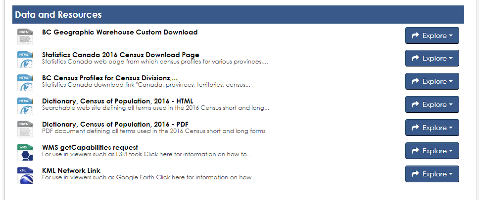
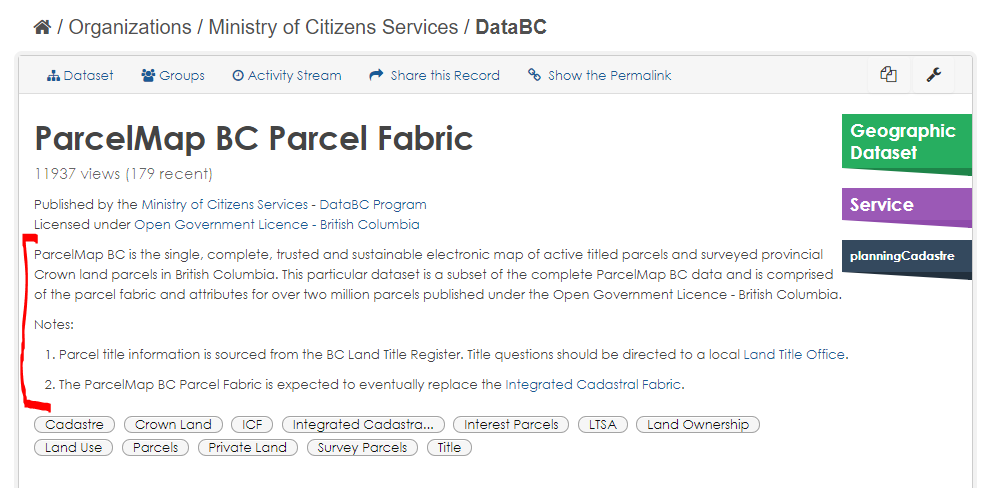
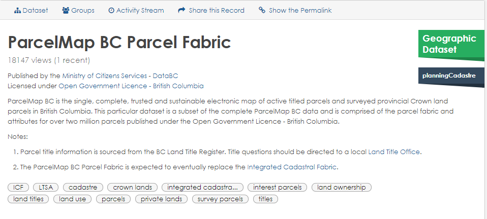

# NAMING AND DESCRIBING

The way we name and describe data creates an understanding of what the data is, where it comes from and under which organization or program its custodianship resides, among others. Standardized naming and describing helps to:
+ reduce ambiguity around the data
+ ensure unique names are used for data objects
+ provide reliable searchability
+ organize data into appropriate groupings
+ provide users with clear information on what the data is

DataBC adheres to the standards in this document for naming and describing data components within the DataBC Program, specifically in:

+ the BC Geographic Warehouse (BCGW)
+ the BC Data Catalogue BCDC)
+ the DataBC Data Modelling tool (currently Oracle Designer)

|**AUDIENCE**|  |  |  |  | 
|:---:|:---:|:---:|:---:|:---:|
| *Data Publishers* | *Developers* | *Data Modellers* | *Metadata Editors* | *DataBC Catalogue Team* |

## Table of Contents
+ [**Audience**](#audience)
	+ [Why do we need Naming Standards and Guidelines?](#why-do-we-need-naming-standards-and-guidelines)
	+ [Why do we need Describing Guidelines?](#why-do-we-need-describing-guidelines)
	+ [What Data Components do these standards and guidelines apply to?](#what-data-components-do-these-standards-and-guidelines-apply-to)
+ [**GENERAL NAMING GUIDELINES**](#general-naming-guidelines)
	+ [Dataset and Application Acronym](#dataset-and-application-acronym)
+ [**GENERAL DESCRIBING GUIDELINES**](#general-describing-guidelines)
	+ [Use of Latin Abbreviations](#use-of-latin-abbreviations)
	+ [Acronyms](#acronyms)
	+ [Providing Examples](#providing-examples)
	+ [Defining Code and Indicator Values](#defining-code-and-indicator-values)
	+ [Date and Time Fields](#date-and-time-fields)
+ [**GENERAL ABBREVIATION GUIDELINES**](#general-abbreviation-guidelines)
	+ [Abbreviations](#abbreviations)
+ [**ORACLE COMPONENT NAMING STANDARDS**](#oracle-component-naming-standards)
	+ [Database Object Prefix](#database-object-prefix)
	+ [Database Object Suffix](#database-object-suffix)
	+ [Database Object Short Name](#database-object-short-name)
	+ [Table](#table)
	+ [View and Materialized View](#view-and-materialized-view)
	+ [Code Table](#code-table)
	+ [Column](#column)
	+ [Spatial Mandatory Columns](#spatial-mandatory-columns)
	+ [Common Standardized Optional Columns](#common-standardized-optional-columns)
	+ [Transactional Columns](#transactional-columns)
	+ [Primary Key Column](#primary-key-column)
	+ [Index](#index)
	+ [Sequence](#sequence)
	+ [Constraint](#constraint)
	+ [Trigger](#trigger)
+ [**BC DATA CATALOGUE NAMING GUIDELINES**](#bc-data-catalogue-naming-guidelines)
	+ [Title](#title)
	+ [Resource](#resource)
	+ [CSV and XLSX Resource Column](#csv-and-xlsx-resource-column)
+ [**BC DATA CATALOGUE CONTENT AND DESCRIBING GUIDELINES**](#bc-data-catalogue-content-and-describing-guidelines)
	+ [Dataset Description](#dataset-description)
	+ [Resource Descriptions](#resource-descriptions)
	+ [Dataset Keywords (Tags)](#dataset-keywords-tags)
+ [**WEB SERVICES CONTENT AND DESCRIBING GUIDELINES**](#web-services-content-and-describing-guidelines)
+ [**APPENDIX A: Standard List of Abbreviations**](#appendix-a-standard-list-of-abbreviations)
+ [**APPENDIX B: Standard List of Column Names**](#appendix-b-standard-list-of-column-names)

-----------------------

### Why do we need Naming Standards and Guidelines?

**Naming Standards and Guidelines:**

+ Ensure that the same data component name (column name, attribute, constraint name, etc.) does not get used for multiple different purposes.
+ Promote clarity and understanding when the structure of a data component name indicates its type and use (e.g., a database object name ending in "_I" can be assumed to be the name of an index.
+ Promote clarity and understanding when the content of the names of related data components have similarities themselves (e.g., Fresh Water Atlas object names all begin with with "FWA_").
+ ensures that objects are consistently documented, recognised and referenced appropriately between their interconnected relationships.
+ Provide a platform for ensuring greater data sharing and consistency within the organization.
+ Ensure that the understanding and use of the data beyond its immediate context is accurate and valid.
+ Aid in the recognition of the component without external reference and to remove the ambiguity and errors in management of the components.

### Why do we need Describing Guidelines?

**Describing Guidelines:**

+ Promote clarity by ensuring that anyone who might have use for a component data will understand how it has been described.
+ Ensure that enough information is provided to allow someone to properly use the data.
+ Reduce ambiguity.

### What Data Components do these standards and guidelines apply to?

A data component is any object used to capture or store information about the data that is harnessed by software applications.  Specific examples include:

|Oracle database objects	|Files				|Data Models					|Data Streams		|BC Data Catalogue|
|:---|:---|:---|:---|:---|
|table and view names		|file names			|container names				|JSON Schema components	|dataset titles
|table and view descriptions	|description of file contents	|entity, relationship, and attribute names	|			|dataset descriptions
|table and view short names	|spreadsheet column names	|descriptions and data types			|			|tags
|column names			|spreadsheet column descriptions|						|			|resource names
|column descriptions		|spreadsheet column data types	|						|			|resource descriptions
|column data types		|				|						|			|
|constraint name		|				|						|			|
|trigger names			|				|						|			|	
|sequence names			|				|						|			|
|index names			|				|						|			|

-----------------------------------------------------------

## GENERAL NAMING GUIDELINES

This section presents the general principles used for naming and describing any of the data components. It includes the process for creating acronyms and abbreviations. Subsequent sections show where these principles are augmented and constrained to meet more specific requirements of the software or the management of the components.

### Dataset and Application Acronym

The dataset or application acronym is used to locate information about the data set and to name data components within DataBC's environments. It is first identified and confirmed in the whiteboard sessions with the business area.

The title of the dataset or application, and the acronym derived from it, are the first pieces of information resulting from the initial whiteboard sessions and must be agreed upon before any data design occurs.

The acronym is 3 to 5 characters in length and should be a representation of the business function of the dataset or the application that the dataset supports. It is used to identify the dataset or application in the Meta Repository (currently Oracle Designer) container name, all accounts on delivery servers, database schemas, and the prefix for all database objects created on any of the DataBC program's databases. It is mandatory that the dataset acronym be vetted by DataBC's DA and DBA for duplication as it must be unique. 

In a database designed for holding data that supports applications (e.g., DataBC's DBC database), an acronym should represent the particular application that the data supports. In a data warehouse (e.g., DataBC's BCGW), an acronym should represent a business function rather than any particular application since application names can change while the function of a dataset might not.

An example of dataset/application acronym naming is FWA which maps to the title "Fresh Watershed Atlas". Usually the acronym is the first letter of each word in the title.

This acronym is prefixed to all 'physical' database objects such as tables, views, packages, sequences, primary key names, foreign key names, roles and proxies. Functions and procedures that are not encapsulated in packages must also be prefixed with this acronym.

The intent of requiring the prefixing the Dataset and Application Acronym on all objects is to reduce the possibility of namespace collisions. 
 
------------------------------------------------------------------------------

## GENERAL DESCRIBING GUIDELINES

Entity type and attribute definitions should clearly describe what business information they record, using: 

+ **precision** - they resolve ambiguities and qualify imprecise terms; 
+ **completeness** - all terms are defined and clear examples are given; 
+ **clarity** - plain English sentences, including spelling out acronyms appropriately if not universally understood or previously spelled out in the same paragraph; 
+ **brevity** - brief and to the point; 
+ **compatibility** - with other definitions;
+ **understandably** - to a non-business point of view. 

Keep in mind that the definitions will automatically appear in the BC Data Catalogue (BCDC) metadata page, so definitions should be carefully written so that they make sense to anyone not completely familiar with the subject area.  For visual presentation in the BCDC, comments should be limited to around 200 characters (but don't sacrifice clarity to achieve that). (Note: these descriptions are separate from potentially longer and more detailed descriptions that can be manually added to the BCDC page.)

Definitions must be full sentences or a combination of sentences, even when using structured descriptions along with examples.

**Definitions should:**

+ not contain extraneous information, such as comments on future releases and plans;
+ not contain reference to ministry or business area names;
+ not contain reference to database or server names;
+ be consistent;
+ contain examples that are part of the description paragraph, with no carriage returns or special characters;
+ explain what the entity/object/table/view or attribute/column/field is in one or two sentences;
+ be written consistently in the following format (for a COLUMN called **FIELD_NAME**)
    + for all new data models:
    + A statement of what FIELD_NAME means, with either some typical examples or a list of all possible values.
    		+ Example: `The system calculated area of a two-dimensional polygon in square meters.`
    + in cases where a new/updated object should match other related objects:
    		+ FIELD_NAME is a statement of what the column means, with either some typical examples or a list of all possible values. 
    		+ Example: `FEATURE_AREA_SQM is the system calculated area of a two-dimensional polygon in square meters.`

The description of a spatial point table/view must contain an indication of whether the features in the table or view are point (one point per feature) or multipoint (possibly multiple points per feature).

### Use of Latin Abbreviations

Lower case is the form for a Latin abbreviation. Commas normally precede and follow the use of these Latin abbreviations. “i.e.” and “e.g.” do not stand alone after a sentence but are part of it, so it is not proper to use these abbreviations after the period ending a sentence. 

Use "i.e." when providing a complete list of possible values; use "e.g." when providing a (not complete) list of examples.

For both "i.e." and "e.g." values that are codes or numbers, provide the full description of that coded value in brackets after each value.

+ **Example**: The 3D Segment length in meters (nnn.nnn), e.g., 123.456.*

+ **Example - not the full descriptions in brackets**: The four character watershed group code, e.g., ADMS (Adams River), ALBN (Alberni Inlet).

+ **Example**: Identifies if the approved accommodation is a participant in the program, i.e., Y (yes) and N (no).

### Acronyms

Except when defining a coded value, the way to introduce an acronym is to state in full the proper name then the acronym enclosed within parentheses, e.g., Resource Information Standards Committee (RISC). When defining the meaning of a coded value that's an acronym, the meaning of the acronym should appear in parentheses.

+ **Example**: A unique Resource Information Standards Committee (RISC) standard code for a plant or animal species, based on its scientific or common name, e.g., M-URAR	 

+ **Example**: Defines the source of the spatial feature, e.g., TRIM (Terrain Resource Information Management), SAT (satellite), CDMS (Cadastral Data Management System).

#### Business Acronyms in Descriptions

When used in text, acronyms must be shown in full and qualified when first used in a section. The only time a acronym need not be qualified is if it is universally understood like the acronym 'SIN' for Social Insurance Number. An acronym is qualified by spelling the name in full followed by the acronym in brackets. Example: Global Positioning System (GPS).

If an acronym is first introduced at an entity level in the description, it must be qualified, but afterwards in can be used without qualifications in any of the attributes associated with that entity. However, if an acronym is used as a code value for a column or attribute, then the meaning of the acronym should be spelled out each time the code value is referred to.

**Example of comments for different columns in the SAME TABLE:**

+ The source of the spatial feature, e.g., *TRIM* (Terrain Resource Information Management), *CDMS* (Cadastral Data Management System). 
+ The source of the non-spatial attributes, e.g., *CDMS* (Cadastral Data Management System). 

If an acronym is used and is qualified in one entity's description and then the same acronym is used in another entity's description it must be qualified again. If an acronym is used in an attribute's description it must be fully qualified, unless the acronym already occurs in the attribute's entity description.

### Providing Examples

When providing examples, give 1, 2, or 3 examples, depending on how much clarification is warranted.

**Example**: The four character watershed group code, e.g., ADMS (Adams River), ALBN (Alberni Inlet).

#### When NOT to provide examples

Do not include examples for these types of fields:

+ system-generated primary key values,
+ fields whose domain is numeric and continuous,
+ fields of type DATE and BLOB,
+ fields that contain people's names or userids,
+ fields that contain comments or large descriptions,
+ fields with URLs,
+ system fields: FEATURE_AREA_SQM, FEATURE_LENGTH_M, SHAPE, OBJECTID, SE_ANNO_CAD_DATA.

**Examples**

1. A system-generated unique identifier number.
1. The system-calculated area of a two-dimensional polygon in square meters.
1. The date the associated active voting area boundary was gazetted.
1. The elevation above sea level of the monument, in metres.

### Defining Code and Indicator Values

The use of Code and Indicator fields are explained in [_Use of Indicator and Flag Columns_](dsg_bcgw_data_standards.md#use-of-indicator-and-flag-columns). When defining the meaning of code and indicator values, enclose the meaning in parentheses, following the code or indicator value.


+ **Example of a code column**: The four character watershed group code, e.g., ADMS (Adams River), ALBN (Alberni Inlet).
+ **Example of an indicator column**: Identifies if the approved accommodation is a participant in the program, i.e., Y (yes) or N (no).

### Date and Time Fields

When a field stores a date-time, the description of the field should, whenever possible, describe the time zone used for the source data being modeled in the BCGW. 
+ Is the date and time stored as Coordinated Universal Time (UTC)? - **recommended**
+ Is the date and time always the local time? (i.e., depends on the time zone plus whether daylight savings or standard time)
+ Is the date and time always the same time zone and always standard time? (e.g., Pacific Standard Time, Mountain Standard Time)?
+ Is the date and time always the same time zone and always daylight savings time? (e.g., Pacific Daylight Time, Mountain Daylight Time)?
+ Is the date and time always the same time zone but depends on time of year for standard time vs. daylight savings time (e.g., Pacific Time, Mountain Time)?
+ Is the date and time dependent on the system time and time zone (of the database or application) when the data was collected or calculated? (e.g., in Oracle databases, the system time zone of the database can be determined using the DBTIMEZONE function)

[RETURN TO TOP][1] 

-----------------------------------------------------------

## GENERAL ABBREVIATION GUIDELINES

### Abbreviations

This section provides the methods to determine abbreviations for use in naming data components. A search of the naming conventions used in the warehouse can also be done to look for consistent use of abbreviations. Words should be abbreviated consistently within the same dataset or application.

#### Creation of Abbreviations

Abbreviations are determined for words/terms as follows:

1. Determine required length of abbreviation.
2. Put first and last letter of word in first and last position of abbreviation.
3. Remove vowels.
4. Remove one of any double consonants.
5. Fill remaining spaces of abbreviation with consonants of the word in the order in which they appear until the required number of letters is obtained.

For example, to abbreviate the word 'ABBREVIATION' to 5 characters:

1. Put 'A' in location 1 and 'N' in location 5.
2. Remove 'E', 'I', 'A', 'I', and 'O'.
3. Remove one 'B'.
4. This leaves 'BRVT' to choose from for the 3 characters between 'A' and 'N'. 
5. Result is ABRVN

Caution should be taken to ensure that the abbreviation process doesn't result in a word that means something unrelated to what's being abbreviated.

#### Standard Abbreviations

+ **FA**: _Fully Attributed_ 
   + When a table or view contains identical data to another table or view, but instead has additional fields. 
      	+ This might be an internal government IDIR-only view where a public view with less attributes also exists. 
   + Example: GSR_SOCIAL_MIN_OFFICES_FA_SV
+ **PA**: _Partially Attributed_
   + When a table or view contains identical data to another table or view, but instead has less fields. 
      	+ This might be a public view of an already existing IDIR-only table.
   + Example: XYZ_EXISTING_TABLE_PA_SV
   
-----------------------------------------------------------

## ORACLE COMPONENT NAMING STANDARDS

This section presents the standards for providing names and text (definitions, description, or other) in the production of documentation for Oracle Objects, these include Tables, Synonyms, Tablespaces, etc. Naming standards for these are driven by the constraints of the Oracle database.

DataBC's conventions for naming database objects (including tables, views, columns, indexes, sequences, roles, packages and functions, etc) follow those basic naming conventions imposed by Oracle:

Object names should be maximum of thirty (30) characters long with these exceptions:

+ names of databases are limited to 8 characters;
+ names of database links can be as long as 128 characters;
+ should not contain quotation marks;
+ are not case-sensitive;
+ can only contain alphanumeric characters from the database character set and the characters _, $, and #,
   + The use of $ and # is strongly discouraged. 
   + Names of database links can also contain periods (.) and at-signs (@);
+ should contain underscores (_) for visual clarity;
+ must begin with a letter;
+ must not duplicate an ORACLE reserved word;
+ should not contain the word DUAL (e.g. DUAL is the name of a dummy table in Oracle);
+ must not duplicate the name of another database object;
+ should use nouns, rather than verbs;
+ should be as descriptive and as short as possible;
+ should use standard abbreviations when required;
+ should not be ambiguous.

### Database Object Prefix

All Oracle database objects (e.g., tables, views, triggers, constraints, etc,), **except for columns and comments** are prefixed by the [_Dataset/Application Acronym_](#dataset-and-application-acronym)

**Examples**:

|Object Name|Object Type|Prefix|
|:---|:---:|:---:|
|ADM_BC_PARKS_REGIONS_SP| table |ADM|
|EBC_VOTING_PLACES_SV| view |EBC |
|FTEN_FDU_LICENCE_XREF_MVW| materialized view |FTEN |
|ADM_MBRS_PK| index |ADM |
|BCTS_BCPRPS_BR_IU_TRG| trigger |BCTS|

### Database Object Suffix

Most types of Oracle database object have a corresponding standard suffix:

|Object Type| Suffix|
|:---|:---:|
| Spatial Tables| \_SP|
| Spatial Tables with Different Feature Types| \_POLY, \_LINE, \_POINT|
| Instantiated Spatial Tables (deprecated, not to be used for future deliveries)| \_ISP (deprecated)|
| Generalized Spatial Tables|\_SG (\_SPG deprecated)|
| Code Tables|\_CODE or _CD  |
| Generalized Spatial View|\_SVG  |
| Non-spatial Materialized Views| \_MV (\_MVW deprecated)|
| Spatial Regular and Materialized Views| \_SV (\_SVW deprecated)|
| Non-Spatial, Non-Materialized Views| \_VW|
| Primary Key Constraints and Primary Key Indexes| \_PK|
| Foreign Key Constraints| \_FK|
| Unique Key Constraints|\_UK|
| Index (other than the primary key index)|\_I|
| Sequences (discuss with DataBC DA before using these)|\_SEQ|
| Triggers|\_TRG|
| Check Constraints|\_CHK|
| Functions|\_F|
| Procedures|\_P|
| Packages|\_PKG|
| Repository BCGW Container Name|\_WHSE|
| Repository Application Container Name|\_APP|

**Note** that non-spatial tables do not have a suffix unless they are [_code tables_](#code-table).

### Database Object Short Name

Every BCGW table or view/materialized view has a short name, built from its full name.  This short name, sometimes referred to as a _table short name_, or just _short name_, is used in defining database objects that are based on the table - e.g., triggers, indexes, constraints, etc.  The short name is usually constructed by forming an acronym from the first letters of each of the parts of the table name, excluding the database object prefix.  Extra letters may be included for uniqueness.

Examples

|Object Name|Short Name|
|:---|:---:|
|FWA_STREAM_NETWORKS_SP |SNS |
|EBC_VOTING_AREAS_POINT|VAPN|
|EBC_VOTING_AREAS_POLY|VAPL|

### Table

+ The table name must be prefixed with the [_application acronym_](#dataset-and-application-acronym) and an underscore, e.g., FWA_STREAM_NETWORKS_SP.
+ The addition of a suffix is required for names of spatial tables. Refer to the [_Database Object Suffix_](#database-object-suffix) section above. 
+ The pre-suffix portion of a table name should be plural, e.g., FWA_STREAM_NETWORK**S**_SP.

### View and Materialized View

View names should be descriptive and, where applicable, indicate which tables are used within the view. Views follow the same object naming conventions described above, including the suffixing, which should be _VW, _MV or _SV, using the rules listed in the following table.
 
|Spatial? | Materialized? | Use this suffix |
|:---|:---:|:---:|
| Yes| No | \_SV |
| Yes | Yes | \_SV |
| No | No | \_VW |
| No | Yes | \_MV |


### Code Table

Code tables are given the class of CODE. Any code columns are also given the suffix CODE. 

If abbreviation is necessary for the table or column, use **CD**.

### Column

Column names, including foreign key columns, must **NOT** be prefixed with the dataset/application acronym.

#### Unique Identifier Column

The unique (primary key) identifier or surrogate key is used to make sure all records are unique within a spatial layer. If it is not a unique business identifier but a system-generated surrogate primary key column, the column name must be of the form <application_acronym>_<table_short_name>_SYSID. 

|System or Business Unique ID|Column Name|Data Type|Nullable|Description|
|:---|:---|:---:|:---:|:---|
|`System Generated`| `<application_acronym>_<table_short_name>_SYSID` | NUMBER(10)| No| `A system-generated unique identification number.`|
| `Business Area Generated`| `<unique identifier column name> ID ` | NUMBER(10)| No|  `A statement of what it is and/or derived in the business area system or process.`|

**Note**: 

+ When possible, the standard method for populating a system-generated unique identifier column should be on load using a script (such as FME). 
+ If it is being populated on load with a database trigger, the unique identifier requires a database sequence. 
+ Refer to how to name [_sequences_](#sequence) and [_triggers_](#trigger) in the sections below.

#### Recursive Join Column

If a column is a foreign key to itself on a recursive join, the column name must match the primary key column name, only suffixed with _PARENT instead of _ID.

`<primary_key_column_name>_PARENT`

**Example**: `FWA_WB_PARENT` if the primary key column is `FWA_WB_SYSID`.

#### Foreign Key Column

If a column is a foreign key (referring to the primary key of another table), the column name must match the primary key name of that other table. However, if two or more columns in a table are foreign keys to the same primary key, then the foreign key column names must be suffixed by a word describing the role of the foreign key column in the relationship

`<primary_key_column_name>_''role''`

**Example**: `RAILWAY_TRACK_ID_PRIMARY`, `RAILWAY_TRACK_ID_SECONDARY`

#### Indicator Column

An _indicator_ column is a binary (boolean) column, usually indicating the presence or absence of some property. If a column is an indicator column, the column name must be suffixed by _IND. 

` <column_name>_IND`

The description will contain the values the indicator represents, as illustrated in the following example, for column `DECIDUOUS_IND` in `WHSE_FOREST_TENURE.FTEN_TIMBER_MARK` 

 **Example**: *Indicates whether the timber mark is primarily for
harvesting deciduous species, i.e., Y (true), N (false).*

Values of indicator columns should be consistent thought out a model.  For example, do not use 'T'/'F' for some columns and 'Y'/'N' for others.

#### Code Column

A _code_ column is a column with a fixed domain, usually indicating the state of some property. If a column is a code column, the column name must be suffixed by \_CODE (or \_CD if the column name would be too long otherwise). 

`<column_name>_CODE`

If the domain is small then the description will contain all the possible values of the code, in the following form: 

 `Describes <description of property>, i.e., code1 (description of code1), code2 (description of code2), code3 (description of code3),...`

**Example**: _The emulsion type referenced in code form, i.e., B (Black and White), C (Colour), IR (Infrared), H (Historical Emulsion (unknown))_.

If the domain is large then the description will contain 2 or 3 possible values of the code, in the following form: 

 `Describes <description of property>, e.g., code1 (description of code1), code2 (description of code2)`

**Example**: _A coded-value indicator of the quality of the map point placement, e.g., 10 (Better or equal to 10 metres), 100 (Better or equal to 100 metres), Unknown (Accuracy unknown)_.

#### URL Column

A _URL_ column is used for providing a link to a resource related to more information about each record. The name of a URL column should refer to the website or system where the information is located and be suffixed with _URL. 

`<information_resource_name>_URL`

The description of the column should indicate that the column provides a link to a particular information resource. An example should not be included for URL fields. 

**Example**: *A link to the research project webpage.*

**Note**: To accommodate distribution of the data in a shapefile format with losing the full link to the resource, the length of URL fields should be limited to **254** characters.

### Spatial Mandatory Columns

There are 3 to 5 mandatory attributes in a spatial layer depending on the geometry type. The following fields are to be included in the order below and to be described as such: 

|Column Name|Data Type|Nullable|Description|
|:---|:---:|:---:|:---|
| `FEATURE_AREA_SQM`| NUMBER(19,4)| Yes|` The system calculated area of a two-dimensional polygon in square meters.`|
| `FEATURE_LENGTH_M`| NUMBER(19,4)| Yes| `The system calculated length or perimeter of a geometry in meters.`|
| `SHAPE` |MDSYS.SDO_GEOMETRY| Yes| `The column used to reference the spatial coordinates defining the feature.`|
| `OBJECTID`| NUMBER(38)| No| `A system managed column with unique ids, required for  database objects registered with the ArcGIS geodatabase.`|
| `SE_ANNO_CAD_DATA`| BLOB| Yes| `A binary column used by spatial tools to store annotation, curve features and CAD data when using the SDO_GEOMETRY storage data type.`|

### Common Standardized Optional Columns

There are a few optional but standardized columns, described in [_APPENDIX B: Standard list of column names_](#appendix-b-standard-list-of-column-names) below. 

### Transactional Columns

Entities/objects which record transactions, or go through changes in state due to a business process, must have the following audit columns. For all other tables, it is recommended to include these columns for recording the data management history for the source system. These columns are not to be used to record information on the history of loading data into the BCGW.

The standard audit attributes for code entities/tables (which can also use be used in other entities/tables) as a ministry standard are:

|Column Name|Data Type|Nullable|Description|
|:---|:---:|:---:|:---|
| `WHO_CREATED`| VARCHAR2(30)| No| `The userid (e.g., IDIR or BCeID) of the person who updated the record.`|
| `WHEN_CREATED`| Date| No| `The date and time the record was created.`|
| `WHO_UPDATED`| VARCHAR2(30)| Yes| `The userid (e.g., IDIR or BCeID) of the person who updated the record.`|
| `WHEN_UPDATED` | Date| Yes| `The date and time the record was last modified.`|

The standard temporal date attribute for code entities/tables as a ministry standard is EXPIRY_DATE.

### Primary Key Column

`<application_acronym>_<table_short_name>_PK`

**Example**: FWA_SN_PK

### Index

For indexes on columns that are not primary or foreign key columns , the format of the index name is: 

 `<application_acronym>_<table_short_name>_<column_alias>_I`

**Example**: FWA_SN_FWC_I

Indexes on primary key and foreign key columns have indexes with the same name as the respective constraint.


### Sequence

 `<table_name>_SEQ`

**Example**: FWA_STREAM_NETWORK_SP_SEQ

+ For instances where there are multiple sequences, they are numbered consecutively, i.e., _SEQ1, _SEQ1, …, etc.
+ Note: If the Sequence name is too long use the standard abbreviation rules.

### Constraint

#### Unique Key Constraint Names

 `<application_acronym>_<table_short_name>_UK`

**Example**: FWA_SN_UK

+ For instances where there are multiple unique keys, they are numbered consecutively, i.e., _UK1, _UK2, ..., etc.

#### Foreign Key Constraint Names

The foreign key constraint name should contain both the objects and foreign object’s prefix and alias and include a suffix of FK.

 `<application_acronym>_<short_name>_<foreign_application_acronym>_<foreign_short_name>_FK`

+ If a table has multiple foreign keys to the same table and column, then the role of the relationship should be included in the name.

 `<application_acronym>_<short_name>_<foreign_application_acronym>_<foreign_short_name>_<role>_FK`

**Example**:  FWA_SN_FWA_WSGRP_FK
**Example**:  EHCH_RTFN_EHCH_RRAC_LOWER_FK
**Example**:  EHCH_RTFN_EHCH_RRAC_UPPER_FK

#### Check Constraint Names

Check constraints must following this format:

 `<application_acronym>_<table_short_name>_CHK`

 **Example**: FWA_SN_CHK

+ For instances where there are multiple check constraints, they are numbered consecutively, i.e., _CHK1, _CHK2, …, etc.

### Trigger

Database Triggers are named in the following manner:

 `<application_acronym>_<table_short_name>_B/A_R/S_I/U/D_TRG`

+ B/A = Before/After
+ R/S = Row/Statement
+ I/U/D = Insert / Update / Delete

**Example**: FWA_SN_BR_IUD_TRG

+ This trigger example means that trigger is Before Row upon the operations Insert, Update and Delete for the table FWA_STREAM_NETWORK_SP.

[RETURN TO TOP][1] 

-----------------------------------------------------------

## BC DATA CATALOGUE NAMING GUIDELINES

### Title

The search results page in the BC Data Catalogue displays just the Title and just the first 150 or so characters of the Description for datasets that are found.  Therefore it's very important that the reader be able to tell from the Title if they've found the record they're looking for. 

Titles should:

+ succinctly describe the subject of the dataset;
+ be free of acronyms that may not be understood by people who might find the dataset useful. Internal system acronyms should not be used in titles;
+ related datasets should have consistent titles (e.g., all datasets related to ParcelMap BC have "ParcelMap BC" at the start of the title)
+ when there are two versions of a dataset - one consumable by the public and an internal version requiring special privileges to consume - the internal version should have "- Internal" at the end of the title.
+ Dates should appear in titles only when the data is static and won't be replaced by data for which a different date pertains. 
   + **_Household Income Summaries for BC Census Subdivisions - 2016 Census_** is okay, since it's expected that a new comparable record will be created for the 2021 census, and the existing record will not be archived.
   + **_Current Census Metropolitan Areas_** doesn't have a date, since it's expected that this same metadata record will reference a dataset updated with the 2021 census data.

### Resource

The Data and Resources section of a BC Data Catalogue dataset record lists the specific _resources_ for that dataset that can be downloaded or otherwise accessed.  Resource titles should generally follow the same rules as dataset titles.  They should be concise, but still give the viewer enough information about the resource to know whether the resource will meet their needs.



### CSV and XLSX Resource Column

Column headings in CSV files and XLSX spreadsheets should be clear enough to give the viewer some indication of what the contents of the column mean. In addition, CSV files and XLSX spreadsheets should be accompanied by a data dictionary document that further describes the columns, their meaning, valid domains, data types, and examples. 

See this [Catalogue Resource](https://catalogue.data.gov.bc.ca/dataset/42f7ca99-e7f3-40f7-93d7-f2500cccc315/resource/824f2a99-d738-4b63-a492-a906d4c37be0/download/datadict_public.xlsx) for an example of a data dictionary document. Multiple resources within a single dataset can be described by a single data dictionary document.

-----------------------------------------------------------

## BC DATA CATALOGUE CONTENT AND DESCRIBING GUIDELINES

### Dataset Description

A dataset's description appears near the top of the dataset's Catalogue record, under the title, name of the custodial organization, and licence.



The description should be concise, yet answer the 5 "W" questions:
1. _What_ is the subject of the dataset?
2. _Who_ produced or is responsible for the dataset?
3. Is there any temporal constraint on the data?  Historical vs. current, etc. (_When_)
4. Does the dataset pertain to a particular geographic area (_Where_)
5. WHat business function(s) does the dataset server (_Why_)

The goal of the description is to give the reader enough information to allow them to decide whether or not to read the rest of the record.

### Resource Descriptions

Resource descriptions are optional. They are useful for answering any of the 5 "W" questions whose answers are significant and not provided by the resource title.

### Dataset Keywords (Tags)

The BC Data Catalogue can search for datasets based on the value of its keywords (also known as _tags_), using a URL of the form ```https://catalogue.data.gov.bc.ca/dataset?tags=_TagValue_```.  For example, 
```
https://catalogue.data.gov.bc.ca/dataset?tags=Land+Ownership
https://catalogue.data.gov.bc.ca/dataset?tags=Parcels&tags=Plans
```

The first URL returns datasets having the keyword "Land Ownership"; the second returns datasets having both Parcels and Plans as keywords. Note that keywords can actually consistent of multiple words (i.e., they are actually key _phases_), and that having multiple keywords (e.g., **Land** and **Ownership**) will yield different search results than having a keyword (key phrase) that combines them (e.g., **Land Ownership**).

The search mechanism used by the Data Catalogue is very literal and case sensitive.  Hence the keywords Parcel, parcel, parcels, and Parcels are all considered different, even though from a business perspective they should be interchangeable. Because of the tag search query used by the Catalogue, described above, it is important that only one of these choices be used, and that the choice be made consistently. 

For this reason, keywords
+ should be lower case (e.g., parcels), even for proper nouns (e.g., **canada**)
+ should have spaces between words (e.g., **land ownership**)
+ be plural (e.g., parcels, not parcel). but only in cases where plural nouns or verbs make sense (e.g., **canada** is fine; **canadas** isn't).
+ be in all caps if they are an acronym (e.g., **BC**, not bc), to avoid confusion between acronyms (e.g., **TRIM**) and normal words with the same spelling (e.g., **trim**)
+ be free of punctuation characters (e.g., _, -, #, +) unless they are essential to the meaning of the keyword (e.g., **GBA+** is fine; **Land_Ownership** isn't).

These guidelines are flexible; there will certainly be cases where it makes sense to break one or more of the rules listed above. The Data Architect reviewing your *Pending Publish* records will discuss any special cases with you, and you can also send questions and concerns to [Data Architecture Services](databc.da@gov.bc.ca).

Above all, keep in mind the intention of the *data seeker* when supplying keywords.  What keywords will best help them find what they are looking for?  The following image illustrates the keywords for the [_ParcelMap BC dataset_](https://catalogue.data.gov.bc.ca/dataset/4cf233c2-f020-4f7a-9b87-1923252fbc24).



-----------------------------------------------------------

## WEB SERVICES CONTENT AND DESCRIBING GUIDELINES

--under construction--

-----------------------------------------------------------

## APPENDIX A: Standard List of Abbreviations

--under construction--

[RETURN TO TOP][1]

-----------------------------------------------------------

## APPENDIX B: Standard List of Column Names

|Column Name|Data Type|Size|Description|
|:---|:---:|:---:|:---|
| `FEATURE_CODE`| VARCHAR2 | 10| `Contains an alphanumeric value based on the Canadian Council of Surveys and Mapping’s (CCSM) system for classification of geographic features, e.g., AR82000110.`|
| `FEATURE_CLASS_SKEY`| VARCHAR2 | 10 | `The unique key assigned to a Feature Class by the Ministry of Forests, where a Feature Class is used to define a class of geographic items having the same basic set of characteristics.`|
| `LATITUDE`| Number | 8,6 | `The geographic coordinate, in decimal degrees (dd.dddddd), of the location of the feature as measured from the equator, e.g., 55.323653.`|
| `LONGITUDE`| Number | 9,6	| `The geographic coordinate, in decimal degrees (-ddd.dddddd), of the location of the feature as measured from the prime meridian, e.g., -123.093544.`|
| `UTM_ZONE`|	Number | 2 | `A segment of the Earth's surface 6 degrees of longitude in width. The zones are numbered eastward starting at the meridian 180 degrees from the prime meridian at Greenwich. There are five zones in BC (7 to 11), e.g., 10.`|
| `UTM_EASTING` | Number| 9 | `The distance in meters eastward to or from the central meridian of a UTM zone with a false easting of 500000 meters.`|
| `UTM_NORTHING` | Number| 7 | `The distance in meters northward from the equator.`|
| `WHO_CREATED`| VARCHAR2|30| `The userid (e.g., IDIR or BCeID) of the person who updated the record.`|
| `WHEN_CREATED`| Date| | `The date and time the record was created.`|
| `WHO_UPDATED`| VARCHAR2|30| `The userid (e.g., IDIR or BCeID) of the person who updated the record.`|
| `WHEN_UPDATED` | Date| | `The date and time the record was last modified.`|
| `EXPIRY_DATE` | Date| | `The date and time the record expired.`|

-------------------------------------------------------

[RETURN TO TOP][1]

[1]: #Naming-and-Describing
