# Gogs Instructions for Vendors

-----
## Install your Git client

Make sure you have the Git client installed on your machine..

Download from here: <https://git-scm.com/download/win>

Install, using all the defaults.


-----
## Login procedures to bind GoGS with your IDIR (or your GitHub account).

* Go to the DataBC Gogs site: <https://gogs.data.gov.bc.ca/DataBC/FAQ>
* Click on “Sign in with OpenID Connect”
* Under the Sign In section, click on “Forgot Password”
* Type in your government email (or GitHib account email)
* You will be sent an email and click on that link and type in a temporary password
* Go back to the main login page https://gogs.data.gov.bc.ca/user/login  
* Click on “Sign in with OpenID Connect” again
* In the Sign In section enter your government email and temporary password. (If there is any ID listed automatically in the Username section delete that and replace it with your email.)
* Click Sign In. Your IDIR will now be bound to GoGS.


-----
## Create your Gogs token

Next, you will need to generate a Gogs token - allows you to coonect to Gogs while work from your desktop Git client.

Go to your Gogs user Settings. (<https://gogs.data.gov.bc.ca/user/settings>)
Then on the Applications tab, create a Gogs Token:
* For the Token Name, enter a phrase of your choosing.
* Click the Generate Token button.

You now have a Gogs token.
Save this Gogs token for future use when connecting to Gogs repositories in your Git client.
**Make sure you copy this token into a text file somewhere only you have access to.**


-----
## DataBC Gogs datasets

You should be logged into DataBC Gogs (if not, make sure to sign in using the OpenID Connect.)
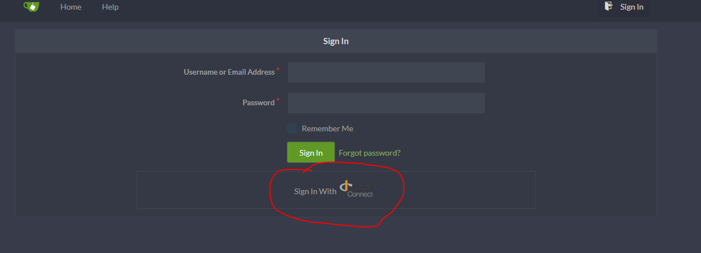

In your web browser, navigate to the Gogs “datasets” organization
<https://gogs.data.gov.bc.ca/datasets>.


-----
## Find the Gogs repository you are working in

Use the Explore option to search, or just browse the pages to find the repository.

Click to open the repository (container, e.g. “acdf\_app”). This is the
master repository.


-----
## Fork the master repository to your own work repository

Fork the repository for your work in your own area (fork button in the
top right of the page).

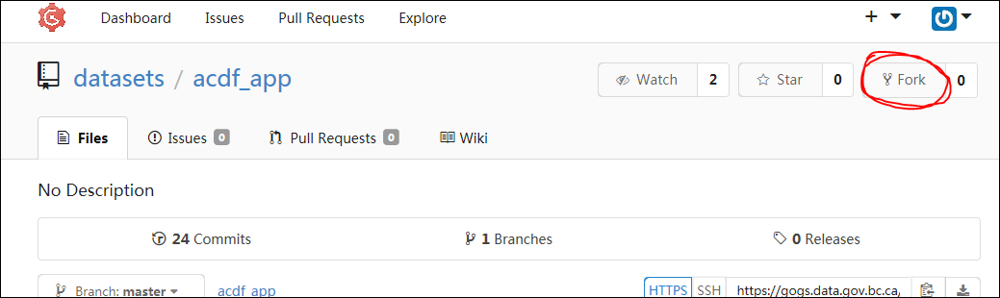

In your forked repository (e.g., “BSPARKS/acdf\_app”), copy the URL of
the repository. This is the URL you will use to clone the repository to
your desktop.

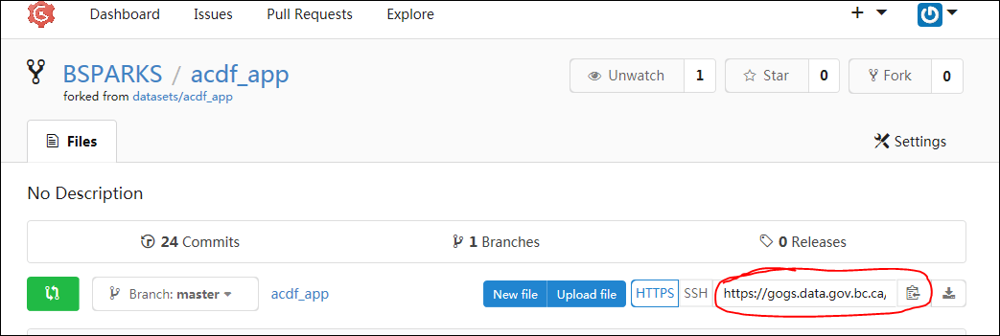


-----
## Clone your forked repository to your computer

In your project directory, create an empty folder for the delivery kit to be
cloned (copied) from Gogs.

Shift-right-click in empty folder, and choose “Open command window
here”.

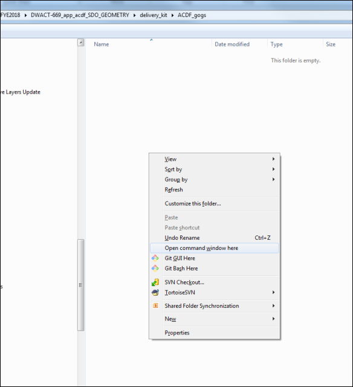

At the command line, clone your forked repository to the folder, but make sure to inlcude your Gogs token as part of the URL.


```
git clone url

git clone https://YOURGOGSTOKEN@gogs.data.gov.bc.ca/BSPARKS/acdf\_app.git
```


There is now a copy of the repository in your folder (this is now your
working directory).

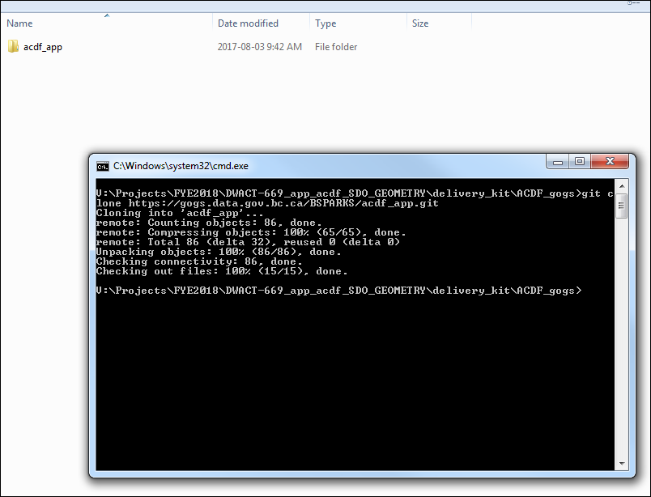


-----
## Create and edit your delivery kit files

In your working directory, you can now edit the files, add and delete
files, add and delete subfolders.

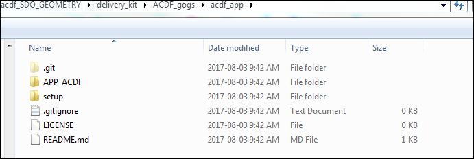


-----
## Readying your delivery for pushing back into Gogs

On your computer still...

Add the file contents to the index (Git staging area)

The staging area is a file, generally contained in your Git working
directory, that stores information about what will go into your next
commit. It’s sometimes referred to as the “index”, but it’s also common
to refer to it as the staging area.


### Git Add

At the command line (**from the top level** of your working directory)
add the updated files and folders to the staging area.


```
git add -A
```

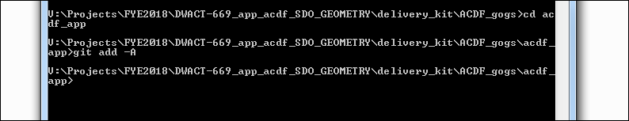


### Git Commit

Before committing to the repository, the add command can be used
multiple times, as you make changes to your working directory over time.

Commit (record) changes to all the files into the repository:

Take the current contents of the index (staging area) and store this
snapshot permanently to your Git directory.

At the command line, commit the staged changes, and use the message
option to add a simple comment about the changes you’ve made (usually
this is just the Jira ticket number, where all the project comments can
be found).


```
git commit -m “DWACT-###”
```


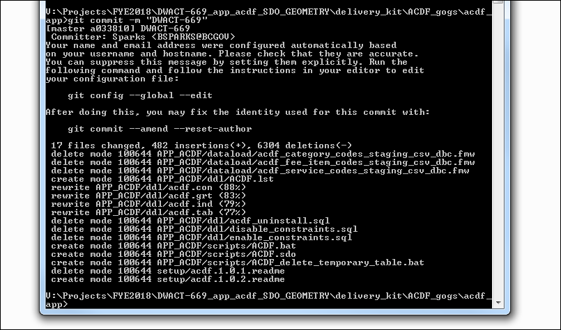


### Git Push

At the command line, (**from the top level** of your working directory)
push your committed changes back into your Gogs repository.


```
git push
```


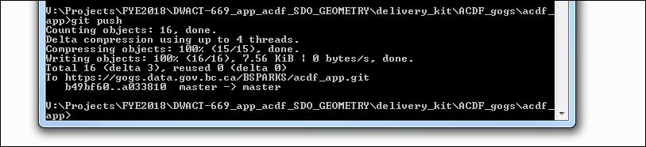

Note: if there are any empty folders (which includes having empty
subfolders), empty folders will be ignored and will not be part of the
push into your Gogs repository.


-----
## Check your Gogs repository

Back in Gogs, make sure your delivery kit there reflects the work you have done.
Take a look at your Gogs repository, review your files and folders,
convince yourself that the changes are now in Gogs.

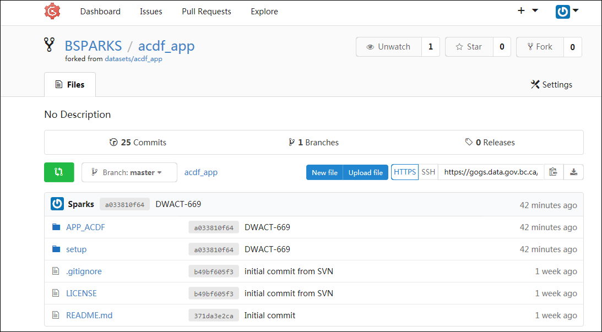


-----
## Make a pull request in Gogs

The final step is to make a pull request of your forked repository
(e.g., “BSPARKS/acdf\_app”) back into the master repository (e.g.,
“Datasets/acdf\_app”). You do this by pressing the green pull request
button:

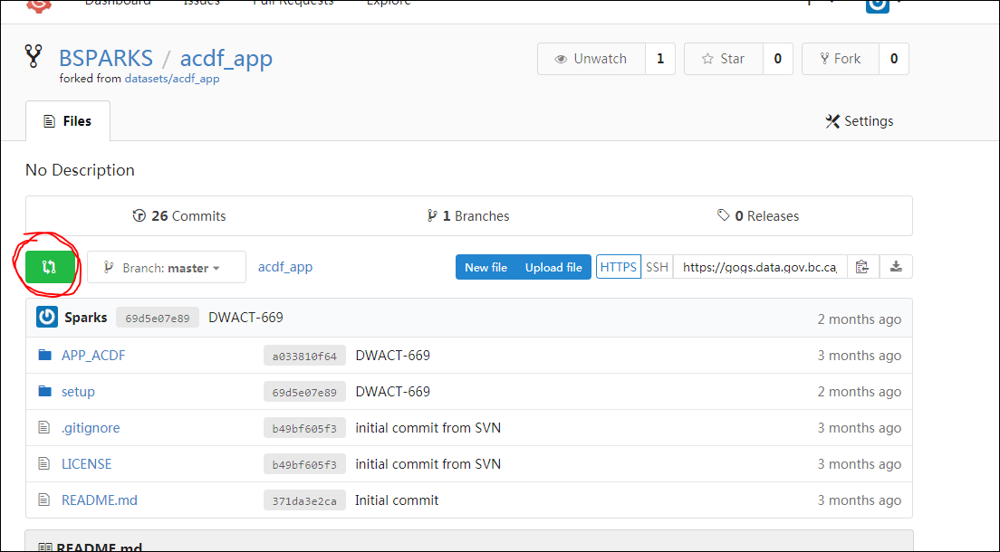

On the next screen, make sure you include a **Title** to your pull request
– this should be the Jira ticket number (e.g., DWACT-669), *as provided to
you by the DataBC Data Administration group*. Although the title (Jira ticket) 
is sufficient, if you also **Write** a description, this would be much 
appreciated as it helps the DA staff at DataBC to quickly
see at a glance which project your are submitting for approval.
Then click the button to **Create Pull Request**.

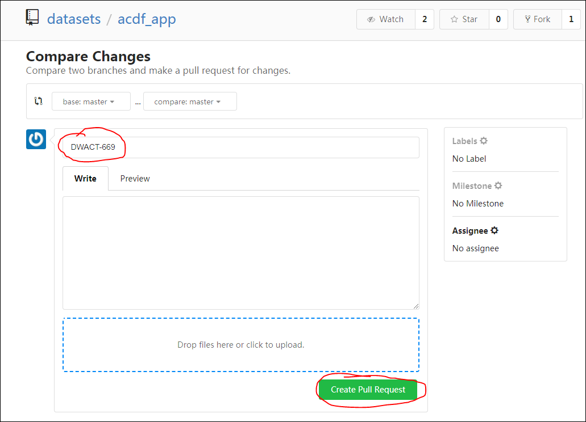

NOTE:
**There is no visual confirmation of your pull request, however the Data
Administration group will automatically be notified of the request and
will then review the changes and execute the pull into the master
repository, if there are no issues with your delivery kit. We will contact
you if there is anything you'll need to correct in your delivery kit.**
