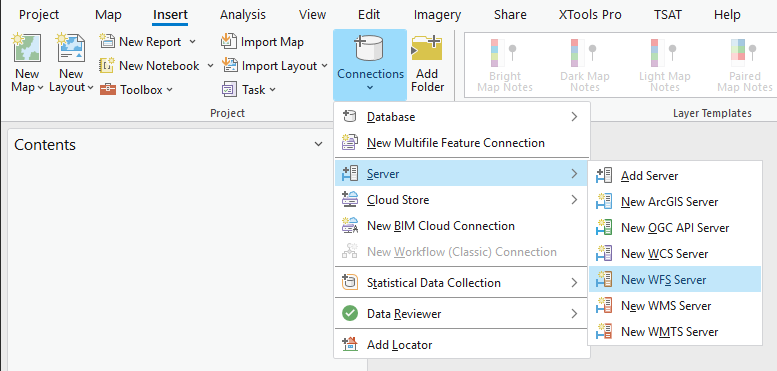
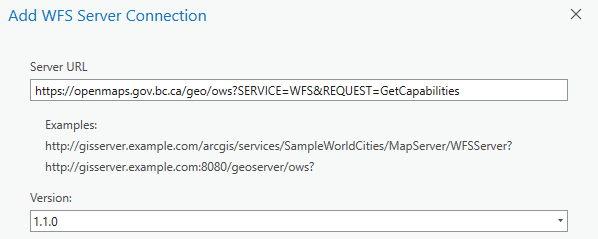
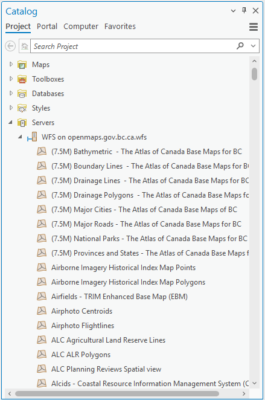
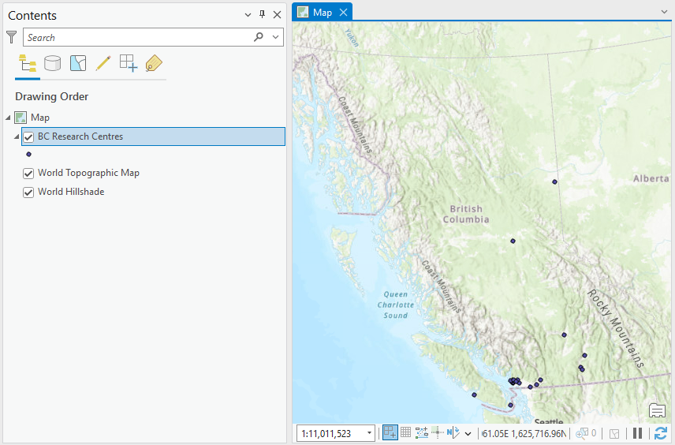
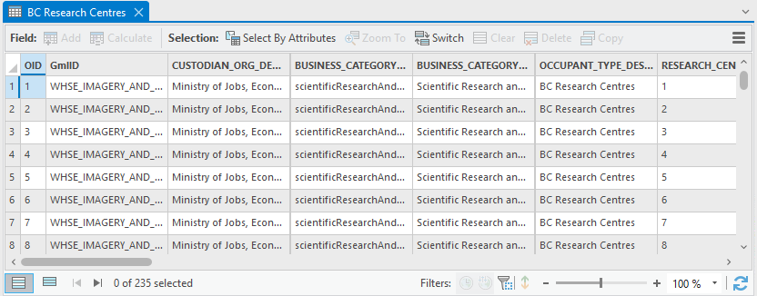
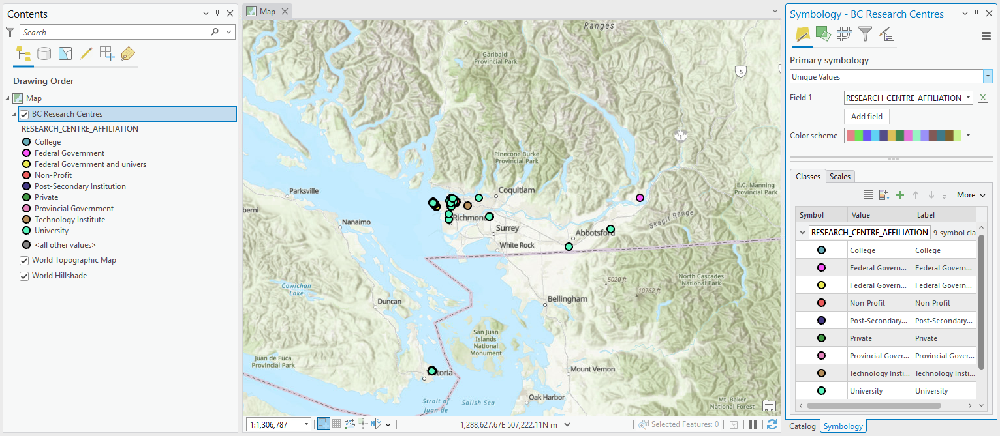

# ARCGIS PRO - LOADING A WFS LAYER

Here is a quick walk-through on how to load a WFS layer in ArcGIS Pro, with some additional details on the DataBC services. 

Learn more about WFS in ArcGIS Pro in the [Esri documentation](https://pro.arcgis.com/en/pro-app/latest/help/data/services/use-wfs-services.htm). 

   {: .highlight-title}
   > ⚠ Limited features returned
   >
   > As of 2024/01/08, ArcGIS Pro 3.1.3 cannot use [paging](tips_tricks_webservices.md#pagination) on DataBC services using WFS 2.0.0 (the default version).
   >
   > This limits the number of features ArcGIS Pro can load for a single WFS layer to about 7000. If you need to load a large dataset, look at using [QGIS](map_getting_started_qgis_wfs.md) or the [bcdata R package](https://github.com/bcgov/bcdata).
   >
   > Setting the WFS version to `1.1.0` will allow adding a larger dataset without displaying any errors, however features will be capped and there will be no indication that features are missing.

1. Open ArcGIS Pro. 
2. On the ribbon's **Insert** tab, click **Connections** > **Server** and select **New WFS Server**.
   
3. Set the **Server URL** to `https://openmaps.gov.bc.ca/geo/ows?SERVICE=WFS&REQUEST=GetCapabilities`, and **Version** to `1.1.0`.
   
4. Click **OK**.
5. In the **Catalog** pane, expand **Servers** and then the new WFS connection, `WFS on openmaps.gov.bc.ca.wfs`. Allow a moment for the layers list to load. You should see:
   
   

6. Identify the dataset you'd like to add. Dataset names should correspond to the [BC Data Catalogue](https://catalogue.data.gov.bc.ca/). For this example, we will add BC Research Centres. 
7. To reduce scrolling through the layer list, click one of the first layers, then type `bc` and then page down to `BC Research Centres`. Unfortunately, the search function does not include server layers.
8. Right click the layer name, and select **Add to Current Map** or **Add to New** > **Map**.
9. Explore the data - zoom in, pan around, and try selecting features.
    
10. Right click the layer in the **Contents** pane and click **Attribute Table** (CTRL+T). As a feature service (rather than a map service like WMS), it is possible to see attribute data, select features, and perform geoprocessing.
    
    
    {: .note-title}
    > Are all the features loaded?
    >
    > If the Attribute Table shows exactly 3000 features, it's very likely ArcGIS Pro is hitting the maximum features returned setting for the layer. The default value is 3000 features, but you can try setting this as high as 7000 in the **Layer Properties** > **WFS**. Higher values will cause data source errors.

11. WFS allows for custom layer styling. Change the styling from `Single Symbol` to `Unique Values` based on the `RESEARCH_CENTRE_AFFILIATION` field.
    

12. Similarly, we can add labels.
    

13. Definition queries can be used to filter the features displayed but only the features initially loaded will be included, so unfortunately filtering will not help with loading larger datasets. 
    
    To filter features, go to **Layer Properties** > **Definition Query**, click **New definition query**. Modify the query to `Where RESEARCH_CENTRE_AFFILIATION is equal to University`. 
14. Click **Apply** and then **OK**.

-----------------------

[RETURN TO TOP][1]

[1]: #top
