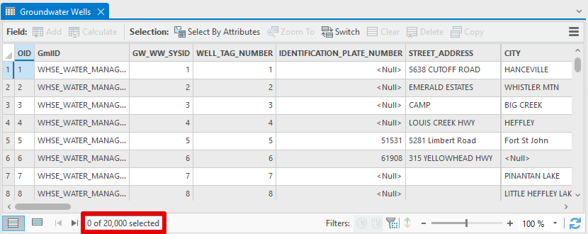
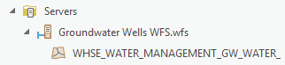
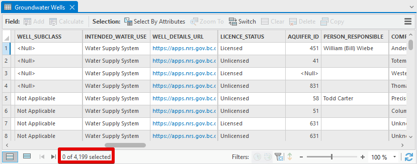
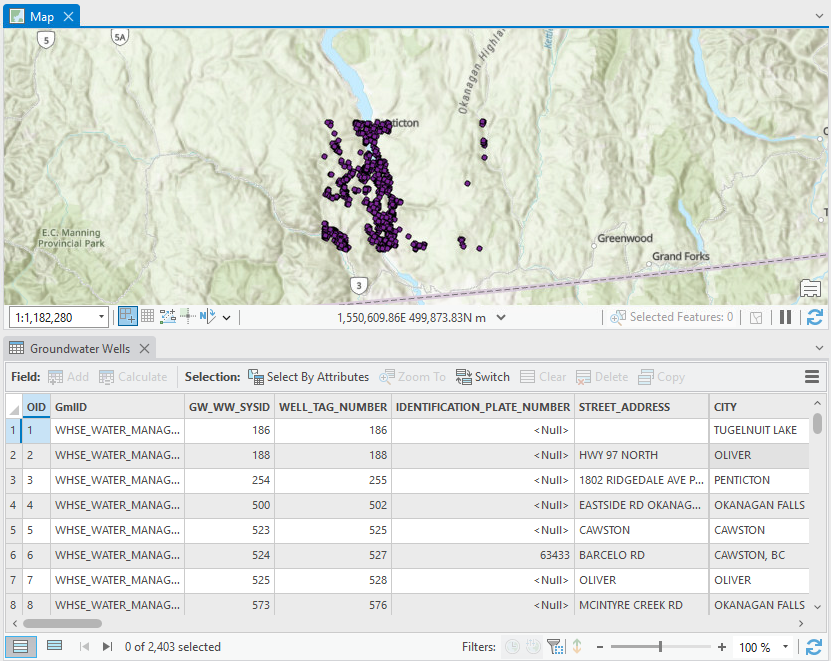
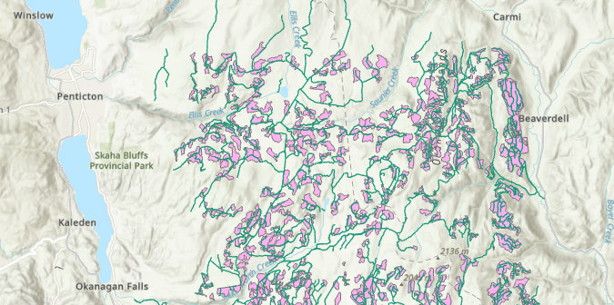

# ARCGIS PRO - LOADING LARGE DATASETS VIA WFS <!-- omit in toc -->

Keeping with Esri's general model, ArcGIS Pro support for consuming OGC services is less than stellar. As mentioned in the introductory [ArcGIS Pro - Loading a WFS Layer](map_getting_started_arcgispro_wfs.md) guide, ArcGIS Pro 3.1.3 cannot [page](tips_tricks_webservices.md#pagination) through features on DataBC services with the default settings, and so will return a limited number of features. But fear not, loading large datasets is possible (with some additional configuration).

This walk-through will show how to add a large (>10 000 features) dataset, and use queries to make more efficient requests. The process is a little more involved (🌶) but may still be worthwhile as the same connections can be used to get fresh data on demand, once the project is set up.

Learn more about WFS in ArcGIS Pro in the Esri documentation:
- [Use WFS Services](https://pro.arcgis.com/en/pro-app/latest/help/data/services/use-wfs-services.htm)
- [Add WFS Services](https://pro.arcgis.com/en/pro-app/latest/help/data/services/add-wfs-services.htm)

-----------------------

## Table of Contents <!-- omit in toc -->
- [🌶 Loading Additional Features via WFS](#-loading-additional-features-via-wfs)
- [🌶🌶 Querying a WFS Layer by Attribute or Geometry](#-querying-a-wfs-layer-by-attribute-or-geometry)

<!-- no toc -->

-----------------------

## 🌶 Loading Additional Features via WFS

1. Open ArcGIS Pro. 
2. On the ribbon's **Insert** tab, click **Connections** > **Server** and select **New WFS Server**.
3. Set the **Server URL** to `https://openmaps.gov.bc.ca/geo/ows?SERVICE=WFS&REQUEST=GetCapabilities`, and **Version** to `2.0.0`.
   
   Expand **Custom requests parameters** and add the following rows: 
   
    | Parameter     | Value      | Description |
    |---------------|------------|-------------|
    | `sortBy`      | `OBJECTID` | Primary key which will be used for sorting features for paging. Must be a unique value for each feature. If an error is returned when adding some datasets, confirm if `OBJECTID` is a column for that table on the [BC Data Catalogue](https://catalogue.data.gov.bc.ca/). If not, choose a suitable substitute.|
    | `PAGESIZE`    | `1000`     | Number of features to return in each paged request. Default value is `200`, so using `1000` will reduce total number of requests.                                                                                                                                                   |
    | `MAXFEATURES` | `20000`    | Maximum number of features to return. Can be set higher but loading features will take longer and rendering may lag. Default value is `3000`.                                                                                                                                |

    ⚠ Parameters and values are case sensitive

4. Click **OK**.
5. In the **Catalog** pane, expand **Servers** and then the new WFS connection, `WFS on openmaps.gov.bc.ca.wfs`. Allow a moment for the layers list to load. 
6. Identify the dataset you'd like to add. For this example, we will add Groundwater Wells. 
7. To reduce scrolling through the layer list, click one of the first layers, then type `grou` and then page down to `Groundwater Wells`.
8. Right click the layer name, and select **Add to Current Map** or **Add to New** > **Map**.
9. Explore the data - zoom in, pan around, and try selecting features.
10. Right click the layer in the **Contents** pane and click **Attribute Table** (CTRL+T).
    
    
    {: .note-title}
    > Are all the features loaded?
    >
    > The Attribute Table shows exactly 20 000 features, so it's very likely ArcGIS Pro is hitting the `MAXFEATURES` cap we set. Which 20 000 features are loaded? A quick glance at the `OBJECTID` column suggests our features have been ordered by `OBJECTID`, as specified with the `sortBy` parameter.
    > 
    > We can increase the maximum feature cap either for the specific layer via **Layer Properties** or for the entire WFS connection via **WFS Server Connection Properties**.

11. Let's increase the maximum number of features returned on the layer. Right click the layer in the **Contents** pane, select **Properties** > **WFS** and change the value from `20000` to `25000`.
12. Click **OK** and allow a moment as features are fetched. The Attribute Table now shows 25 000 features, keeping the original 20 000 and adding the next 5 000 based on `OBJECTID`. One could increase this value further, but be prepared to wait as data loads.

## 🌶🌶 Querying a WFS Layer by Attribute or Geometry

Chances are we aren't interested in the first X features as ordered by `OBJECTID`, but perhaps we'd like to see all of the features in a given area or with certain attributes. Queries can help us get the complete dataset needed for our work, and by avoiding loading the whole dataset, we improve load times and reduce unnecessary traffic.

1. Open ArcGIS Pro. 
2. On the ribbon's **Insert** tab, click **Connections** > **Server** and select **New WFS Server**.
3. Since we will be using attributes specific to our layer of interest, it doesn't make sense to use a connection to *all* layers. Instead, we will create a connection just for Groundwater Wells by using the [layer-specific `GetCapabilities` URL](map_wms_wfs_getting_started.md#getcapabilities-requests).
4. Set the **Server URL** to `https://openmaps.gov.bc.ca/geo/pub/WHSE_WATER_MANAGEMENT.GW_WATER_WELLS_WRBC_SVW/ows?service=WFS&request=GetCapabilities`, and **Version** to `2.0.0`.
5. Click **OK**. A new WFS connection will be shown in the **Catalog** pane. If we expand it, only the `Groundwater Wells` layer is shown. Rename the WFS connection to `Groundwater Wells WFS` to avoid confusion.
   
   Note: the layer name will change to the BC Geographic Warehouse object name.
   

6. Now it's time to set up our query. Right click the WFS connection (`Groundwater Wells WFS.wfs`) and select **Properties**. Expand **Custom requests parameters** and add the following rows below the `SWAPXY` parameters:

    | Parameter     | Value                                      |
    |---------------|--------------------------------------------|
    | `sortBy`      | `OBJECTID`                                 |
    | `PAGESIZE`    | `1000`                                     |
    | `MAXFEATURES` | `25000`                                    |
    | `CQL_FILTER`    | `INTENDED_WATER_USE='Water Supply System'` |
        
    `CQL_FILTER` uses Common Query Language to specify a filter. Note the attribute name on the left and string value enclosed in single quotes. See more on CQL in the [GeoServer CQL tutorial](https://docs.geoserver.org/main/en/user/tutorials/cql/cql_tutorial.html).
7. Click **OK** (the layer name may revert to `Groundwater Wells`) and add the layer to the map. Note the relatively fast load time.
8. Right click the new layer in the **Contents** pane and click **Attribute Table** (CTRL+T). There are only 4199 (or so) features, even though our limit was set to 25 000. We have loaded all the relevant features! 🎉
    
   
   {: .highlight-title}
   > ⚠ What about definition queries?
   >
   > **Definition queries** (set in Layer Properties) can be used to filter the features displayed, but only features already loaded will be included. If the same filter `INTENDED_WATER_USE='Water Supply System'` is applied to our WFS connection from the previous tutorial (`MAXFEATURES=25000` but without the `CQL_FILTER`) via a definition query, only 345 features are returned. 

9. Spatial queries are also possible with `CQL_FILTER`. Right click the WFS connection (`Groundwater Wells WFS.wfs`) and select **Properties**. Expand **Custom requests parameters** and modify the `CQL_FILTER` to `BBOX(GEOMETRY, 1450000, 480000, 1500000, 520000)` to define a bounding box. Bounding boxes include four values: minimum X, minimum Y, maximum X, and maximum Y. Use BC Albers coordinates.
10. Click **OK** and add the layer to the map. 2403 (or so) wells should be shown close to Penticton. 
    
11. The same `BBOX` filter should work on other layers. Try modifying the first (all layers) WFS connection by adding a `CQL_FITLER` for an area of interest, then add different layers, such as `Forest Tenure Road Section Lines` and `Forest Tenure Cutblock Polygons`.
    
    
    If an empty standalone table is returned, there were no results for the query.
    If an error is returned, confirm the presence of `OBJECTID` and `GEOMETRY` columns. Some datasets use `SEQUENCE_ID` and `SHAPE` instead.

Not satisfied with the WFS experience in ArcGIS Pro? Look at using [QGIS](map_getting_started_qgis_wfs.md) or the [bcdata R package](https://github.com/bcgov/bcdata).

-----------------------

[RETURN TO TOP][1]

[1]: #top
