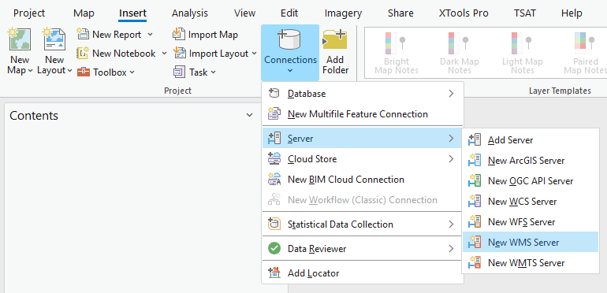
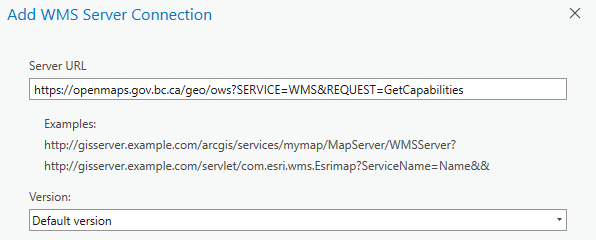
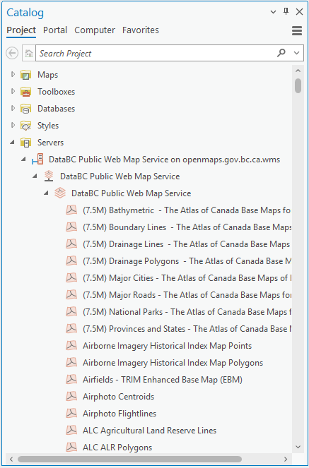
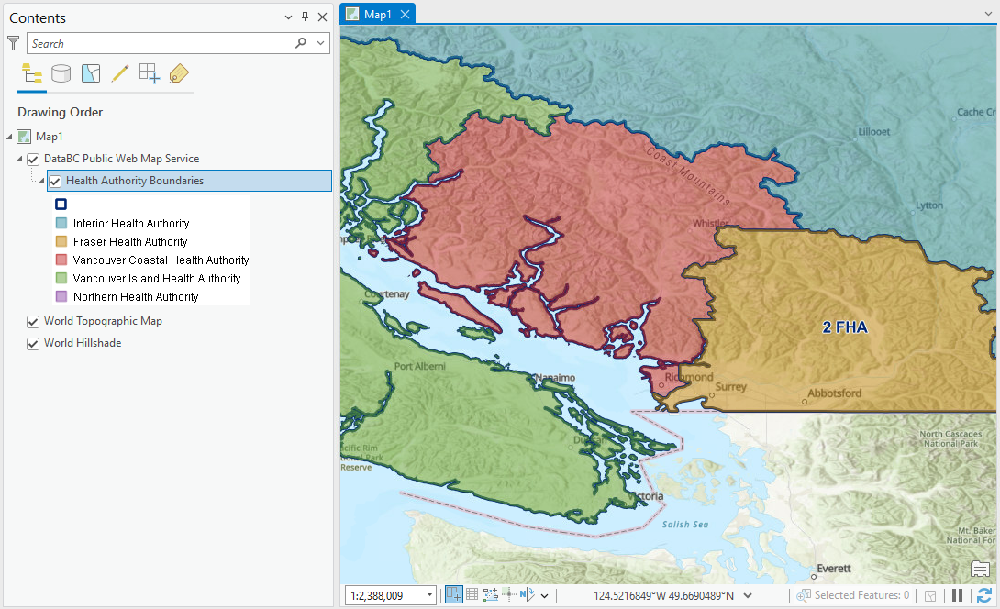
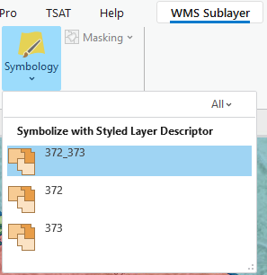

# ARCGIS PRO - LOADING A WMS LAYER

Here is a quick walk-through on how to load a WMS layer in ArcGIS Pro, with some additional details on the DataBC services. 

Learn more about WMS in ArcGIS Pro in the [Esri documentation](https://pro.arcgis.com/en/pro-app/latest/help/data/services/use-wms-services.htm). 

1. Open ArcGIS Pro. 
2. On the ribbon's **Insert** tab, click **Connections** > **Server** and select **New WFS Server**.
   
3. Set the **Server URL** to `https://openmaps.gov.bc.ca/geo/ows?SERVICE=WMS&REQUEST=GetCapabilities`, leaving the other settings as is.
   
4. Click **OK**.
5. In the **Catalog** pane, expand **Servers** and then continue to expand the new WMS connection, `DataBC Public Web Map Service on openmaps.gov.bc.ca.wms`, and the groups within. Allow a moment for the layers list to load. You should see:
   
   
   
6. Identify the dataset you'd like to add. Dataset names should correspond to the [BC Data Catalogue](https://catalogue.data.gov.bc.ca/). For this example, we will add Health Authority Boundaries.
7. To reduce scrolling through the layer list, click one of the first layers, then type `hea`, which should then jump to and select `Health Authority Boundaries`. Unfortunately, the search function does not include server layers.
8. Right click the layer name, and select **Add to Current Map** or **Add to New** > **Map**.
9. Explore the data - zoom in, pan around. Labels are visible for some services at pre-defined scales. If you expand the new layer in the **Contents** pane, you will see the layer legend.
    
    
  
   {: .note-title}
   > WMS Styles
   >
   > ArcGIS Pro adds the layer using the default style. Other style options can be accessed by clicking the layer name (`Health Authority Boundaries`) in the **Contents** pane, then opening the **WMS Sublayer** tab and clicking **Symbology** in the **Drawing** group.
   >
   > 
   >
   > ArcGIS Pro only shows the style `Name`, which is just an ID number. The layer specific `GetCapabilities` request (e.g. [https://openmaps.gov.bc.ca/geo/pub/WHSE_ADMIN_BOUNDARIES.BCHA_HEALTH_AUTHORITY_BNDRY_SP/ows?service=WMS&request=GetCapabilities](https://openmaps.gov.bc.ca/geo/pub/WHSE_ADMIN_BOUNDARIES.BCHA_HEALTH_AUTHORITY_BNDRY_SP/ows?service=WMS&request=GetCapabilities)) shows the `Title` for each style. For `Health Authority Boundaries`, `372` (`Outlined`) shows only boundaries, while  `373` (`Colour_Themed`) shows a coloured fill for each health area. `372_373`, the default, is a combination of both. A similar pattern is followed for most datasets.

10. DataBC's WMS service supports `GetFeatureInfo` requests to view individual feature information. While this feature works just fine in QGIS, unfortunately ArcGIS Pro does not make the request correctly, so it is not possible to view any feature info beyond what is shown through symbology and labels.

Read more about [the nature and limitations of WMS](map_getting_started_qgis_wms.html#the-nature-and-limitations-of-wms) or jump into the [WFS tutorial](map_getting_started_arcgispro_wfs.md).

-----------------------

[RETURN TO TOP][1]

[1]: #top
