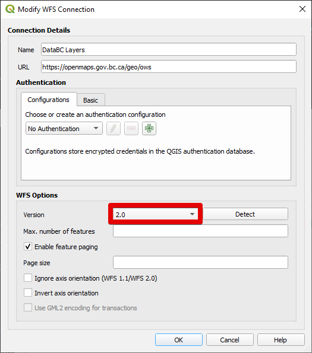
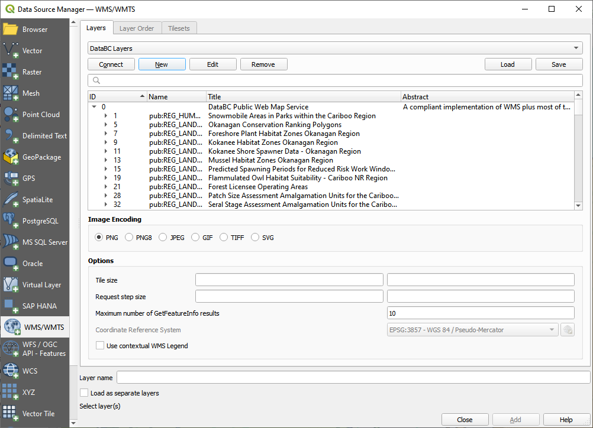
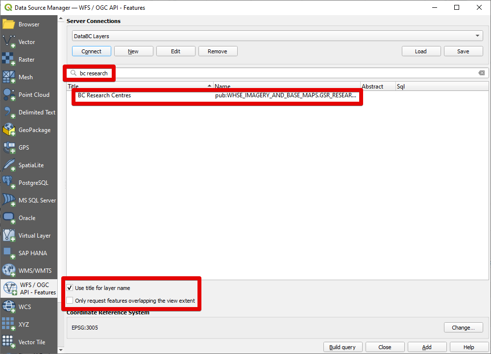
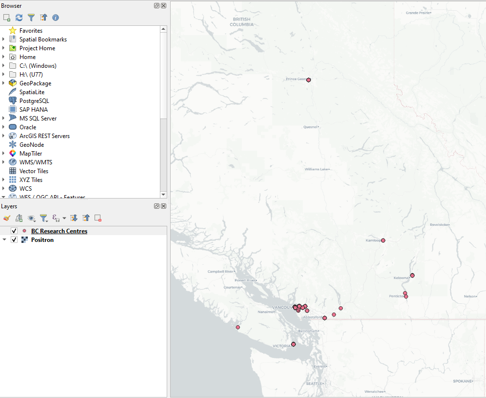
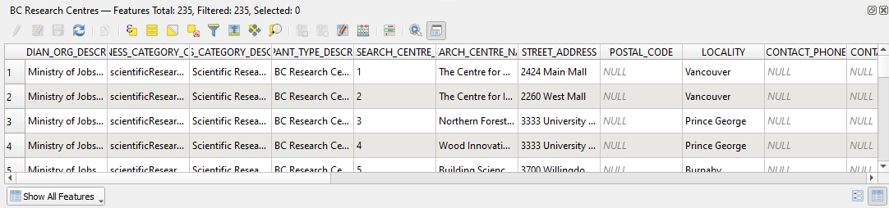
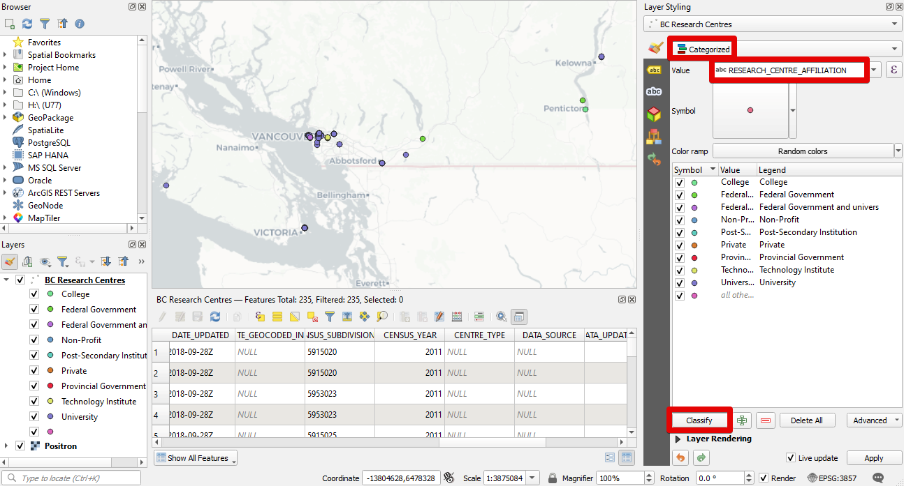

# QGIS - LOADING A WFS LAYER

The QGIS documentation also provides an [excellent walk-through](https://docs.qgis.org/latest/en/docs/training_manual/online_resources/wfs.html) on how to load a WFS layer. These instructions are adapted from the QGIS docs with additional details on the DataBC services. 

1. Open QGIS and create a new project. 
2. Open  Data Source Manager >  **WFS/OGC API-Features** tab.
3. Create a **New** connection.
4. Provide a **name** like `DataBC Layers` and set the **URL** to `https://openmaps.gov.bc.ca/geo/ows?SERVICE=WFS&REQUEST=GetCapabilities`, and under WFS Options set **Version** to `2.0`.
   
5. Click **OK**.
6. Click **Connect** and allow a moment for the layers to load. You should see:
   
7. Use the **search** bar to find a dataset of interest. For this tutorial we will add `BC Research Centres`. Find this layer and click on it.
   
8. Turn on **Use title for layer name** - this will show the plain-language dataset title instead of the BC Geographic Warehouse table name in the layer list. 
9. Turn off **Only request features overlapping the view extent** - we want to retrieve all features across the province.

   {: .highlight-title}
   > Loading large datasets
   >
   > There is a hard limit on the maximum number of features the DataBC servers will return (10 000 at time of writing). Even when not hitting the feature limit, large and complex requests will often take too long to load, time out, and give a `Connection closed` error in QGIS.
   >
   > To avoid incomplete data loads, it is often best to turn on **Only request features overlapping the view extent** and zoom to your area of interest before adding the layer. Toggling off **Render** can provide a smoother map navigation experience, or you may choose to use **Extract/clip by extent** to save loaded features locally.
   >
   > Occasionally it is necessary to reload features in the visible extent using  refresh (F5).

10. Click **Add** to load the layer.
11.  **Close** the Data Source Manager window.
12. Right click the new layer and click **Zoom to Layer(s)**.
    
13. Explore the data - zoom in, pan around, and try selecting features.
14. Right click the layer in the Layers panel and click **Open Attribute Table** (F6). As a feature service (rather than a map service like WMS), it is possible to see attribute data, select features, and perform geoprocessing.
    
    
    {: .note-title}
    > Viewing the attribute table
    >
    > The normal **Open Attribute Table** function will try and load all features (even if the displayed layer is only requesting features by view extent) which is problematic for large datasets and can lead to failed requests or crashes. Instead, use **Open Attribute Table (visible only)**, available from the Layer menu up top, or via CTRL+F6. The selection only option (SHIFT+F6) is also helpful.

15. WFS allows for custom layer styling. Change the styling from `Single Symbol` to `Categorized` based on value `RESEARCH_CENTRE_AFFILIATION`, then click classify.
    

16. Similarly, we can add labels.
    

17. We can filter the data we request from the WFS service to improve load times and reduce traffic. In the **Data Source Manager**, select the `BC Research Centres` layer, then click **Build query** at the bottom. Modify the query to `SELECT * FROM "WHSE_IMAGERY_AND_BASE_MAPS.GSR_RESEARCH_CENTRES_SVW" WHERE "RESEARCH_CENTRE_AFFILIATION" = 'University'`. 
    
18. Click **OK** and then **Add** the layer. A filter symbol will show next to the layer name showing the dataset is being filtered. The query can be modified from layer Properties > Source > **Query Builder**.

  {: .highlight-title}
   > Duplicate features
   >
   > For unclear reasons, QGIS can sometimes load duplicate features from the DataBC WFS services. To avoid this issue we can add a simple SQL filter to get unique features:
   >
   > `SELECT DISTINCT * FROM "<TABLE>"`

-----------------------

[RETURN TO TOP][1]

[1]: #top
