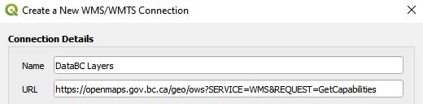
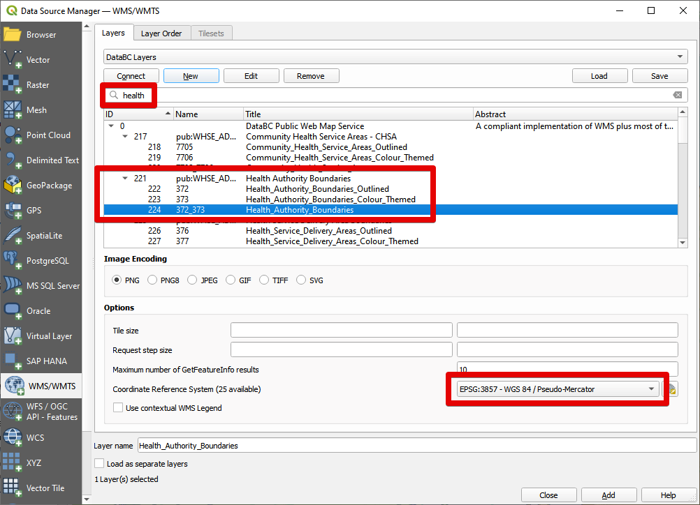
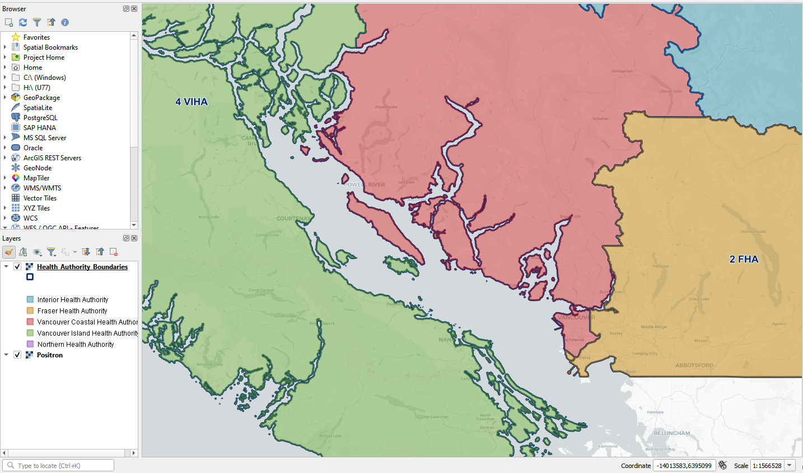
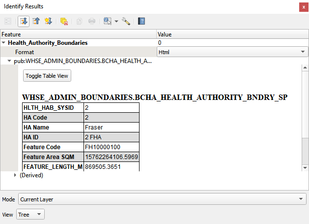

# QGIS - LOADING A WMS LAYER

The QGIS documentation provides an [excellent walk-through](https://docs.qgis.org/latest/en/docs/training_manual/online_resources/wms.html) on how to load a WMS layer. These instructions are adapted from the QGIS docs with additional details on the DataBC services. 

1. Open QGIS and create a new project. 
2. Open  Data Source Manager >  **WMS/WMTS** tab.
3. Create a **New** connection.
4. Provide a **name** like `DataBC Layers` and set the **URL** to `https://openmaps.gov.bc.ca/geo/ows?SERVICE=WMS&REQUEST=GetCapabilities`, leaving the other settings as is.
   
5. Click **OK**.
6. Click **Connect** and allow a moment for the layers to load. You should see:
   
7. Use the **search** bar to find a dataset of interest. For this example, we will add Health Authority Boundaries.
   
8. Click on the `372_373` - `Health_Area_Boundaries` layer. Then change the **Coordinate Reference System** to match your map - if you are using a typical web basemap, chances are it is in `EPSG:3857 - WGS 84 / Pseudo-Mercator`.
   
   {: .note-title}
   > WMS Styles
   >
   > The multiple options shown for a given dataset are different *styles* for the same data, e.g. `Outlined` (Name `372`) shows only boundaries, while `Colour_Themed` (`373`) shows a coloured fill for each health area. `372_373` is a combination of both. A similar pattern is followed for most datasets.

9.  Click **Add** to load the layer.
10.  **Close** the Data Source Manager window.
11. Drag the new layer to the top of the list in the **Layers** panel.
12. Right click the new layer and click **Zoom to Layer(s)**.
13. Explore the data - zoom in, pan around. Labels are visible for some services at pre-defined scales. Any symbology is shown in a legend in the layer list.
    
14. The  [identify tool](https://docs.qgis.org/3.28/en/docs/user_manual/introduction/general_tools.html#identify) allows viewing individual feature information.
    

## The nature and limitations of WMS
The WMS layer looks like it’s made up of vectors, yet it seems to be a raster, and you can’t change its symbology. Why is that?

This is how a WMS works: it’s a map, similar to a normal map on paper, that you receive as an image. What usually happens is that you have vector layers, which QGIS renders as a map. But using a WMS, those vector layers are on the WMS server, which renders it as a map and sends that map to you as an image. QGIS can display this image, but can’t change its symbology, because all that is handled on the server.

This has several advantages, because you don’t need to worry about the symbology. It’s already worked out, and should be nice to look at on any competently designed WMS.

On the other hand, you can’t change the symbology if you don’t like it, and if things change on the WMS server, then they’ll change on your map as well. This is why you sometimes want to use a Web Feature Service (WFS) instead, which gives you vector layers separately, and not as part of a WMS-style map.

Jump into the [WFS tutorial](map_getting_started_qgis_wfs.md) to learn more!

-----------------------

[RETURN TO TOP][1]

[1]: #top
