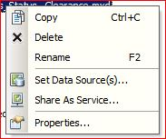
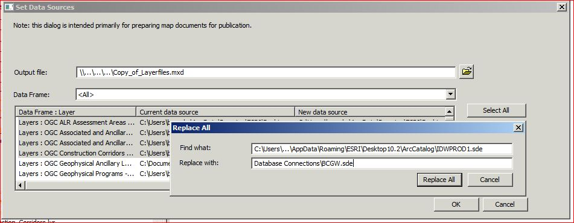
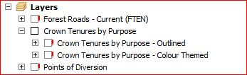
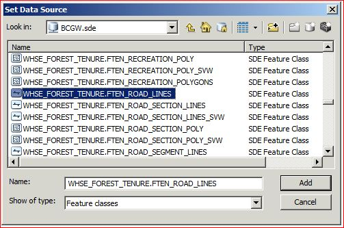
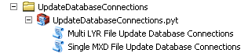
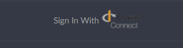
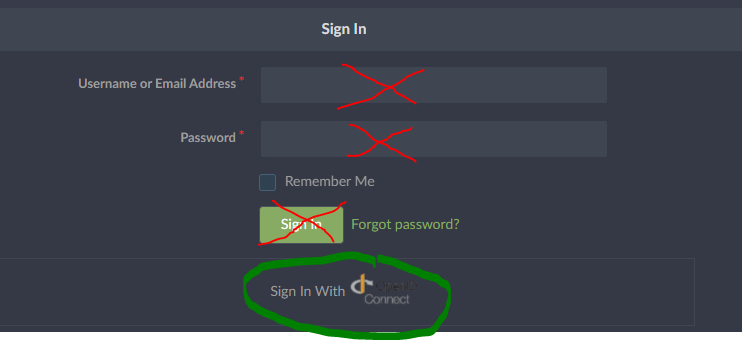

# HELPFUL TIPS ABOUT THE BC GEOGRAPHIC WAREHOUSE

The context below provides helpful tips and data points for those users who manage or provide information to the BD Geographic Warehouse (BCGW) and ArcGIS Desktop. This page will continue to be updated so it is worth bookmarking for current and future references.  

-----------------------
## Table of Contents
+ [**CONNECTING TO THE BCGW**](#connecting-to-the-bcgw)
	+ [Connecting to BCGW Production using ArcGIS Desktop](#connecting-to-bcgw-production-using-arcgis-desktop)
	+ [Other Database Connections](#other-database-connections)
	+ [Connecting to BCGW Production using FME](#connecting-to-bcgw-production-using-fme)
+ [**ADDING DATA USING ARCGIS DESKTOP**](#adding-data-using-arcgis-desktop)
	+ [ADDING LAYERFILES](#adding-layerfiles)
		+ [TSAT toolbar in ArcMap](#tsat-toolbar-in-arcmap)
		+ [ArcCatalog](#arccatalog)
	+ [ADDING DATA DIRECTLY FROM BCGW](#adding-data-directly-from-bcgw)
+ [**IDENTIFIED BUGS**](#identified-bugs)
+ [**UPDATING DATA SOURCES **](#updating-data-sources-)
	+ [VIA ArcCatalog](#via-arccatalog)
	+ [VIA ArcGIS Documents](#via-arcgis-documents)
		+ [Setting Data Sources Via Breaking and Repairing Data Links in ArcMap](#setting-data-sources-via-breaking-and-repairing-data-links-in-arcmap)
+ [**CONNECTING TO GOGS**](#connecting-to-gogs)

-----------------------

# Audience

The content below is intended for all users of the BCGW.

# Purpose

The content below is to provide the intended audience with quick access to tips & tricks for managing and/or providing information for publication within the BC Geographic Warehouse (BCGW). 

---------------------

## CONNECTING TO THE BCGW

Use the following information to create connections to DataBC database environments.

It is a best practise to connect to the BCGW in ArcCatalog prior to starting work in ArcMap. This helps users avoid waiting for BCGW connection multiple times over the course of thier daily work.

### Connecting to BCGW Production using ArcGIS Desktop

In ArcCatalog, under Database Connections, there should be a Database Connection configured called **BCGW.sde**

+ If you do not see this connection in ArcCatalog, click Add Database Connection and set the Database Connection properties to: 
   + Database Platform: **Oracle**
   + Instance: `<BCGW Host Name>``/``<BCGW Service Name>`
     + If you do not know the instance information (BCGW Host Name and BCGW Service Name), please contact [DataBC Data Architecture Services](mailto:databc.da@gov.bc.ca) for connection instructions.
   + User Name: this is your IDIR
   + Password: this is your BCGW password _[How do I get an account to the BCGW?](https://github.com/bcgov/data-standards/blob/master/pages/faq.md#How-do-I-get-an-account-to-BCGW-and-specifically-Delivery-and-Test)_
   + **DO NOT** save your credentials in database connections as this will embed your username and password into any saved MXDs and LYRs that use this connection.  This poses a security threat and can corrupt your MXDs when you are required to [_change your password_](http://apps.bcgov/standards/dbc/Database_Account_Security_Policy).

### Other Database Connections

The BC Geographic Warehouse has three environments: Delivery, Test, and Production, which can be directly connected to from GTS desktops. For data review purposes you may need to connect to the BCGW Test or Delivery databases. These connections are not part of the default start up script on NRS GTS desktops, therefore they will need to be added.

1. Open ArcCatalog
1. Expand Database Connections
1. Click on Add Database Connection and fill in the appropriate parameters
   + Chose Database Platform: **Oracle**
   + Instance: `<Host Name>``/``<Service Name>` or `<tns alias>`
     + If you do not know the instance information (BCGW Host Name and BCGW Service Name), please contact [DataBC Data Architecture Services](mailto:databc.da@gov.bc.ca) for connection instructions.
   + Again **DO NOT** save username or password
1. Rename the sde database connection to the appropriate name for BCGW delivery or test database environments:
   + BCGWTEST.sde
   + BCGWDLVR.sde

### Connecting to BCGW Production using FME

Easy Connects are recommended.

`<Server Alias>``/``<Service Name>`

If not using an Easy Connect then the connection requires ESRI syntax and thus is dependent on the local version of ArcGIS and Oracle Client configuration.

+ Example:  
        ArcGIS 10.6 - `<BCGW Host Name>``/``<BCGW Service Name>`

## ADDING DATA USING ARCGIS DESKTOP

The following outlines how to use ArcCatalog to connect to BCGW data efficiently, so users are not repeatidly waiting for connection to the entire BCGW.

### ADDING LAYERFILES
There are two ways to access pre-styled layers from the Layerfile Library: the TSAT Toolbar in ArcMap and ArcCatalog. Layerfiles use standard themes to represent data and can be very useful for quick and consistent visualization and map production.

_Tip: It is suggested to avoid using the Add Data button in ArcMap, as this re-establishes the connection to the BCGW each time, resulting in long waits to access data._ 

#### TSAT toolbar in ArcMap
   + In ArcMap, from the TSAT toolbar, click the **Add Library Layers** button.
   + Search or browse for your layer(s), and then add to your map
   _Tip: Adding layerfiles via the TSAT Toolbar allows the user to search using keywords_

#### ArcCatalog

   + Make sure you have a network connection in _Windows Explorer_ on the GTS to \\data.bcgov\layer_library. If this connection is not set up first in _Windows Explorer_, it will not be available to connect to in ArcCatalog
   + In ArcCatalog, set up a Folder Connection to \\data.bcgov\layer_library
   + Browse for the layer, then drag-and-drop into ArcMap

### ADDING DATA DIRECTLY FROM BCGW

  + If you know the object name of the data you want to add to your map, open the BCGW connection and browse for the object.  Drag-and-drop into your map.
  + If you do not know the object name for your data, use the [BC Data Catalogue](https://catalogue.data.gov.bc.ca/) to browse for data and the associated object name (shown at the bottom of the metadata record).
  
[RETURN TO TOP][1]
----------------------------------------------------------- 

## IDENTIFIED BUGS

**1. RED (!) beside all layer names, indicating data sources are broken.**

  _Tip: Open the layer properties and review the Source - this will show the original object name for the broken layer. e.g., WHSE_BASEMAPPING.TRIM_WATER_LINES_
  
+ **Workaround** 
   + Add a standalone layer from the same DB connection and leave it at the top of table of contents/drawing order.
   + The first standalone layer in the table of contents cannot be text (annotation) or a group layer.
   + This presentation can be turned off
   + Once added, **Save** and close the document.
   + Next time it is opened all connections should be live.

[RETURN TO TOP][1]
----------------------------------------------------------- 

## UPDATING DATA SOURCES 

### VIA ArcCatalog

[This is how ESRI recommends changing sources](<https://desktop.arcgis.com/en/arcmap/latest/manage-data/using-arccatalog/setting-data-sources.htm>) but as some MXDs have a large variety of source metadata embedded this can take some time. 
A few additional tips are included below:

1. Connect to the BCGW in ArcCatalog. You will only need to connect to the BCGW once when taking this as a first step, avoiding being promtped multiple times when changing more than one source.
2. In ArcCatalog navigate to the MXD
3. Right Click and hit *Set Data Source(s)...*
  

4. You will be prompted for a user name and password potentially more than once. If you already logged in in Step 1, then we recommend that you hit Cancel on these.
5. Change the *Current data source* with the *New data source* by one or mix of the following:
   + copy the following text **Database Connections\\BCGW.sde** and pasting accordingly into the *Replace with...*
      + If <u>only a few</u> layers:
         + Copy and paste one by one into each *New data Source*
      + If <u>all the same</u> *Current data source* path:
         + *Select All* and then *Replace All* and paste into *Replace with...*
      + If <u>many different</u> *Current data source* paths:
         + Select only the same and then hit *Replace* and paste into *Replace with...*
         + You may have to do this multiple times until all off the data sources have been changed
    <!-- end list -->

6. Once done hit OK.

### VIA ArcGIS Documents

This section describes how to manage Oracle database connections in ArcMap and ArcCatalog.

#### Setting Data Sources Via Breaking and Repairing Data Links in ArcMap

[ESRI's guidance on repairing broken links for multiple layers](<http://desktop.arcgis.com/en/arcmap/latest/map/working-with-layers/repairing-broken-data-links.htm#GUID-B7EAAD5E-A147-4F3A-9B69-0850E333EDBA>)

1. Open MXD
2. When prompted for BCGW database credentials hit the Cancel button. *You may have to hit Cancel more than once*
3. All the feature classes connected to the BCGW will now have red exclamation mark (!)**

4. **TIP!!!** Determine the name of one of the feature classes by double clicking on it in the pane, which opens the **Layer Properties**
5. Select the **Source** tab and copy the name of the feature class.
   + This is done so that you don't have to scroll through all the objects but can paste it later in the steps
6. Close the Layer Properties
7. At this point there are two options:
   1.  Click directly on the red exclamation mark for that feature class. This opens the Set Data Source window or
   2.  Right click on a dataset and scroll down to -\> Data -\> Repair Data Source...
8. Navigate to Database Connections and click on the predefined connection called **BCGW.sde**
   
9. Enter your BCGW credentials
10. Paste the name of the feature class or scroll down to the feature class and select

11. Hit Add

  
Let this run.

+ Large MXDs may take a while to run.

##### Generic arcpy python tools for updating connections
 
Please see [ESRI's guidance for updating and fixing data sources](http://desktop.arcgis.com/en/arcmap/latest/analyze/arcpy-mapping/updatingandfixingdatasources.htm)

###### Available DataBC Script Tools
   
There are Multi LYR File Update OR Single MXD File Update Database Connections for 10.6 clients. For GTS users and Government employees the scripts are available here: 

**<Broken Link>**[gogs Update Database Connections](https://gogs.data.gov.bc.ca/daops/UpdateDatabaseConnections) - this is a \*.pyt python tool box with two scripts **(WHICH REQUIRES THE USE OF THE ARCINFO LICENSE LEVEL)** one for multiple layer file conversion and one for a single MXD update:  
         

          
**Some things to consider:**

+ There is a How To document here - [How to use Single MXD File Update Database Connections](\\giswhse.env.gov.bc.ca\whse\corp\script_whse\python\Utility_Misc\Ready\UpdateDatabaseConnections\How_to_use_Singl_MXD_File_Update_Database_Connections.pdf)

+ Click _X_ to close the window on any database connection prompts and it will run faster.  
+ Enable the ArcINFO licensing level on your client  
+ There is an issue of connection prompts hiding
   + look for and close connection prompt windows by clicking the _X_ button
   + ESRI/ArcPY does not allow a way to automate this step\!  
+ Garbage collection and creating new layouts/data frames in MXDs is not possible with ArcPY.

   + LIMITATION \#1 - You can not do the same thing in arcpy that the _saveAs_ feature in ArcMAP does (ie. cleans out garbage info and unused mxd connection info),
   + LIMITATION \#2 - You cannot create or copy map layouts or data frames to other MXDs (you can only modify them)
    
    <!-- end list -->
    
Due to these limitations there are two output MXDs created per Single MXD script run. Their suffixes are:

+ **\*do\_a\_saveAs\_on\_this\_to\_remove\_useless\_connects.mxd** -can be used IF the input HAD map layouts and/or multiple data frames (do a 'saveAs' in ArcMap/Catalog to rid it of the unused connection prompts.
+ **\*cleaned\_but\_has\_removed\_any\_layouts\_or\_extra\_data\_frames.mxd** - can be used IF the input did not have map layouts OR multiple data frames
+ This script will not do annotation layers  
+ This script will not remap joins  
+ If you leave the parameters blank for service and server name will overwrite ALL connections regardless of connection type  

**Post Update Testing:**

+ FOR ALL APPROACHES ALWAYS VERIFY\!
+ To verify, open MXD/LYR in ArcMap and check the data source tab in the table of contents.

[RETURN TO TOP][1] 

------------------------------------------------------------------------------

## CONNECTING TO GOGS

Connecting to the DataBC Gogs repositories requires that you log in first.

+ Navigate to [_gogs.data.gov.bc.ca_](https://gogs/data.gov.bc.ca)
+ Click on the  bar at the bottom of the form. 
   + Do not use any of the other fields or buttons on the form. 
 
+ You can authenticate with an IDIR id, a GitHub id, or a BCEID id. 
+ Select your choice and proceed with the login screens.
   + BC Government employees will user their IDIR id
 
[RETURN TO TOP][1] 

[RETURN TO PUBLISHING DATA TO THE DATABC PROGRAM > TIPS AND TRICKS][2]

-------------------------------------------------------

[1]: #helpful-tips-about-the-bc-geographic-warehouse
[2]: ../index.md#tips-and-tricks

