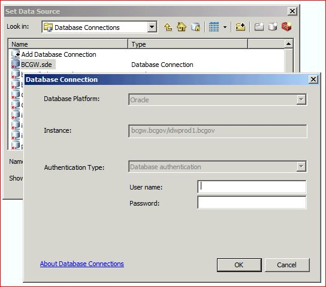

# HELPFUL TIPS FOR MANAGING DATA WITHIN THE DATABC PROGRAM

The context below provides helpful tips and data points for those users who manage or provide information to the BD Geographic Warehouse (BCGW) and ArcGIS Desktop. This page will continue to be updated so it is worth bookmarking for current and future references.  

-----------------------
## Table of Contents
+ [**CONNECTING TO THE BCGW**](#CONNECTING-TO-THE-BCGW)
	+ [Database Connections](#Database-Connections)
	+ [Database Instances](#Database-Instances)
	+ [Direct Connects](#Direct-Connects)
	+ [Connecting to BCGW Production using FME](#Connecting-to-BCGW-Production-using-FME)
	+ [Connecting to BCGW Production using ArcGIS Desktop](#Connecting-to-BCGW-Production-using-ArcGIS-Desktop)
	+ [Adding Other Database Connections using ArcGIS Desktop](#Adding-Other-Database-Connections-using-ArcGIS-Desktop)
	+ [Updating to Direct Connect Database Connections in ArcGIS Documents](#Updating-to-Direct-Connect-Database-Connections-in-ArcGIS-Documents)
+ [**ADDING LAYERS USING ARCGIS DESKTOP**](#ADDING-LAYERS-USING-ARCGIS-DESKTOP)
	+ [Add BCGW Data from the TSAT toolbar in ArcMap](#Add-BCGW-Data-from-the-TSAT-toolbar-in-ArcMap)
	+ [Add Layerfile Library LYR into ArcMap without using TSAT Add Layer Library](#Add-Layerfile-Library-LYR-into-ArcMap-without-using-TSAT-Add-Layer-Library)
	+ [Add BCGW Data Directly from ArcCatalog to ArcMap](#Add-BCGW-Data-Directly-from-ArcCatalog-to-ArcMap)
+ [**WORKFLOW FOR CREATING AND DELETING BCGW DATABASE OBJECTS**](#WORKFLOW-FOR-CREATING-AND-DELETING-BCGW-DATABASE-OBJECTS)
	+ [Prepare the Delivery Kit DDL scripts](#Prepare-the-Delivery-Kit-DDL-scripts)
	+ [Write the Data Loading Script](#Write-the-Data-Loading-Script)
	+ [Write the Script for Managing the MDSYS USER_SDO_GEOM_METADATA View](#Write-the-Script-for-Managing-the-MDSYS-USER_SDO_GEOM_METADATA-View)
	+ [Write the README file](#Write-the-README-file)
	+ [Test the README file (including rollback instructions) in BCGW Delivery](#Test-the-README-file-including-rollback-instructions-in-BCGW-Delivery)
+ [**CONNECTING TO GOGS**](#CONNECTING-TO-GOGS)
-----------------------

# Audience

The content below is intended for all users of the BCGW, including, but not limited to:

+ Vendor Delivery Personal, 
+ DataBC Data Architecture Team, 
+ Business Analysis/Business Portfolio Managers, 
+ DataBC Delivery Specialists, 
+ DataBC Project Lead Spatial Data Architects, 
+ DataBC ETL Specialists. 

# Purpose

The content below is to provide the intended audience with quick access to tips & tricks for managing and/or providing information for publication within the BC Data Catalogue (BCDC). 

---------------------

## CONNECTING TO THE BCGW

Use the following information to create connections to DataBC database environments.

### Database Connections

ArcGIS Desktop 'Direct Connect' uses an Oracle client installed along with the ESRI Software.  
A local TNSNAMES.ora file must also be included in the Oracle Client installation location.  

  - For users on GTS desktops, the TNSNAMES will already be set up via CSNR OID(LDAP)
  - For DataBC PC users, add Environment Variable `TNS_ADMIN=\\apps.bcgov\TNS_ADMIN\`
  - For Unix/Linux/OSX users, run `set TNS_ADMIN=`<smb://apps.bcgov/TNS_ADMIN/>
    
### Database Instances

The BC Geographic Warehouse has three environments: Delivery, Test, and Production, which can be directly connected to from GTS desktops. Please contact [DataBC Data Architecture Services](mailto:databc.da@gov.bc.ca) for connection instructions.

 
### Direct Connects

Direct Connect for DataBC's database environments is comprised of:

`<tns alias>`

OR with the *Easy Connect* syntax

`<Server Alias>``/``<Service Name>`

For more information see the [_ESRI Documentation on Oracle Connections_](http://desktop.arcgis.com/en/arcmap/latest/manage-data/gdbs-in-oracle/connect-oracle.htm) from ArcGIS.

### Connecting to BCGW Production using FME

Easy Connects are recommended.

`<Server Alias>``/``<Service Name>`

If not using an Easy Connect then the connection requires ESRI syntax and thus is dependent on the local version of ArcGIS and Oracle Client configuration.

+ Example:  
        ArcGIS 10.6 - sde:oracle:<BCGW Host Name>``/``<BCGW Service Name>

### Connecting to BCGW Production using ArcGIS Desktop

In ArcCatalog on NRS GTS desktops there should be a Database Connection called **BCGW.sde**

+ If there, it will be accessible from other ArcGIS tools and scripts
+ Its Connection Properties should a;ready be configured. If not then the properties should be set to:
   + Database Platform: **Oracle**
   + Instance: `<BCGW Host Name>``/``<BCGW Service Name>`
   + **DO NOT** save your credentials in database connections as this will embed your username and password into any saved MXDs and LRYs that use this connection.  This poses a security threat and can corrupt your MXDs when you are required to [_change your password_](http://apps.bcgov/standards/dbc/Database_Account_Security_Policy).
  
### Adding Other Database Connections using ArcGIS Desktop

For data review purposes you may need to connect to the BCGW Test or Delivery databases. These connections are not part of the default start up script on NRS GTS desktops, therefore they will need to be added.

1. Open ArcCatalog
1. Expand Database Connections
1. Click on Add Database Connection and fill in the appropriate parameters
   + Chose Database Platform: **Oracle**
   + Instance: `<Host Name>``/``<Service Name>` or `<tns alias>`
   + Again **DO NOT** save username or password
1. Rename the sde database connection to the appropriate name for BCGW delivery or test database environments:
   + IDWTEST1.sde
   + IDWDLVR1.sde

### Updating to Direct Connect Database Connections in ArcGIS Documents

This section describes how to manage Oracle database connections in ArcMap and ArcCatalog.

#### Setting Data Sources Via Breaking and Repairing Data Links in ArcMap

<http://desktop.arcgis.com/en/arcmap/latest/map/working-with-layers/repairing-broken-data-links.htm#GUID-B7EAAD5E-A147-4F3A-9B69-0850E333EDBA>

1. Open MXD
2. When prompted for BCGW database credentials hit the Cancel button. *You may have to hit Cancel more than once*
3. All the feature classes connected to the BCGW will now have red exclamation mark **\!**

4. Determine the name of one of the feature classes by double clicking on it, which opens the Layer Properties
5. Select the Source tab and copy to notepad or remember the name of the feature class
6. Close the Layer Properties
7. At this point there are two options:
   1.  Click directly on the red exclamation mark for that feature class. This opens the Set Data Source window or
   2.  Right click on a dataset and scroll down to -\> Data -\> Repair Data Source...
8. Navigate to Database Connections and click on the predefined connection called **BCGW.sde**
   

9. Enter your BCGW credentials
10. Scroll down to the feature class and select

11. Hit Add

  
Let this run.

+ If prompted to connect via an Application Connection, e.g., has Port: 5153 listed or slkux1 hit Cancel.
+ Large MXDs may take a while to run.

#### Setting Data Sources Via ArcCatalog

This is how ESRI recommends changing sources but as some MXDs have a large variety of source metadata embedded this can take some time. A few tips are included below:

<https://desktop.arcgis.com/en/arcmap/latest/manage-data/using-arccatalog/setting-data-sources.htm>

1. **Highly recommend first** go to the Database Connections and log into BCGW.sde, as ArcCatalog remembers your logins while it is open and you won't be prompted to login multiple times if you are changing multiple source metadata with the steps below.
2. In ArcCatalog navigate to the MXD
3. Right Click and hit *Set Data Source(s)...*
  

4. You will be prompted for a user name and password potentially more than once. If you already logged in in Step 1, then we recommend that you hit Cancel on these.
5. Change the *Current data source* with the *New data source* by one or mix of the following:
   + copy the following text **Database Connections\\BCGW.sde** and pasting accordingly into the *Replace with...*
      + If <u>only a few</u> layers:
         + Copy and paste one by one into each *New data Source*
      + If <u>all the same</u> *Current data source* path:
         + *Select All* and then *Replace All* and paste into *Replace with...*
      + If <u>many different</u> *Current data source* paths:
         + Select only the same and then hit *Replace* and paste into *Replace with...*
         + You may have to do this multiple times until all off the data sources have been changed
    <!-- end list -->

6. Once done hit OK.

##### Generic arcpy python tools for updating connections
 
Please see http://desktop.arcgis.com/en/arcmap/latest/analyze/arcpy-mapping/updatingandfixingdatasources.htm

###### Available DataBC Script Tools
   
There are multi LYR File Update OR Single MXD File Update Database Connections for 10.6 clients.  For GTS users and Government employees the scripts are available here: 

<mark>Move these pages to github and add other toolboxes we've written?</mark>

https://gogs.data.gov.bc.ca/daops/UpdateDatabaseConnections this is a \*.pyt python tool box with two scripts **(WHICH REQUIRES THE USE OF THE ARCINFO LICENSE LEVEL)** one for multiple layer file conversion and one for a single MXD update:  
        

          
**Some things to consider:**

+ There is a How To document here - [\\giswhse.env.gov.bc.ca\whse\corp\script_whse\python\Utility_Misc\Ready\UpdateDatabaseConnections\How_to_use_Singl_MXD_File_Update_Database_Connections.pdf](\\giswhse.env.gov.bc.ca\whse\corp\script_whse\python\Utility_Misc\Ready\UpdateDatabaseConnections\How_to_use_Singl_MXD_File_Update_Database_Connections.pdf)

+ Click _X_ to close the window on any database connection prompts and it will run faster.  
+ Enable the ArcINFO licensing level on your client  
+ There is an issue of connection prompts hiding
   + look for and close connection prompt windows by clicking the _X_ button
   + ESRI/ArcPY does not allow a way to automate this step\!  
+ Garbage collection and creating new layouts/data frames in MXDs is not possible with ArcPY.

   + LIMITATION \#1 - You can not do the same thing in arcpy that the _saveAs_ feature in ArcMAP does (ie. cleans out garbage info and unused mxd connection info),
   + LIMITATION \#2 - You cannot create or copy map layouts or data frames to other MXDs (you can only modify them)
    
    <!-- end list -->
    
Due to these limitations there are two output MXDs created per Single MXD script run. Their suffixes are:

+ **\*do\_a\_saveAs\_on\_this\_to\_remove\_useless\_connects.mxd** -can be used IF the input HAD map layouts and/or multiple data frames (do a 'saveAs' in ArcMap/Catalog to rid it of the unused connection prompts.
+ **\*cleaned\_but\_has\_removed\_any\_layouts\_or\_extra\_data\_frames.mxd** - can be used IF the input did not have map layouts OR multiple data frames
+ This script will not do annotation layers  
+ This script will not remap joins  
+ If you leave the parameters blank for service and server name will overwrite ALL connections regardless of connection type  

**Post Update Testing:**

+ FOR ALL APPROACHES ALWAYS VERIFY\!
+ To verify, open MXD/LYR in ArcMap and check the data source tab in the table of contents.

[RETURN TO TOP][1] 

-----------------------------------------------------------

## ADDING LAYERS USING ARCGIS DESKTOP

The following outlines how to use ArcCatalog with ArcMap to only connect to the BCGW once or twice a day, thus users not having to wait for the connection to the BCGW multiple times.

Ideally a combination of use of the Add from Layerfile Library on the TSAT toolbar and ArcCatalog should be used. 
Avoid using the Add Data button in ArcMap to add datasets from the BCGW because each time users will have to wait for the long connection time.

**TIP!** - **Connecting to the BCGW for the first time for a new MXD:**
1. Add a layerfile via TSAT (or directly from the layer library folder)  
   + Connecting to the BCGW directory or adding a layerfile at first will be initially slow as it reads the entire database metadata.
   + Subsequent layerfiles added to your MXD will be much faster because you will not need to re-connect to the BCGW.
1. For any datasets in the BCGW that do not have layerfiles, open ArcCatalog, establish a connection to the BCGW, and use it to transfer datasets into your MXD document(s) using drag-and-drop.
   + Using drag-and-drop from ArcCatalog, ArcMap will be much quicker at connecting and adding single datasets from the BCGW.
   + With the BCGW connection now established in ArcCatalog, keep it open while you work throughout the day. Drag-and-drop BCGW datasets to all your MXD documents.

### Add BCGW Data from the TSAT toolbar in ArcMap

1. In ArcMap, from the TSAT toolbar, click the Add Library Layers button.
1. Search or browse for your layer(s), and then add to your map

### Add Layerfile Library LYR into ArcMap without using TSAT Add Layer Library

1. Open up the Layerfile Library in *Windows Explorer*.  ***DO NOT*** use ArcCatalog to touch a .LYR in the Corporate Layerfile Library as you will be prompted to connect to the BCGW for each item in the .LYR
   + \\data.bcgov\layer_library
1. Drap-and-drop them into your MXD
***Limitation:*** Adding layerfiles directly doesn't allow the full search functionality found in the TSAT toolbar in ArcMap. 

### Add BCGW Data Directly from ArcCatalog to ArcMap

1. Open ArcCatalog at the beginning of working with datasets in the BCGW. 
1. Establish your [connection to the BCGW](https://gogs.data.gov.bc.ca/DataBC/FAQ/wiki/Spatial+Data+Connections)
1. Add your datasets into your open MXD document(s) by drag-and-drop directly from ArcCatalog
1. Now that you have established a connection to the BCGW in ArcCatalog, **do not close ArcCatalog until you no longer need to add BCGW datasets to any MXD document in the foreseeable future.**

[RETURN TO TOP][1]
 
------------------------------------------------------------------------------

## WORKFLOW FOR CREATING AND DELETING BCGW DATABASE OBJECTS

This section provides best practices for creating and deleting spatial database objects as part of a data delivery (publication) to the BC Geographic Warehouse.

### Prepare the Delivery Kit DDL scripts

There are two options to choose from when preparing the delivery kit DLL scripts.  

#### Option 1: Starting by Building a Physical Model

1. Using Oracle Designer, transform and export modelled spatial objects into the appropriate DDL files to be included in the delivery kit. Follow the standards defined in [Naming and Describing Standards](naming_and_describing.md) and [Data Guidance and Best Practices](data_guidance_and_best_practices.md). 

#### Option 2: Starting by Building Database Objects and Reverse-Engineering

1. Using a filled-in [Dataset log file](), copy and paste the column definitions into a DDL-generation spreadsheet available [here]().  
1. Copy and clean up the content in the generated tabs into a single SQL file.  There should be one file per database table or view. Ensure that the DDL files include GRANT statements. Change any occurrences of SDO_GEOMETRY to NUMBER.  Run the SQL file(s) in BCGW DELIVERY to make sure there are no errors.  
1. Using Oracle Designer Design Editor, reverse-engineer the DDL files into the appropriate Designer container.  Reverse engineer tables before views.
1. If necessary, correct any definitions of constraints and triggers, column and table comments, etc.  Make sure that SHAPE and/or GEOMETRY column data types are changed back to SDO_GEOMETRY.
1. Generate DDL files as in Option 1.

### Write the Data Loading Script

See [Data Replication Standards and Guidelines](data_replication_standards_and_guidelines.md) for guidance on building FME scripts.

### Write the Script for Managing the MDSYS USER_SDO_GEOM_METADATA View

See [Data Guidance and Best Practices](data_guidance_and_best_practices.md#user_sdo_geom_metadata).  

### Write the README file

A template for the README file is available [here]() for Geographic Sites Registry (GSR) publications and [here]() for all other BCGW publications.

### Test the README file (including rollback instructions) in BCGW Delivery

Before submitting a delivery kit to the DataBC program, make sure that you have tested it in the BCGW delivery environment.

[RETURN TO TOP][1] 
---------------------------

## CONNECTING TO GOGS

Connecting to the DataBC Gogs repositories requires that you log in first.

+ Navigate to [_gogs.data.gov.bc.ca_](https://gogs/data.gov.bc.ca)
+ Click on the  bar at the bottom of the form. 
   + Do not use any of the other fields or buttons on the form. 
 
+ You can authenticate with an IDIR id, a GitHub id, or a BCEID id. 
+ Select your choice and proceed with the login screens.
   + BC Government employees will user their IDIR id
 
[RETURN TO TOP][1] 

[RETURN TO PUBLISHING DATA TO THE DATABC PROGRAM > TIPS AND TRICKS][2]

-------------------------------------------------------

[1]: #helpful-tips-for-managing-data-within-the-databc-program
[2]: ../publishing-data-to-databc.md#tips-and-tricks

