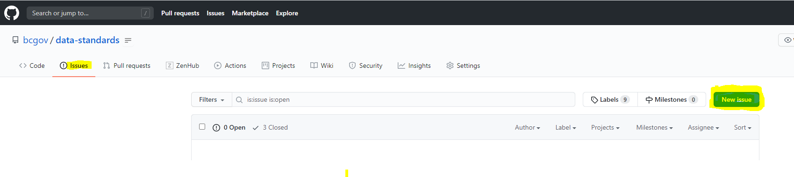
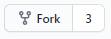
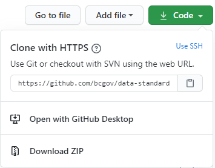
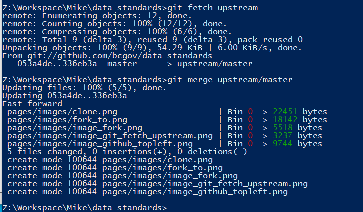

# WE VALUE YOUR CONTRIBUTIONS

Our goal in publishing these documents was to create a complete, clear, and correct repository of guides to help DataBC Program contributors and consumers. We welcome contributions; this document describes processes for providing contributions and feedback.

-----------------------
## Table of Contents
+ [**REPORTING ISSUES WITH THE DOCUMENTATION**](#REPORTING-ISSUES-WITH-THE-DOCUMENTATION)
+ [**CHANGING PAGES OR ADDING NEW ONES**](#CHANGING-PAGES-OR-ADDING-NEW-ONES)
	+ [Get access to Github](#Get-access-to-Github)
	+ [Download a git client](#Download-a-git-client)
	+ [Make a copy of the bcgov/data-standards repository](#Make-a-copy-of-the-bcgovdata-standards-repository)
	+ [Copy your repository down to your file system](#Copy-your-repository-down-to-your-file-system)
	+ [Make changes to pages or add new pages](#Make-changes-to-pages-or-add-new-pages)
	+ [Upload your changes to your copy of the repository on github](#Upload-your-changes-to-your-copy-of-the-repository-on-github)
	+ [Issue a "Pull Request" to request that your changes be incorporated into the bcgov/data-standards repository](#Issue-a-Pull-Request-to-request-that-your-changes-be-incorporated-into-the-bcgovdata-standards-repository)
-----------------------

# Audience

This page is any person wishing to provide feedback on, or contributions to, [Publishing Data to the DataBC Program](../publishing-data-to-databc.md#publishing-data-to-databc.md).

# Purpose

This page describes two mechanisms for providing input on the guides published at [Publishing Data to the DataBC Program](../publishing-data-to-databc.md#publishing-data-to-databc.md):
+ reporting errors in the documentation, and
+ suggesting additions to existing pages or 
+ the addition of new pages.

---------------------------------------------------------------------

## REPORTING ISSUES WITH THE DOCUMENTATION

If you would like to point out an error or make a comment on the content, this can most easily be done by "creating an issue", as illustrated in the following diagram

In the issue comments please give the URL of the page that you are referring to.

[RETURN TO TOP][1] 

-----------------------------------------------------------

## CHANGING PAGES OR ADDING NEW ONES

You can add new pages or replace existing ones by going through the process outlined in the following sections.  

### Get access to Github

You will need a user id for https://github.com.  You can get one by going to that website and clicking on the "Sign up for GitHub" button.

### Download a git client

Download a git client from https://git-scm.com/download. You will use the "git" command to do most of your work

### Make a copy of the bcgov/data-standards repository

#. Log into github.com and navigate to [https://github.com/data-standards](https://github.com/bcgov/data-standards)
#. Click the **Fork** button in the upper right.

	#. A pop-up may appears with the question **Where should we fork data-standards**, click on your userid.
#. A copy of the repository will now be in your own account, e.g., _<userid>/data-standards_
#. To clone this down to a personal file share:
	#. Click on the **Code** button 
	#. Then the clipboard image button as this copies the URL listed beside

### Copy your repository down to your file system

#. On your workstation, create a new directory to store the repository files in.  This is the directory where you will modify pages and add new ones.
#. In a DOS shell, cd into that directory.
#. Enter the command `git clone <URL copied in step 5 of the last section>`.
#. This will create a "data-standards" subdirectory.
#. cd into data-standards.
#. Enter the following commands:
   #. `git remote add --track master upstream git://github.com/bcgov/data-standards.git`
   #. `git fetch upstream`
   #. `git merge upstream/master`
#. The response from the last command will probably be "Already up to date"

### Make changes to pages or add new pages

1. If any significant time has passed since you downloaded the files in the last section, you should make sure that your copy of the repository is up to date with the contents of the master bcgov\data-standards repository. To do this, issue the following to commands:
	1. `git fetch upstream`
    2. `git merge upstream/master`

This will bring your local copy up to date.  You should always do this when coming back to editing files after taking a break. 

2. Using a text editor make changes to the markdown (.md) files, add new markdown files, etc. Any images should be stored in the images subdirectory.

### Upload your changes to your copy of the repository on github

Your changes, additions, etc. on your local filesystem copy now have to be transfered up to your copy on github. Do this by executing the following commands:

1. git add -A
2. git commit -m "some description of the change(s) you've made"
3. git push
 
### Issue a "Pull Request" to request that your changes be incorporated into the bcgov/data-standards repository

1. Return to your browser, pointing to your repository on github, and refresh.  You will see an image similar to the following:

2. Notice that there is a message saying that your copy is more recent than the main (bcgov) version.  Press the "pull request" button (highlighted).
3. You will now see a screen similar to the following:

4. Enter a description and press the "Create pull request" button. DataBC [Data Architecture Services](mailto:databc.da@gov.bc.ca) will review and either incorporate your changes or contact you if there is a reason the changes cannot be incorporated.

[RETURN TO TOP][1] 

[RETURN TO PUBLISHING DATA TO THE DATABC PROGRAM][2]

-------------------------------------------------------

[1]: #we-value-your-contributions
[2]: publishing_data_to_databc.md#publishing-data-to-the-databc-program

