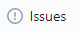

# WE VALUE YOUR CONTRIBUTIONS

Our goal in publishing these documents was to create a complete, clear, and correct repository of guides to help DataBC Program contributors and consumers. We welcome your contributions!

This page describes two mechanisms for providing input on the documentation published on this site:
+ reporting errors in the documentation, and
+ suggesting additions to existing pages or 
+ the addition of new pages.

-----------------------

## Table of Contents
+ [**REPORTING ISSUES WITH THE DOCUMENTATION**](#reporting-issues-with-the-documentation)
+ [**CHANGING PAGES OR ADDING NEW ONES**](#changing-pages-or-adding-new-ones)
	+ [How to Access GitHub](#how-to-access-github)
	+ [How to Download a Git Client](#how-to-download-a-git-client)
	+ [How to Clone the bcgov/data-standards Repository](#how-to-clone-the-bcgovdata-standards-repository)
	+ [How to Pull down a Repository to a File System](#how-to-pull-down-a-repository-to-a-file-system)
	+ [How to Create or Change Pages](#how-to-create-or-change-pages)
	+ [How to Push to GitHub](#how-to-push-to-github)
	+ [How to Issue a Pull Request](#how-to-issue-a-pull-request)

-----------------------

## REPORTING ISSUES WITH THE DOCUMENTATION

If you would like to point out an error or make a comment on the content, this can most easily be done by creating an issue:
1. Click the  tab. 
1. Click the  button. 
1. Enter a **Title** that is brief to describe the issue.
1. Enter a **Description** of the issue and what URL it is on.
1. Click the  button. 

-----------------------------------------------------------

## CHANGING PAGES OR ADDING NEW ONES

You can add new pages or replace existing ones by going through the process outlined in the following sections.  

### How to Access GitHub

You will need a user id for https://github.com.  You can get one by going to that website and clicking on the "Sign up for GitHub" button.

For BC Government employees read the [BC Policy Framework For GitHub](https://github.com/bcgov/BC-Policy-Framework-For-GitHub).

### How to Download a Git Client

Download a git client from https://git-scm.com/download. You will use the "git" command to do most of your work

### How to Clone the bcgov/data-standards Repository

1. Log into github.com and navigate to [https://github.com/data-standards](https://github.com/bcgov/data-standards)
1. Click the  button in the upper right.
	1. A pop-up may appears with the question **Where should we fork data-standards**, click on your userid.

A copy of the data-standards will now be in your repo, e.g., _userid/data-standards_

### How to Pull down a Repository to a File System

1. Copy the repo URL to your clipboard:
	1. Click the  button.
	1. Click the clipboard image  as this copies the URL listed beside it
1. On your workstation, create a new directory to store and modify the repository files. 
1. Either using a program of your choice or open a DOS/PowerShell to that directory.
1. Enter the command to create a `data-standards` subdirectory:
	```
	git clone <paste the URL from your clipboard>
	```
1. Enter the following commands to move to and sync content from the master repo:
   ```
   cd data-standards
   git remote add --track master upstream git://github.com/bcgov/data-standards.git
   git fetch upstream
   git merge upstream/master
   ```
	If both are in sync the follow message will display "Already up to date".

### How to Create or Change Pages

1. If any significant time has passed since you downloaded the files in the last section, you should make sure that your copy of the repository is up to date with the contents of the master bcgov/data-standards repository. 

To do this, issue the following to commands:
	```
	git fetch upstream
    git merge upstream/master
	```
	
1. Using a text editor make changes to the markdown (.md) files, add new markdown files, etc. 
1. Any images should be stored in the images subdirectory.

### How to Push to GitHub

Your changes, additions, etc. on your local filesystem copy now have to be transfered up to your copy on GitHub. Do this by executing the following commands:

```
git add -A
git commit -m "briefDescriptionOfTheChanges"
git push
```
 
### How to Issue a Pull Request

1. Open or refresh your repository in a browser.
	1. There will be a note saying your _This branch is X commits ahead of bcgov:master_.
1. Click the  button beside this. 
	1. This page will show the change comparison.
1. Click the  button. 
1. Enter a **Title** that is brief to describe the changes.
1. Enter a **Description** of the changes made.
1. Click the final  button. 

 [DataBC](mailto:databc.da@gov.bc.ca) will review and either incorporate your changes or contact you if there is a reason the changes cannot be incorporated.

-------------------------------------------------------

[RETURN TO TOP][1] 

[1]: #we-value-your-contributions
